- [1. Title: **Bakhtin's Carnivalesque Concept**](#1-title-bakhtins-carnivalesque-concept)
- [2. **Key Concepts**](#2-key-concepts)
  - [2.1. **Subversion of Norms**](#21-subversion-of-norms)
    - [2.1.1. **Components of Subversion of Norms**:](#211-components-of-subversion-of-norms)
      - [2.1.1.1. **Reversal of Hierarchies**](#2111-reversal-of-hierarchies)
      - [2.1.1.2. **Liberating Atmosphere**](#2112-liberating-atmosphere)
      - [2.1.1.3. **Temporary Nature**](#2113-temporary-nature)
  - [2.2. **Dialogic Space for Marginalized Voices**](#22-dialogic-space-for-marginalized-voices)
    - [2.2.1. **Characteristics of Dialogic Space for Marginalized Voices**:](#221-characteristics-of-dialogic-space-for-marginalized-voices)
      - [2.2.1.1. **Inclusivity**](#2211-inclusivity)
      - [2.2.1.2. **Multiplicity of Voices**](#2212-multiplicity-of-voices)
      - [2.2.1.3. **Playfulness**](#2213-playfulness)
  - [2.3. **Rejection of Authority**](#23-rejection-of-authority)
    - [2.3.1. \*\* Components of Rejection of Authority\*\*:](#231--components-of-rejection-of-authority)
      - [2.3.1.1. **Satirical Critique**](#2311-satirical-critique)
      - [2.3.1.2. **Irreverence**](#2312-irreverence)
      - [2.3.1.3. **Chaotic Atmosphere**](#2313-chaotic-atmosphere)
  - [2.4. **Renewal**](#24-renewal)
    - [2.4.1. **Components of Renewal**:](#241-components-of-renewal)
      - [2.4.1.1. **Regeneration**](#2411-regeneration)
  - [2.5. **Transformation**](#25-transformation)
    - [2.5.1. **Components of Transformation**:](#251-components-of-transformation)
      - [2.5.1.1. **Creative Freedom**](#2511-creative-freedom)
      - [2.5.1.2. **New Perspectives**](#2512-new-perspectives)
  - [2.6. **Forces of Inclusion**](#26-forces-of-inclusion)
    - [2.6.1. **Components of Forces of Inclusion**:](#261-components-of-forces-of-inclusion)
      - [2.6.1.1. **Collective Participation**](#2611-collective-participation)
      - [2.6.1.2. **Egalitarian**](#2612-egalitarian)
  - [2.7. **Forces of Exclusion**](#27-forces-of-exclusion)
    - [2.7.1. **Components of Forces of Exclusion**:](#271-components-of-forces-of-exclusion)
      - [2.7.1.1. **Highlighting Marginalization**](#2711-highlighting-marginalization)
      - [2.7.1.2. **Resistance**](#2712-resistance)
- [3. **Conclusion**](#3-conclusion)


### 1. Title: **Bakhtin's Carnivalesque Concept**

- **Carnivalesque**:
  - **Definition**: The concept of *carnivalesque* refers to moments in literature and culture where traditional hierarchies and norms are subverted, creating a space for alternative voices, perspectives, and ideas to emerge. It embodies a temporary suspension of rules, order, and authority, allowing for a liberating and transformative experience.

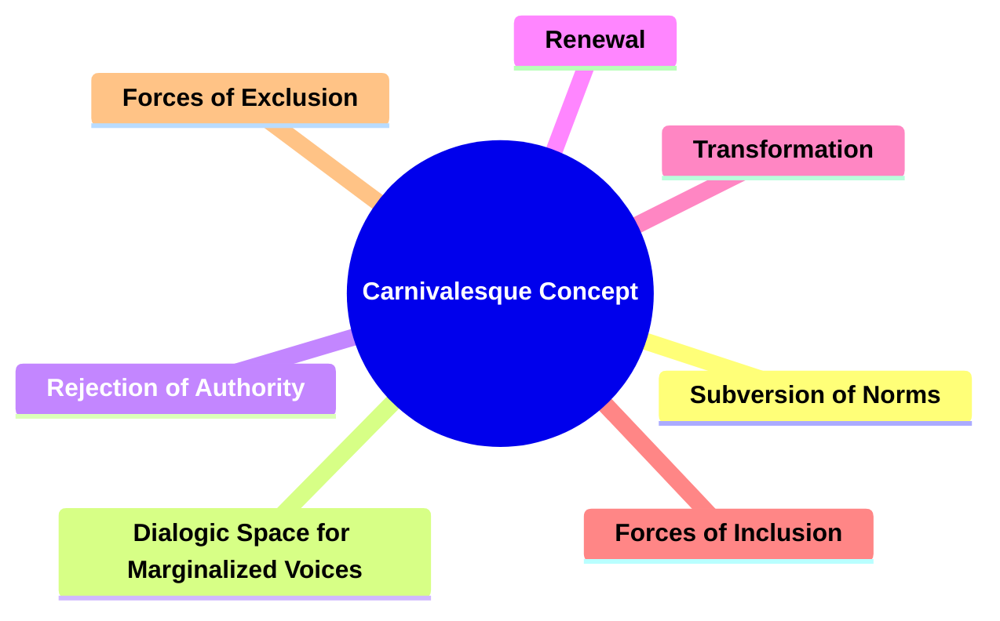

---

### 2. **Key Concepts**

#### 2.1. **Subversion of Norms**

- **Definition**:
  - The carnivalesque centers on the disruption of societal norms and hierarchies, offering a space where traditional power dynamics are overturned, and marginalized or suppressed perspectives can be expressed.

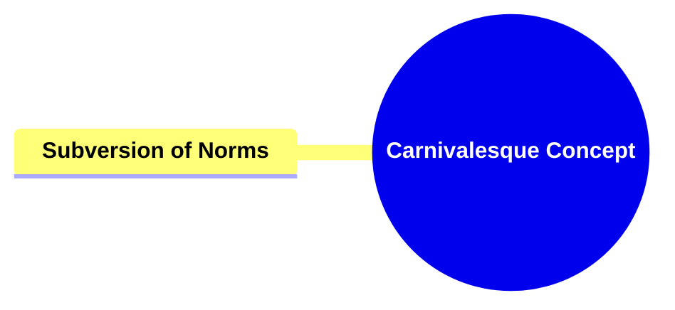

##### 2.1.1. **Components of Subversion of Norms**:
###### 2.1.1.1. **Reversal of Hierarchies**
  - **Definition**: Traditional power structures are inverted, with lower classes or marginalized groups temporarily elevated to positions of power, challenging societal norms and conventions.

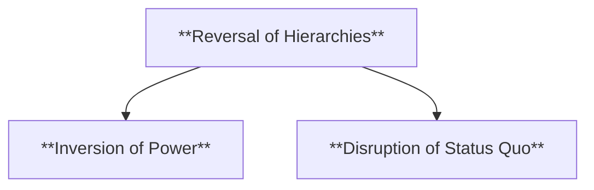

  - **Characteristics**:
    - **Inversion of Power**: Those typically without authority or influence in society take on roles of dominance, subverting existing hierarchies.
    - **Disruption of Status Quo**: This reversal challenges the established order, offering a critique or reimagining of societal structures, even if only for a short period.


###### 2.1.1.2. **Liberating Atmosphere**
  - **Definition**: A sense of freedom from established rules and conventions, creating an environment where creative expression flourishes and authority is questioned or ridiculed.

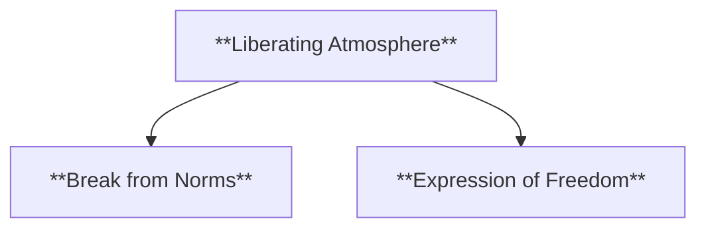

  - **Characteristics**:
    - **Break from Norms**: In this atmosphere, individuals can act beyond societal expectations, often engaging in behaviors or ideas that would be suppressed under typical conditions.
    - **Expression of Freedom**: The environment encourages the exploration of new ideas, challenging traditional values and allowing for more radical forms of expression and thought.


###### 2.1.1.3. **Temporary Nature**
  - **Definition**: The subversion of norms is often fleeting, occurring in specific moments or settings where the usual rules and hierarchies are momentarily suspended, only to be restored afterward.

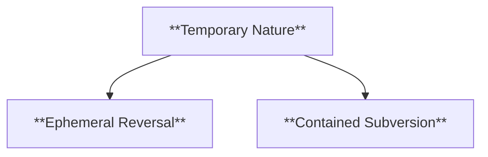

  - **Characteristics**:
    - **Ephemeral Reversal**: The inversion of norms is temporary, highlighting the instability of societal structures but also reinforcing their eventual return.
    - **Contained Subversion**: This temporary change typically occurs within defined spaces, such as festivals, carnivals, or specific events, where social roles are allowed to be reversed for a limited time.

---
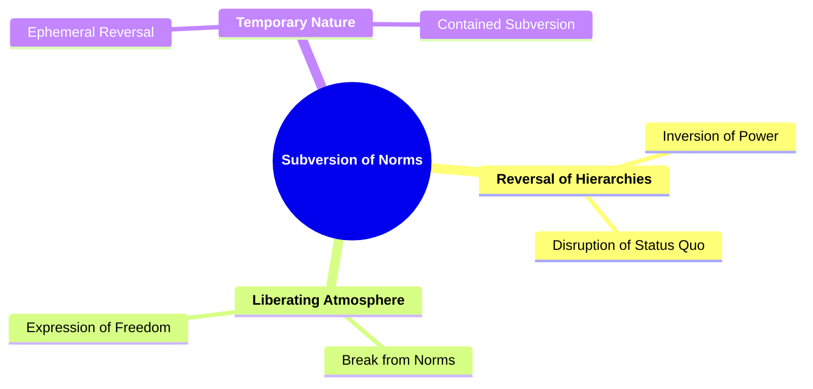

---

#### 2.2. **Dialogic Space for Marginalized Voices**

- **Definition**: 
  - The carnivalesque opens a dialogic space where multiple voices, especially those of the marginalized or oppressed, can be heard, disrupting the monologic, authoritative voice.


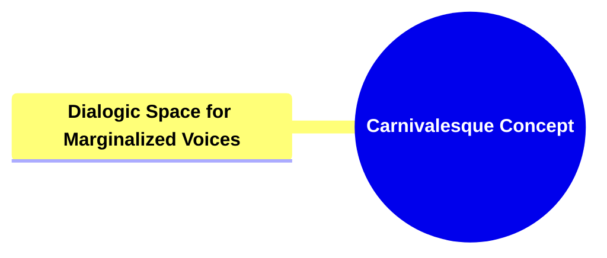

##### 2.2.1. **Characteristics of Dialogic Space for Marginalized Voices**:

###### 2.2.1.1. **Inclusivity**
  - **Definition**:Allows for the expression of diverse perspectives, particularly those often silenced or marginalized by dominant discourse, ensuring a broader representation of voices and experiences in the narrative.

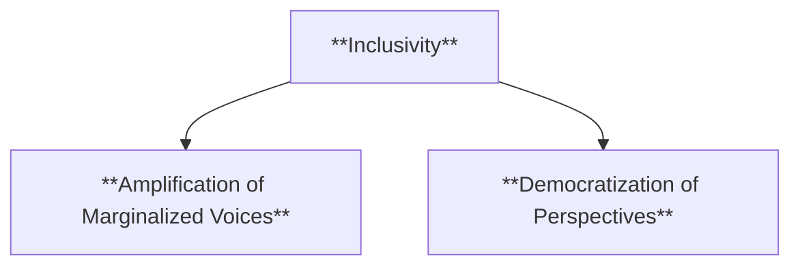


  - **Characteristics**:
    - **Amplification of Marginalized Voices**: The narrative creates space for individuals and groups typically excluded from mainstream conversation to share their stories and viewpoints.
    - **Democratization of Perspectives**: Inclusivity emphasizes that all perspectives are valuable, encouraging a more open and diverse exchange of ideas.


###### 2.2.1.2. **Multiplicity of Voices**
  - **Definition**: A wide range of voices and viewpoints coexist within the narrative, challenging the notion of a single, authoritative voice or perspective.

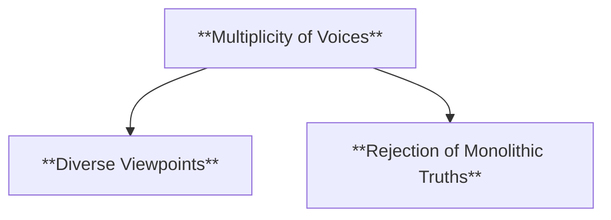

  - **Characteristics**:
    - **Diverse Viewpoints**: The narrative includes multiple perspectives, often presenting conflicting or varied interpretations of events, characters, or themes.
    - **Rejection of Monolithic Truths**: By embracing different voices, the narrative critiques the idea of one dominant truth or interpretation, fostering a more pluralistic view of reality.


###### 2.2.1.3. **Playfulness**
  - **Definition**: Humor, parody, and absurdity are common, often used to critique and mock power structures, creating a light-hearted but incisive commentary on societal norms and hierarchies.

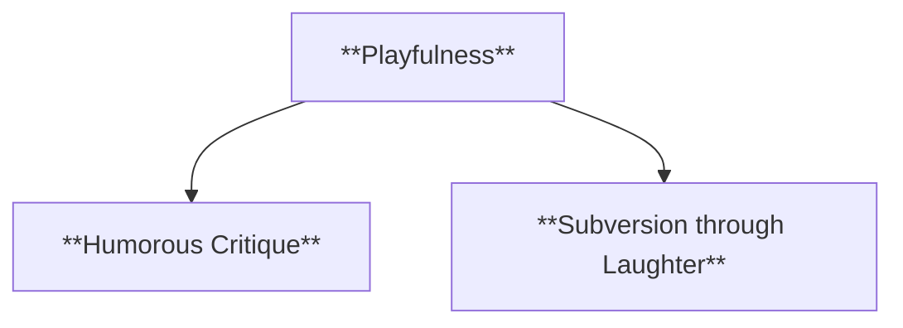

  - **Characteristics**:
    - **Humorous Critique**: Through playful elements such as satire, irony, and absurdity, the narrative exposes the flaws or contradictions in dominant ideologies or power systems.
    - **Subversion through Laughter**: Playfulness allows for a more accessible form of critique, using humor to challenge authority while maintaining an engaging, entertaining tone.


---
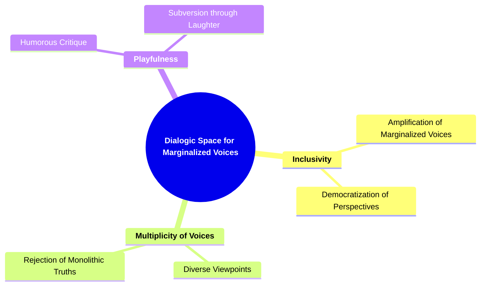

---

#### 2.3. **Rejection of Authority**

- **Definition**:
  - The carnivalesque includes a rejection of centralized authority, often using satire and parody to undermine figures of power and ridicule societal structures.

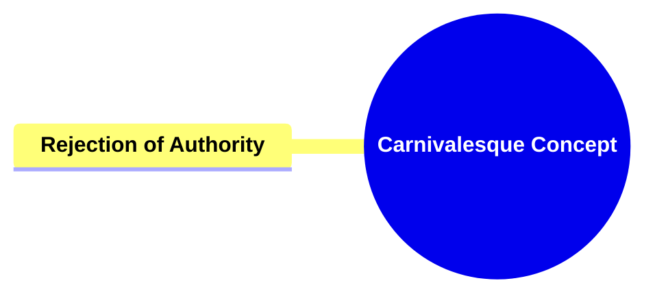

##### 2.3.1. ** Components of Rejection of Authority**:
###### 2.3.1.1. **Satirical Critique**
  - **Definition**: Authority figures are often mocked or parodied, diminishing their power and exposing their flaws, hypocrisies, or contradictions through satire.

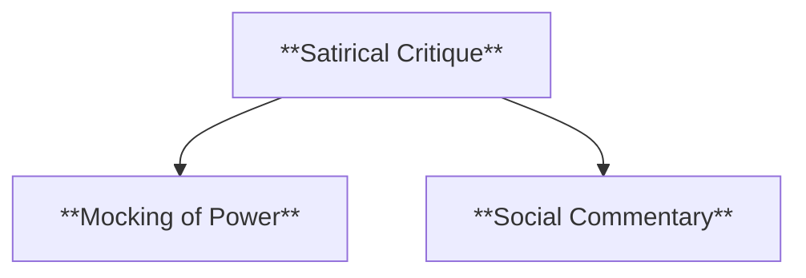

  - **Characteristics**:
    - **Mocking of Power**: The narrative uses humor or exaggeration to undermine the authority of figures in power, revealing their weaknesses or absurdities.
    - **Social Commentary**: By ridiculing authority, the satire serves as a critique of larger societal structures, offering a pointed analysis of political or cultural systems.

###### 2.3.1.2. **Irreverence**
  - **Definition**: A lack of respect for traditional hierarchies, laws, or social norms, allowing characters or the narrative to question, ridicule, or disregard established power structures.

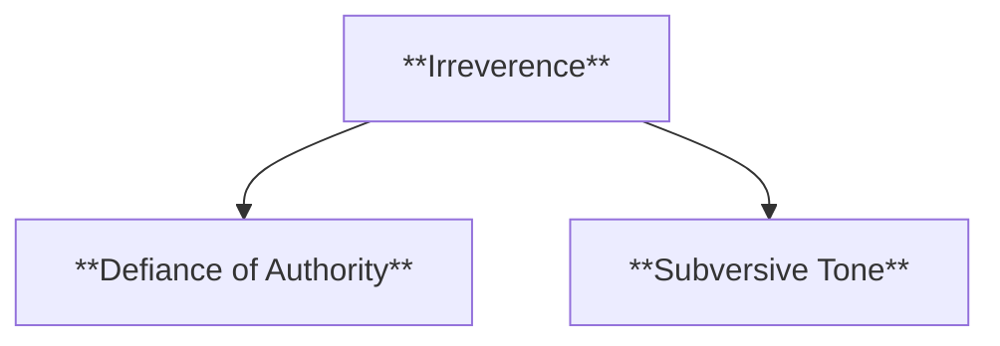


  - **Characteristics**:
    - **Defiance of Authority**: The narrative challenges or mocks societal rules, customs, or hierarchies, often rejecting them entirely or treating them with disdain.
    - **Subversive Tone**: Irreverence adds a rebellious element to the narrative, encouraging characters (and readers) to think critically about power and tradition.

###### 2.3.1.3. **Chaotic Atmosphere**
  - **Definition**: A sense of disorder where established systems are temporarily broken down, creating an environment where normal rules do not apply and unpredictability reigns.

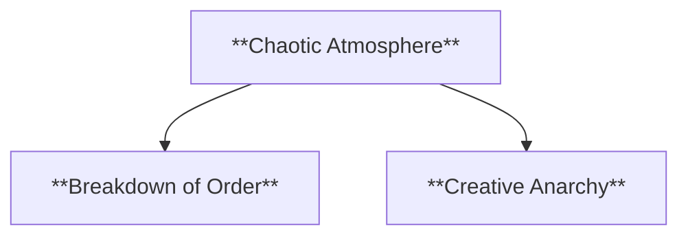


  - **Characteristics**:
    - **Breakdown of Order**: The usual societal, political, or moral systems are disrupted, creating an environment of unpredictability and confusion.
    - **Creative Anarchy**: Chaos often leads to creativity or new possibilities as traditional structures are dismantled, allowing for freedom of expression or alternative ways of thinking.

---
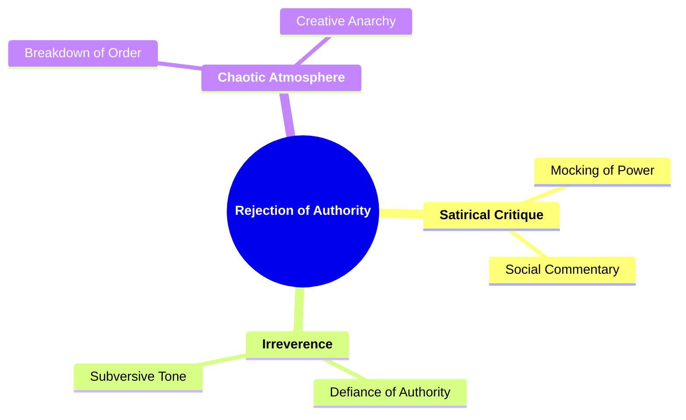
---

---

#### 2.4. **Renewal**

- **Definition**:
  - The carnivalesque is associated with the idea of renewal, where the temporary suspension of order allows for the possibility of new perspectives, relationships, and ideas to emerge.

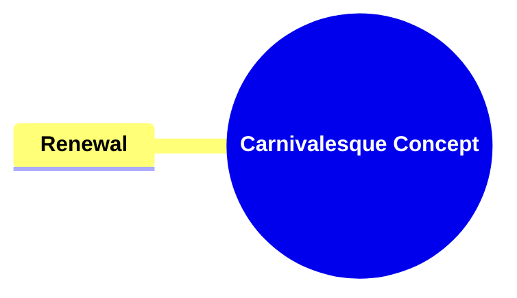


##### 2.4.1. **Components of Renewal**:
###### 2.4.1.1. **Regeneration**
  - **Definition**: Suggests a symbolic renewal of society or the individual after a period of chaos, often representing a fresh start or the re-establishment of order, wisdom, or growth following disruption.
  - **Characteristics**:
    - **Symbolic Renewal**: After the breakdown of established systems, regeneration signifies the rebuilding or rebirth of a better, more enlightened society or individual.
    - **Restoration of Order**: The chaotic period is followed by a sense of restoration, where new values, structures, or perspectives emerge to replace the old, often leading to progress or transformation.
    - **Personal Growth**: For individuals, regeneration reflects a process of internal growth or self-discovery that occurs after overcoming conflict, challenges, or chaos.

---
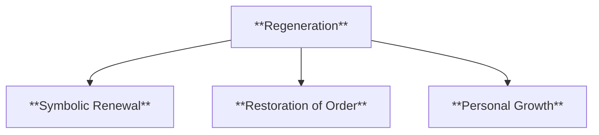

---
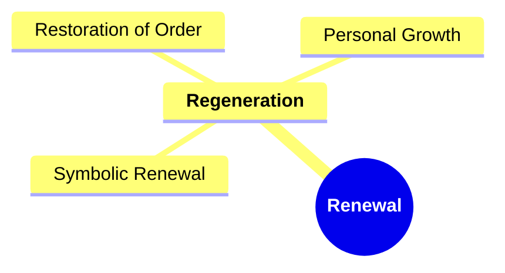
---

#### 2.5. **Transformation**

- **Definition**:
  - The carnivalesque also signifies transformation, where new perspectives emerge from the subversion of norms.

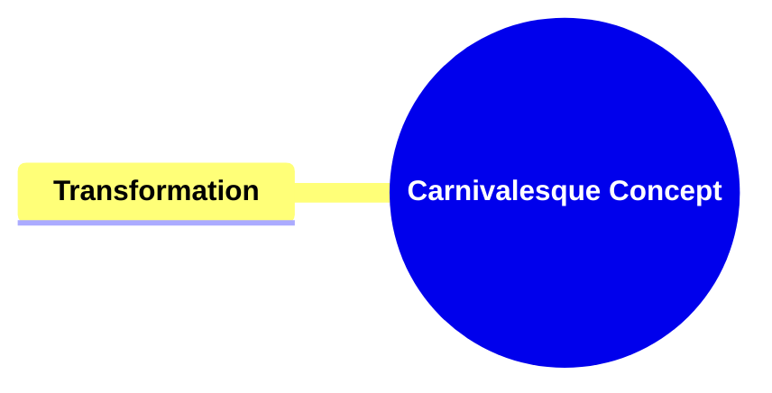

---


##### 2.5.1. **Components of Transformation**:

###### 2.5.1.1. **Creative Freedom**
  - **Definition**: Encourages innovation and the generation of new ideas outside traditional constraints, allowing for more imaginative and unconventional approaches to storytelling and character development.

```mermaid
flowchart TD;
    A[**Creative Freedom**] --> B[**Innovation Beyond Boundaries**];
    A --> C[**Unconventional Storytelling**];
    A --> D[**Exploration of the Imagination**];
```

  - **Characteristics**:
    - **Innovation Beyond Boundaries**: The narrative allows for experimentation with form, structure, and content, breaking free from the limitations of traditional genres or expectations.
    - **Unconventional Storytelling**: Creative freedom enables authors and characters to explore unconventional or radical ideas, often leading to unique narrative techniques and original concepts.
    - **Exploration of the Imagination**: By removing constraints, creative freedom fosters a space where imaginative, visionary ideas can flourish, promoting originality and novelty in storytelling.

---

###### 2.5.1.2. **New Perspectives**
  - **Definition**: Fosters a shift in how characters and readers perceive established norms, encouraging a re-evaluation of traditional values, beliefs, or social structures.

```mermaid
flowchart TD;
    E[**New Perspectives**] --> F[**Challenge to the Status Quo**];
    E --> G[**Shift in Understanding**];
    E --> H[**Expanded Worldview**];
```

  - **Characteristics**:
    - **Challenge to the Status Quo**: The narrative introduces fresh perspectives that challenge the accepted norms of society, prompting characters and readers to reconsider their assumptions.
    - **Shift in Understanding**: Characters undergo transformations in how they view the world, often leading to new insights or realizations that reflect larger social or philosophical themes.
    - **Expanded Worldview**: The introduction of new perspectives allows readers to see established issues or themes from a different angle, broadening their understanding of the narrative and its underlying messages.

---


```mermaid
mindmap
  root((**Transformation**))
    **Creative Freedom**
      Innovation Beyond Boundaries
      Unconventional Storytelling
      Exploration of the Imagination
    **New Perspectives**
      Challenge to the Status Quo
      Shift in Understanding
      Expanded Worldview
    **Regeneration**
      Symbolic Renewal
      Restoration of Order
      Personal Growth
```


---

#### 2.6. **Forces of Inclusion**

- **Definition**: 
  - The carnivalesque is an inclusive force, inviting all participants, regardless of their social status or background, to engage in the subversion of norms.


```mermaid
mindmap
  root((**Carnivalesque Concept**))
    **Forces of Inclusion**
```

##### 2.6.1. **Components of Forces of Inclusion**:
###### 2.6.1.1. **Collective Participation**
  - **Definition**: Everyone is encouraged to participate, breaking down social barriers and fostering an inclusive environment where all voices and actions are valued equally within the narrative or setting.

```mermaid
flowchart TD;
    A[**Collective Participation**] --> B[**Inclusive Involvement**];
    A --> C[**Breaking Social Barriers**];
    A --> D[**Shared Experience**];
```


  - **Characteristics**:
    - **Inclusive Involvement**: The narrative or event promotes active participation from all characters or individuals, regardless of their background or status.
    - **Breaking Social Barriers**: Traditional hierarchies or social distinctions are removed, allowing everyone to engage equally, contributing to a more cohesive and unified group dynamic.
    - **Shared Experience**: Collective participation emphasizes unity, where the act of engaging together enhances the sense of community and dissolves individual differences.


###### 2.6.1.2. **Egalitarian**
  - **Definition**: Reduces distinctions between social classes, genders, and roles, promoting equality and minimizing hierarchical structures, allowing characters or participants to interact on equal footing.

```mermaid
flowchart TD;
    E[**Egalitarian**] --> F[**Equality of Roles**];
    E --> G[**Social Fluidity**];
    E --> H[**Inclusive Representation**];
```


  - **Characteristics**:
    - **Equality of Roles**: The narrative minimizes or eliminates traditional social distinctions, placing characters or individuals on a level playing field, regardless of their societal position.
    - **Social Fluidity**: Egalitarian structures allow for fluid interaction between individuals of different backgrounds, fostering mutual respect and diminishing power imbalances.
    - **Inclusive Representation**: Characters or participants from all walks of life are given equal importance, emphasizing diversity and equality within the story or social setting.

---
```mermaid
mindmap
  root((**Forces of Inclusion**))
    **Collective Participation**
      Inclusive Involvement
      Breaking Social Barriers
      Shared Experience
    **Egalitarian**
      Equality of Roles
      Social Fluidity
      Inclusive Representation
```
---


#### 2.7. **Forces of Exclusion**

- **Definition**: 
  - Despite its inclusivity, the carnivalesque can also highlight the exclusion of certain groups from mainstream power structures, making their voices more prominent during moments of subversion.

```mermaid
mindmap
  root((**Carnivalesque Concept**))
    **Forces of Exclusion**
```

##### 2.7.1. **Components of Forces of Exclusion**:

###### 2.7.1.1. **Highlighting Marginalization**
  - **Definition**: Exposes the ways in which certain groups are excluded from dominant discourse, bringing attention to the social, political, or cultural forces that silence or marginalize particular voices.

```mermaid
flowchart TD;
    A[**Highlighting Marginalization**] --> B[**Exposing Injustice**];
    A --> C[**Amplifying Silenced Voices**];
    A --> D[**Critique of Dominant Ideologies**];
```


  - **Characteristics**:
    - **Exposing Injustice**: The narrative or setting brings to light how specific groups are systematically excluded or silenced, often challenging the dominant power structures that enforce this marginalization.
    - **Amplifying Silenced Voices**: It provides a platform for underrepresented groups to express their perspectives and experiences, drawing attention to their struggles and contributions.
    - **Critique of Dominant Ideologies**: By highlighting marginalization, the story critiques the societal norms that perpetuate exclusion and encourages readers to reflect on the inequalities within the existing social framework.


###### 2.7.1.2. **Resistance**
  - **Definition**: Creates a space for resistance against oppressive systems, offering characters or groups a means to challenge, subvert, or overthrow the structures that oppress them.

```mermaid
flowchart TD;
    A[**Resistance**] --> B[**Opposition to Power**];
    A --> C[**Empowerment**];
    A --> D[**Revolutionary Potential**];
```

  - **Characteristics**:
    - **Opposition to Power**: The narrative actively confronts and resists systems of oppression, often depicting characters or groups who fight back against unjust authority or social norms.
    - **Empowerment**: Resistance in the narrative empowers marginalized individuals or groups, giving them agency to reclaim their voices, rights, or freedoms.
    - **Revolutionary Potential**: By fostering resistance, the story opens up the possibility of systemic change or transformation, pushing back against the status quo and envisioning a more just or equitable world.

---

```mermaid
mindmap
  root((**Forces of Exclusion**))
    **Highlighting Marginalization**
      Exposing Injustice
      Amplifying Silenced Voices
      Critique of Dominant Ideologies
    **Resistance**
      Opposition to Power
      Empowerment
      Revolutionary Potential
```
---

```mermaid
mindmap
  root((**Carnivalesque Concept**))
    **Subversion of Norms**
      **Reversal of Hierarchies**
        Inversion of Power
        Disruption of Status Quo
      **Liberating Atmosphere**
        Break from Norms
        Expression of Freedom
      **Temporary Nature**
        Ephemeral Reversal
        Contained Subversion
    **Dialogic Space for Marginalized Voices**
      **Inclusivity**
        Amplification of Marginalized Voices
        Democratization of Perspectives
      **Multiplicity of Voices**
        Diverse Viewpoints
        Rejection of Monolithic Truths
      **Playfulness**
        Humorous Critique
        Subversion through Laughter
    **Rejection of Authority**
      **Satirical Critique**
        Mocking of Power
        Social Commentary
      **Irreverence**
        Defiance of Authority
        Subversive Tone
      **Chaotic Atmosphere**
        Breakdown of Order
        Creative Anarchy
    **Renewal**
      **Regeneration**
        Symbolic Renewal
        Restoration of Order
        Personal Growth
    **Transformation**
      **Creative Freedom**
        Innovation Beyond Boundaries
        Unconventional Storytelling
        Exploration of the Imagination
      **New Perspectives**
        Challenge to the Status Quo
        Shift in Understanding
        Expanded Worldview
    **Forces of Inclusion**
      **Collective Participation**
        Inclusive Involvement
        Breaking Social Barriers
        Shared Experience
      **Egalitarian**
        Equality of Roles
        Social Fluidity
        Inclusive Representation
    **Forces of Exclusion**
      **Highlighting Marginalization**
        Exposing Injustice
        Amplifying Silenced Voices
        Critique of Dominant Ideologies
      **Resistance**
        Opposition to Power
        Empowerment
        Revolutionary Potential
```

---

### 3. **Conclusion**

- **Bakhtin’s Contribution**:
  - Bakhtin’s concept of the *carnivalesque* adds a powerful tool to the analysis of literature and culture, offering insight into how narratives can challenge dominant power structures and celebrate alternative voices. By highlighting the subversion of norms and the potential for renewal, the carnivalesque becomes a framework for understanding how disorder and chaos can lead to new ways of thinking.

- **Relevance in Literary and Cultural Studies**:
  - The *carnivalesque* remains a key concept for analyzing texts that engage with questions of power, authority, and social norms. Its continued relevance lies in its ability to unpack the complexities of social dynamics and the role of literature in reflecting and challenging those dynamics.
