- [1. **Title: Sternberg's Temporal Ordering Framework**](#1-title-sternbergs-temporal-ordering-framework)
- [2. **Key Concepts**](#2-key-concepts)
  - [2.1. **Anachrony**](#21-anachrony)
    - [2.1.1. **Components of Anachrony**](#211-components-of-anachrony)
      - [2.1.1.1. **Analepsis (Flashbacks)**](#2111-analepsis-flashbacks)
      - [2.1.1.2. **Prolepsis (Flashforwards)**](#2112-prolepsis-flashforwards)
      - [2.1.1.3. **Non-linear Narrative**](#2113-non-linear-narrative)
  - [2.2. **Duration**](#22-duration)
    - [2.2.1. **Components of Duration**](#221-components-of-duration)
      - [2.2.1.1. **Summary**](#2211-summary)
      - [2.2.1.2. **Scene**](#2212-scene)
      - [2.2.1.3. **Ellipsis**](#2213-ellipsis)
  - [2.3. **Frequency**](#23-frequency)
    - [2.3.1. **Components of Frequency**](#231-components-of-frequency)
      - [2.3.1.1. **Singulative Narration**](#2311-singulative-narration)
      - [2.3.1.2. **Repeating Narration**](#2312-repeating-narration)
      - [2.3.1.3. **Iterative Narration**](#2313-iterative-narration)

---
### 1. **Title: Sternberg's Temporal Ordering Framework**

**Temporal Ordering**:
   **Definition**: Meir Sternberg’s Temporal Ordering Framework focuses on the sequence in which events are presented within a narrative, influencing how readers experience and interpret the story. Temporal ordering includes the manipulation of time through various techniques to enhance narrative effect, shaping the pacing, suspense, and thematic depth of a story.

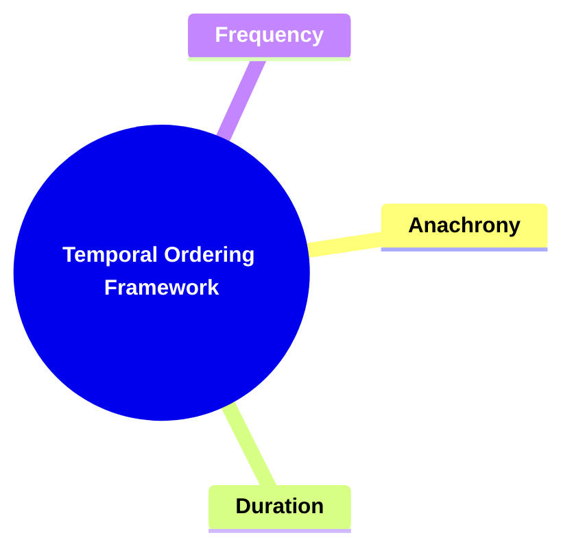

---

### 2. **Key Concepts**

#### 2.1. **Anachrony**

**Definition**:
   Anachrony refers to the reordering of events in a non-chronological sequence within a narrative. It includes techniques such as *analepsis* (flashbacks) and *prolepsis* (flashforwards), allowing events to be presented out of their natural time sequence.

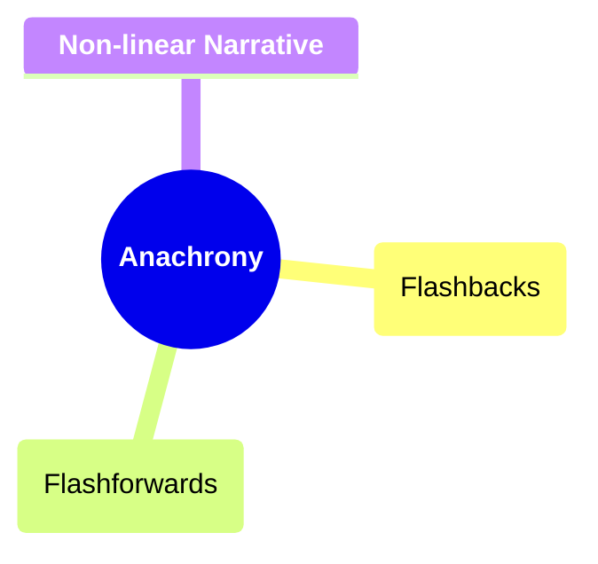

##### 2.1.1. **Components of Anachrony**

###### 2.1.1.1. **Analepsis (Flashbacks)**
  - **Definition**: Revisiting past events to provide background or context that enriches the storyline.

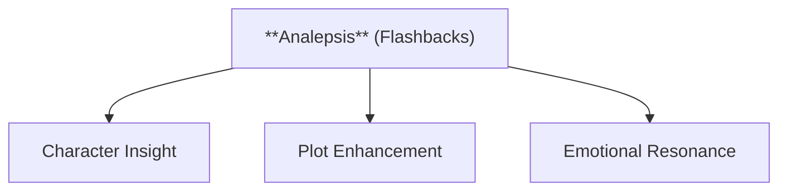

  - **Characteristics**
    - **Character Insight**: Offers a deeper understanding of characters’ motivations and backstories, revealing how past experiences shape present actions.
    - **Plot Enhancement**: Adds complexity to the story by weaving in relevant past events that influence the current narrative.
    - **Emotional Resonance**: Strengthens emotional ties by connecting the reader to pivotal moments in a character’s life.

---

###### 2.1.1.2. **Prolepsis (Flashforwards)**
  - **Definition**: Projecting future events into the current narrative, creating anticipation or foreshadowing.

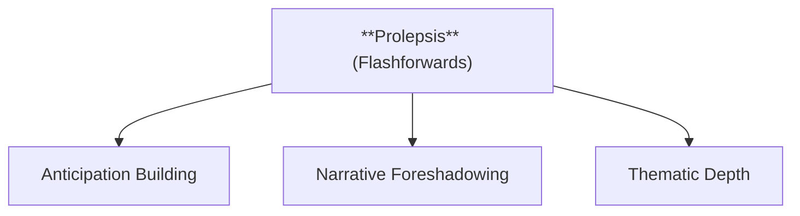

  - **Characteristics**
    - **Anticipation Building**: Generates suspense by hinting at significant future events, keeping readers engaged and curious.
    - **Narrative Foreshadowing**: Provides clues or insights that shape reader expectations and prepare them for upcoming developments.
    - **Thematic Depth**: Highlights themes by showing how current actions or events may impact the future, enriching the narrative’s thematic arc.

---

###### 2.1.1.3. **Non-linear Narrative**
  - **Definition**: Events are not presented in a straightforward chronological sequence.

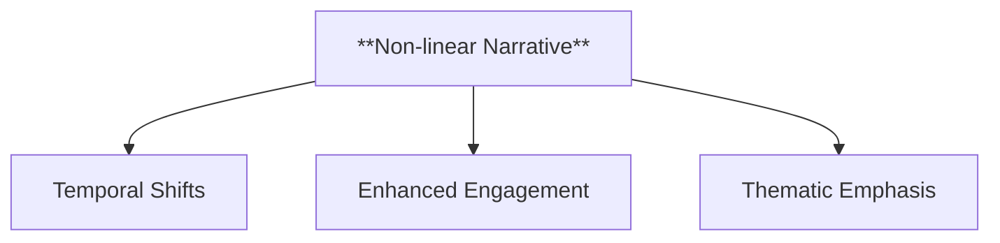

  - **Characteristics**
    - **Temporal Shifts**: Moves back and forth in time, creating a more layered and multifaceted storytelling approach.
    - **Enhanced Engagement**: Requires readers to actively piece together the story, fostering deeper involvement and critical thinking.
    - **Thematic Emphasis**: Allows for the exploration of how different time periods interrelate, emphasizing recurring motifs or contrasts in the storyline.

---

#### 2.2. **Duration**

**Definition**:
   Duration refers to the relationship between the actual time span covered by the story’s events and the time taken to narrate them. Duration influences pacing and the narrative’s focus on specific moments.

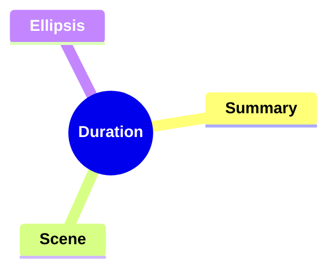

##### 2.2.1. **Components of Duration**

###### 2.2.1.1. **Summary**
  - **Definition**: Condenses long periods into a brief account, speeding up the pacing.

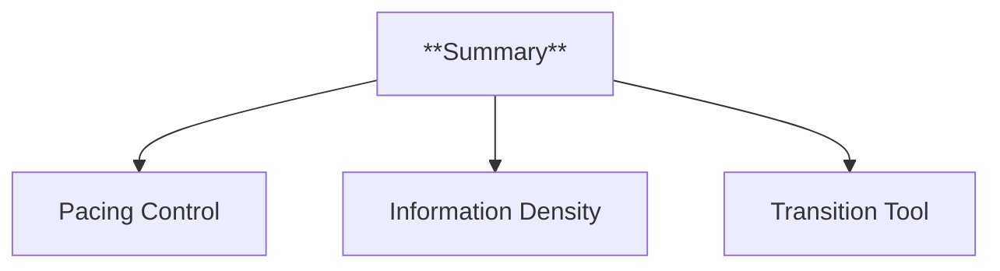

  - **Characteristics**
    - **Pacing Control**: Speeds up the flow of the narrative, allowing the author to move quickly through less significant periods while maintaining continuity.
    - **Information Density**: Provides essential details in a compact form, giving readers an overview without extensive descriptions.
    - **Transition Tool**: Acts as a bridge between key events, ensuring that the story progresses smoothly without losing coherence.

---

###### 2.2.1.2. **Scene**
  - **Definition**: Aligns narrative time with story time, creating a detailed and immersive experience.

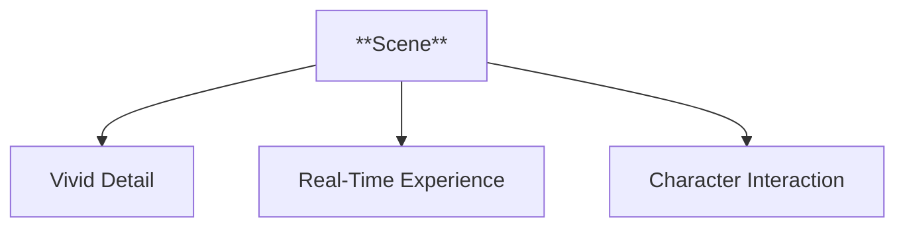

  - **Characteristics**
    - **Vivid Detail**: Captures moments with thorough descriptions, making readers feel present in the action.
    - **Real-Time Experience**: Matches the pace of the story to the narrative, allowing events to unfold as they would naturally.
    - **Character Interaction**: Showcases character dynamics and dialogue, adding depth to the narrative by focusing on interactions and responses.

---

###### 2.2.1.3. **Ellipsis**
  - **Definition**: Omits events or periods, controlling the narrative’s pacing by skipping over less important moments.

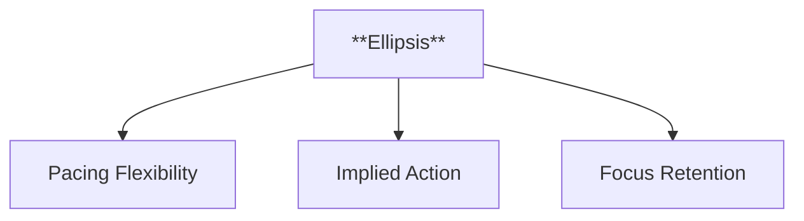

  - **Characteristics**
    - **Pacing Flexibility**: Allows the author to skip non-critical events, accelerating the storyline to more significant moments.
    - **Implied Action**: Suggests events or actions without explicitly stating them, encouraging readers to infer what occurred during the gaps.
    - **Focus Retention**: Keeps the narrative focused on pivotal scenes and themes, preventing unnecessary detail from diluting the main plot.

---

#### 2.3. **Frequency**

**Definition**:
   Frequency refers to how often certain events are narrated within the story. Sternberg identifies *singulative* (one event narrated once), *repeating* (one event narrated multiple times), and *iterative* (multiple similar events narrated as one).

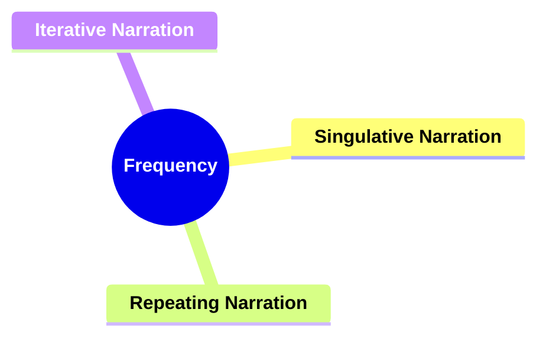

##### 2.3.1. **Components of Frequency**

###### 2.3.1.1. **Singulative Narration**
  - **Definition**: Narrating an event exactly once.

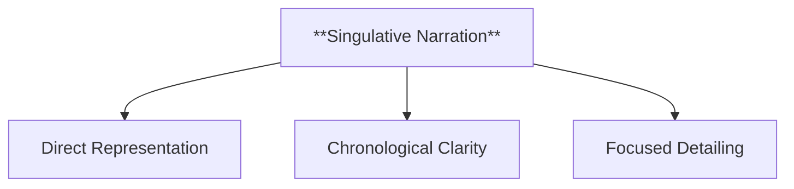

  - **Characteristics**
    - **Direct Representation**: Provides a clear and singular account of an event, maintaining a straightforward and realistic narrative flow.
    - **Chronological Clarity**: Ensures the timeline is easy to follow, presenting events without repetition or variation.
    - **Focused Detailing**: Highlights the importance of a single event, allowing for in-depth exploration of that moment.

---

###### 2.3.1.2. **Repeating Narration**
  - **Definition**: Narrating the same event multiple times, often from different perspectives.

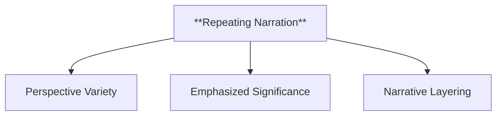

  - **Characteristics**
    - **Perspective Variety**: Offers different angles or viewpoints of the same event, deepening readers' understanding of the narrative and its characters.
    - **Emphasized Significance**: Reinforces the importance of an event by revisiting it, ensuring it stands out in the overall storyline.
    - **Narrative Layering**: Adds complexity by showing how one event can be perceived differently, providing depth and nuance to the story.

---

###### 2.3.1.3. **Iterative Narration**
  - **Definition**: Narrating similar events as a single instance, suggesting habitual actions.

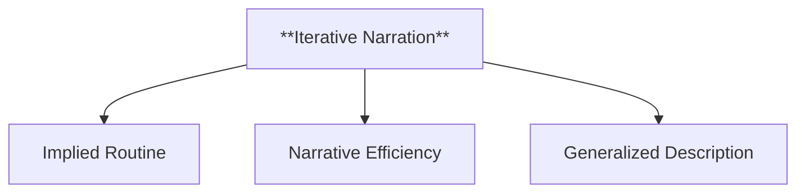

  - **Characteristics**
    - **Implied Routine**: Indicates that an action occurs frequently or regularly, without needing to recount each instance.
    - **Narrative Efficiency**: Condenses repeated events into one passage, saving time while conveying the pattern or habit.
    - **Generalized Description**: Focuses on the typical aspects of repeated actions, creating an overarching understanding rather than detailing specific occurrences.

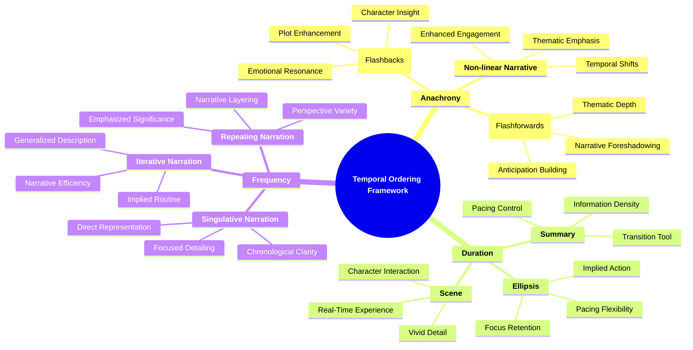