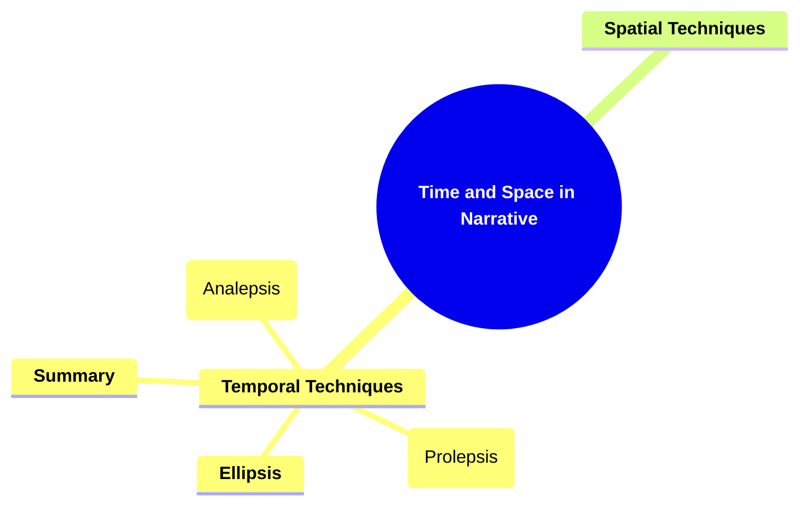
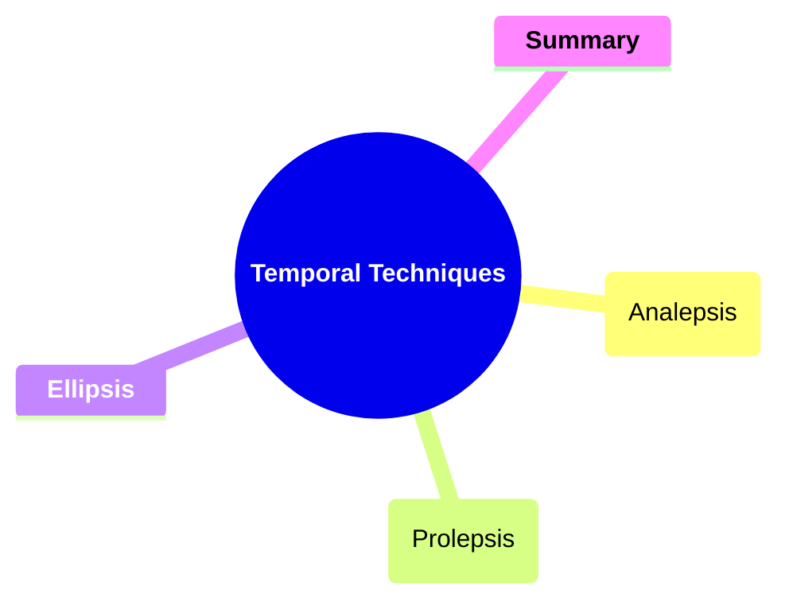
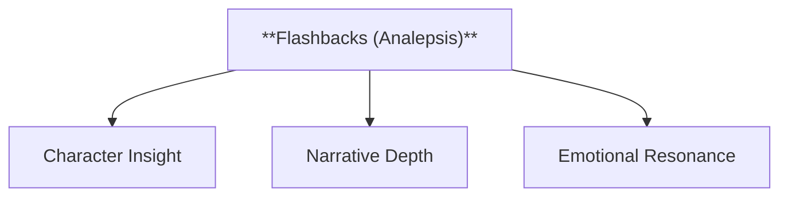
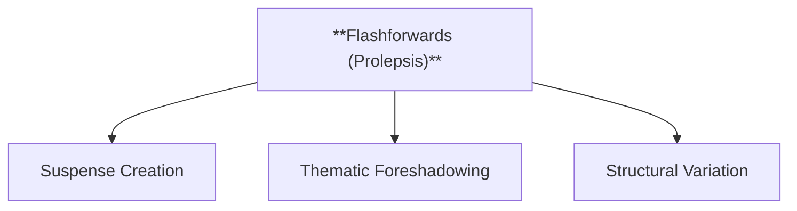
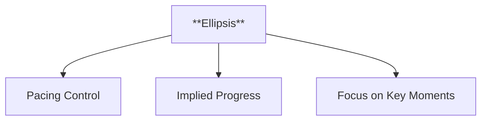
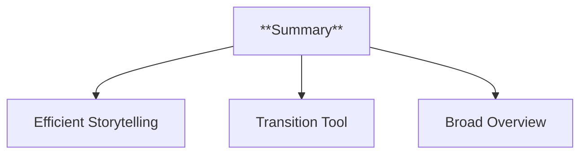
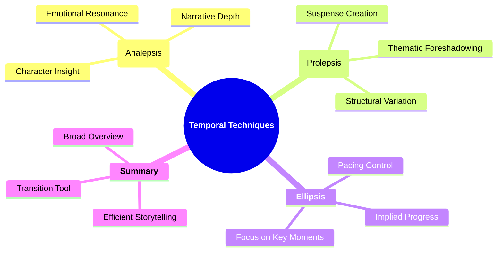

- [1. Title: Chatman's Time and Space in Narrative Framework](#1-title-chatmans-time-and-space-in-narrative-framework)
- [2. Key Concepts](#2-key-concepts)
  - [2.1. Temporal Techniques](#21-temporal-techniques)
    - [2.1.1. **Components of Temporal Techniques**](#211-components-of-temporal-techniques)
      - [2.1.1.1. **Flashbacks (Analepsis)**](#2111-flashbacks-analepsis)
      - [2.1.1.2. **Flashforwards (Prolepsis)**](#2112-flashforwards-prolepsis)
      - [2.1.1.3. **Ellipsis**](#2113-ellipsis)
      - [2.1.1.4. **Summary**](#2114-summary)
  - [2.2. Spatial Techniques](#22-spatial-techniques)
    - [2.2.1. **Components of Spatial Techniques**](#221-components-of-spatial-techniques)
      - [2.2.1.1. **Flashbacks (Analepsis)**](#2211-flashbacks-analepsis)
      - [2.2.1.2. **Flashforwards (Prolepsis)**](#2212-flashforwards-prolepsis)
      - [2.2.1.3. **Ellipsis**](#2213-ellipsis)
      - [2.2.1.4. **Summary**](#2214-summary)
      - [2.2.1.5. **Flashbacks (Analepsis)**](#2215-flashbacks-analepsis)
      - [2.2.1.6. **Flashforwards (Prolepsis)**](#2216-flashforwards-prolepsis)
      - [2.2.1.7. **Ellipsis**](#2217-ellipsis)
      - [2.2.1.8. **Summary**](#2218-summary)
- [3. Implications of Chatman's Time and Space in Narrative Framework](#3-implications-of-chatmans-time-and-space-in-narrative-framework)
- [4. **Theoretical Significance**:](#4-theoretical-significance)

---
### 1. **Title: Chatman's Time and Space in Narrative Framework**

**Time and Space in Narrative**:
   **Definition**: Seymour Chatman’s framework examines how time and space are manipulated to structure narratives and shape the audience’s experience. His analysis highlights the techniques used to alter the chronological flow and spatial arrangement within stories, revealing their impact on pacing, structure, and meaning. Chatman’s work applies to both literature and film, offering insights into the essential role of time and space in storytelling.

---

### 2. **Key Concepts**

#### 2.1. **Temporal Techniques**

**Definition**:
   Temporal techniques refer to methods used to manipulate the sequence of events within a narrative, including flashbacks, flashforwards, ellipses, and summaries, which affect pacing and narrative progression.

##### 2.1.1. **Components of Temporal Techniques**

###### 2.1.1.1. **Flashbacks (Analepsis)**
  - **Definition**: Revisits past events to provide background information or context.

  - **Characteristics**
    - **Character Insight**: Offers deeper understanding of characters' motivations, emotions, and history by exploring significant past events.
    - **Narrative Depth**: Adds complexity to the storyline by intertwining past and present, enriching the main plot with additional layers.
    - **Emotional Resonance**: Engages readers by connecting the past to present situations, fostering empathy and connection with characters.

---

###### 2.1.1.2. **Flashforwards (Prolepsis)**
  - **Definition**: Anticipates future events, creating suspense or foreshadowing outcomes.

  - **Characteristics**
    - **Suspense Creation**: Builds tension and anticipation by hinting at future developments, maintaining reader interest.
    - **Thematic Foreshadowing**: Provides clues that highlight or reinforce the story’s themes, making the narrative more cohesive.
    - **Structural Variation**: Diversifies the storytelling format by breaking linear progression, adding complexity to the narrative structure.

---

###### 2.1.1.3. **Ellipsis**
  - **Definition**: Skips over periods of time, speeding up the narrative’s pace.

  - **Characteristics**
    - **Pacing Control**: Accelerates the plot by omitting less significant periods, maintaining momentum and focus on key events.
    - **Implied Progress**: Encourages readers to infer what happened during the skipped time, involving them actively in the narrative.
    - **Focus on Key Moments**: Keeps attention on critical scenes and developments, ensuring the story remains engaging and efficient.

---

###### 2.1.1.4. **Summary**
  - **Definition**: Condenses long periods of time into brief narration to quickly advance the story.

  - **Characteristics**
    - **Efficient Storytelling**: Provides essential information in a compact format, moving the narrative forward without excessive detail.
    - **Transition Tool**: Bridges major events or plot points smoothly, helping the story maintain coherence without getting bogged down.
    - **Broad Overview**: Offers readers a sense of passing time and context while reserving detailed description for more significant moments.

---

##### 2.1.2. **Implications of Chatman's Temporal Techniques**

**Impact on Narrative and Film Theory**:
   Chatman’s framework has greatly influenced both narrative and film theory by analyzing how time and space are manipulated to shape storytelling. His work bridges literature and film, offering insights into universal techniques for controlling pacing, structure, and audience engagement.

**Collaborative or Future-Oriented Insight**:
   Chatman’s ideas are applicable across various media, including literature, film, theater, and video games. His framework provides valuable tools for analyzing how temporal and spatial elements create compelling narratives, and it has influenced fields like cognitive studies and game design.