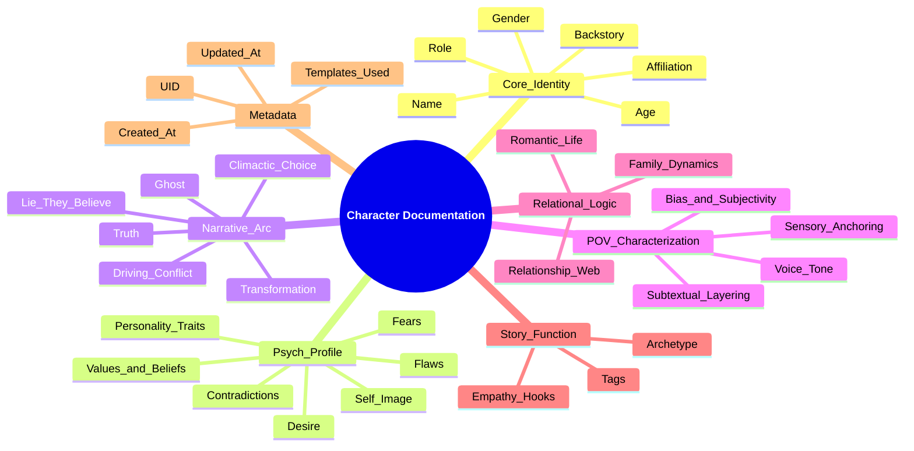
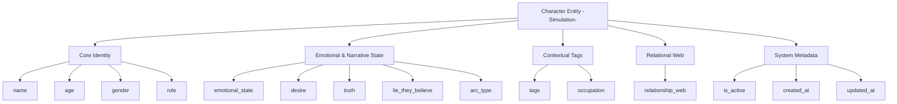

```mermaid

mindmap
  root((**Character Documentation**))
    Core_Identity
      Name
      Age
      Gender
      Role
      Affiliation
      Backstory
    Psych_Profile
      Personality_Traits
      Flaws
      Fears
      Desire
      Values_and_Beliefs
      Contradictions
      Self_Image
    Narrative_Arc
      Ghost
      Lie_They_Believe
      Truth
      Transformation
      Driving_Conflict
      Climactic_Choice
    POV_Characterization
      Voice_Tone
      Subtextual_Layering
      Sensory_Anchoring
      Bias_and_Subjectivity
    Relational_Logic
      Family_Dynamics
      Romantic_Life
      Relationship_Web
    Story_Function
      Archetype
      Empathy_Hooks
      Tags
    Metadata
      UID
      Created_At
      Updated_At
      Templates_Used
```

```mermaid

flowchart TD
A[Character Entity -Simulation-]
A --> B[Core Identity]
B --> B1[name]
B --> B2[age]
B --> B3[gender]
B --> B4[role]
A --> C[Emotional & Narrative State]
C --> C1[emotional_state]
C --> C2[desire]
C --> C3[truth]
C --> C4[lie_they_believe]
C --> C5[arc_type]
A --> D[Contextual Tags]
D --> D1[tags]
D --> D2[occupation]
A --> E[Relational Web]
E --> E1[relationship_web]
A --> F[System Metadata]
F --> F1[is_active]
F --> F2[created_at]
F --> F3[updated_at]

```
