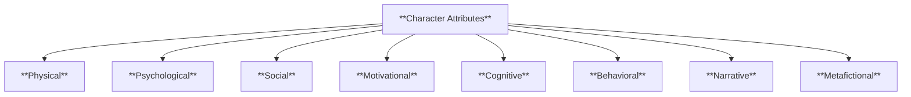

# INTERNAL REPORT — CHARACTER ATTRIBUTE FRAMEWORK

**Division**: Narrative Systems Development  
**Prepared For**: FLUBBERGLAM OPS | Knowledgebase Oversight  
**Prepared By**: Hubertimus Magillicutty  
**Date**: 2025-04-12  
**UID**: report_char_attr_001

---

## 📌 Executive Summary

As of this report, we have successfully completed the **first-phase consolidation and schema formalization** of narrative character attributes for integration into the unified knowledgebase system. This includes:

- A comprehensive taxonomy of attributes segmented into 8 major narrative dimensions.
- Full semantic definitions of each attribute field, suitable for database population or frontend form generation.
- Mermaid diagram for visual structure mapping.
- Markdown-ready documentation with internal linking for live systems (Obsidian, Docsify, etc.).
- Schema metadata support for knowledge management layers.

---

## ✅ Completed Milestones

### 1. **Attribute Categorization**

We identified and validated 8 narrative-relevant attribute domains:

- Physical
- Psychological
- Social
- Motivational
- Cognitive
- Behavioral
- Narrative
- Metafictional

Each domain contains subfields with concise labels and expandable definitions, all structured for JSON/YAML implementation.

---

### 2. **Schema Creation**

A schema was produced with:

- Field-level definitions
- UID and metadata fields
- Hierarchical nesting of subfields
- Grade level and knowledge type fields for curriculum-based modeling

This schema is ready for integration into character modeling tools, writing pipelines, or database-backed worldbuilders.

---

### 3. **Documentation Output**

A knowledgebase-compatible page was drafted:

- With full Table of Contents
- Markdown headers for inline linking
- Domain-specific sections and definitions
- Mermaid flowchart showing categorical structure

This document can be plugged directly into the internal documentation system for developer or writer reference.

---

## 🧠 Outstanding Tasks

| Task                                                          | Status      | Owner            | Priority |
| ------------------------------------------------------------- | ----------- | ---------------- | -------- |
| Turn schema into JSON + YAML templates                        | Pending     | Schema Ops       | High     |
| Create Obsidian-ready character entry template                | Drafting    | KM Team          | Medium   |
| Validate schema against existing character builds             | In Progress | QA Narrative Dev | High     |
| Expand metafictional attributes into separate advanced module | Not Started | Theory Unit      | Medium   |

---

## 🔍 Recommendations

- Move forward with versioning system for character schemas to support evolution over time.
- Begin working on inheritance templates (e.g., Heroic Template, Antihero Template) that apply modifiers to the base schema.
- Assign integration taskforce to sync this schema with astrological and psychological layers.

---

## 📎 Appendices

### Mermaid Category Flowchart

