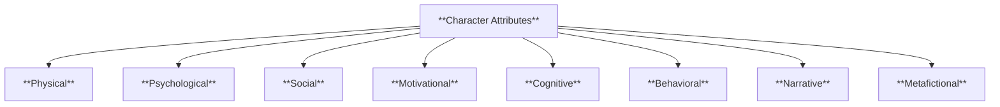

# **General Character Attributes in Narrative**

> **Definition**:  
> Character attributes are the distinct features, qualities, and traits that define a fictional character’s identity, motivations, and behavior within a narrative. They serve as the foundation for understanding and constructing believable, dynamic, and purpose-driven characters in storytelling.

---

## **Table of Contents**

- [**General Character Attributes in Narrative**](#general-character-attributes-in-narrative)
  - [**Table of Contents**](#table-of-contents)
  - [**1. Physical Attributes**](#1-physical-attributes)
  - [**2. Psychological Attributes**](#2-psychological-attributes)
  - [**3. Social Attributes**](#3-social-attributes)
  - [**4. Motivational Attributes**](#4-motivational-attributes)
  - [**5. Cognitive Attributes**](#5-cognitive-attributes)
  - [**6. Behavioral Attributes**](#6-behavioral-attributes)
  - [**7. Narrative Attributes**](#7-narrative-attributes)
  - [**8. Metafictional Attributes**](#8-metafictional-attributes)
  - [**9. Schema Metadata**](#9-schema-metadata)
  - [**10. Mermaid Chart**](#10-mermaid-chart)

---

## **1. Physical Attributes**

Describes the character’s outward appearance and physiological condition.

- **Appearance**: Body type, facial features, distinguishing marks.
- **Clothing/Style**: Preferred fashion or costume; signals personality or class.
- **Age**: Actual or perceived age; important for status and relatability.
- **Health**: Physical condition including chronic illness, stamina, fitness.

---

## **2. Psychological Attributes**

Covers internal states, personality, and mental well-being.

- **Personality Traits**: Persistent tendencies (e.g., stubborn, playful).
- **Fears and Desires**: Core motivators, anxieties, and aspirations.
- **Emotional Disposition**: Emotional baseline (e.g., anxious, detached).
- **Mental Health**: Disorders, coping mechanisms, or breakdowns.

---

## **3. Social Attributes**

Explores the character’s societal position and interpersonal dynamics.

- **Role**: Position in family, society, or job.
- **Relationships**: Key figures that shape the character (e.g., rival, sibling).
- **Reputation**: External perception by others in the story.
- **Cultural Background**: Ethnicity, religion, traditions, and values.

---

## **4. Motivational Attributes**

Reveals what drives the character’s choices and actions.

- **Goals**:
  - _Short-Term_: Immediate, task-oriented aims.
  - _Long-Term_: Lifelong ambitions or emotional closure.
- **Drives**: Internal forces like lust, duty, curiosity.
- **Values**: Guiding principles or moral compass.
- **Flaws and Virtues**: Moral or psychological strengths/weaknesses.

---

## **5. Cognitive Attributes**

Reflects the character’s intellectual capacity and worldview.

- **Intelligence**: Logical reasoning, abstract thought, problem-solving.
- **Worldview**: Philosophical or ideological stance.
- **Skillset**: Learned or trained abilities.
- **Biases**: Prejudices, assumptions, blind spots.

---

## **6. Behavioral Attributes**

Describes action patterns and behavioral tendencies.

- **Speech Patterns**: Accent, rhythm, vocabulary choices.
- **Habits**: Repetitive actions or rituals.
- **Decision-Making**: Impulsive vs. analytical, moral vs. pragmatic.
- **Actions Under Stress**: Behavior in crisis or conflict.

---

## **7. Narrative Attributes**

These define the character’s role and transformation within the story.

- **Character Arc**: The trajectory of change (or stasis).
- **Function**: Narrative purpose (e.g., hero, villain, mentor).
- **Backstory**: Significant past events shaping character.
- **Symbolism**: Thematic or metaphoric meaning they embody.

---

## **8. Metafictional Attributes**

Useful in postmodern or self-aware narratives.

- **Reader Effect**: Emotional or interpretive impact on the audience.
- **Narrative Control**: Awareness or manipulation of their role in the story.
- **Ontological Status**: Diegetic (inside the story) or metafictional (breaking the fourth wall).

---

## **9. Schema Metadata**

Supports organizational use in databases or knowledge management systems.

- **uid**: Unique ID for reference and linking.
- **name**: Character’s full name.
- **role**: Narrative archetype or structural function.
- **created_by**: Author or contributor who defined the character.
- **created_on**: Date of creation or registration.
- **tags**: Thematic keywords for filtering/search.
- **grade_level**: Complexity of the character's role (1 = simple, 10 = literary depth).
- **knowledge_type**: `explicit` (clearly described) or `tacit` (subtle, inferred).

---

## **10. Mermaid Chart**

---
