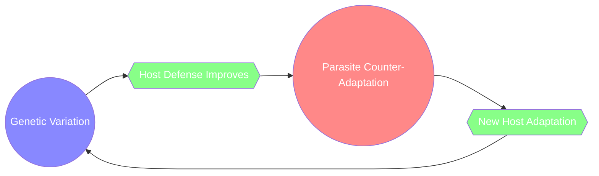
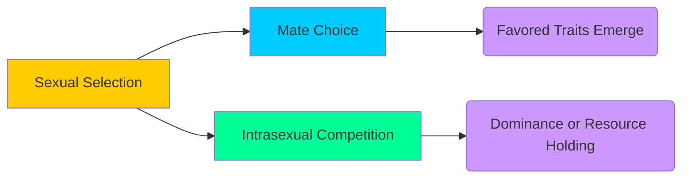
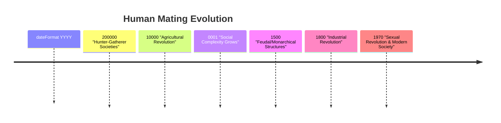

# SOURCE: _The Red Queen: Sex and the Evolution of Human Nature_ by Matt Ridley

Below is a comprehensive, quick-reference guide in the style of a QuickStudy Laminated Reference Guide. It highlights **key themes**, **arguments**, and **takeaways** in a bulleted format, enhanced with embedded charts, diagrams, and callout boxes for clarity.

---

## OVERVIEW & KEY CONCEPTS

- **Author & Context**

  - Written by **Matt Ridley**, first published in **1993**.
  - Title refers to Lewis Carroll’s _Through the Looking-Glass_ character, the Red Queen, who runs constantly just to stay in place—an analogy for **evolutionary arms races**.
  - Explores how sexual reproduction and selection shape **human nature**, **behavior**, and **cultural phenomena**.

- **Central Thesis: “The Red Queen Hypothesis”**

  1. **Organisms must constantly adapt and evolve** to survive against ever-evolving opposing organisms (parasites, predators, competitors).
  2. Sexual reproduction is nature’s way of **generating genetic diversity**, helping species stay one step ahead of parasites and disease.

- **What the Book Covers**
  - **Sexual Selection**: How competition for mates influences traits.
  - **Evolution of Human Mating Behavior**: From polygamy to monogamy, analyzing psychological underpinnings.
  - **Genetic Arms Races**: Ongoing battles between hosts and parasites.
  - **Cultural and Social Implications**: How evolved instincts shape societal norms, courtship, marriage, and more.

---

## CHAPTER-BY-CHAPTER HIGHLIGHTS

> **Callout**: Chapter structures vary by edition; these key points combine overarching themes from the book’s major sections.

1. **Why Sex?**

   - Introduces the puzzle of why sexual reproduction evolved despite being **costly** (only half of one’s genes are passed on).
   - **Key Insight**: Variation from sexual reproduction helps resist parasites—recombination of genes as a “moving target.”

2. **The Red Queen Principle**

   - Explores the **evolutionary arms race**:
     - **Hosts vs. Parasites**
     - **Males vs. Males** in competition
     - **Females vs. Females** in competition
   - **Arms Race**: Each side escalates or adapts, forcing the other to keep pace or face extinction.

3. **The Lottery Principle & The Tangled Bank Hypothesis**

   - **Lottery Principle**: Genetic “tickets” leading to varied offspring, increasing a lineage’s chance of success.
   - **Tangled Bank**: Dense ecological communities need diverse offspring to reduce direct competition.

4. **Mate Choice & Sexual Selection**

   - Explains how **peacock feathers**, **bird song**, or **human ornamentation** can be explained by sexual selection.
   - **Examples**:
     - _Peacock’s tail_ → a costly signal of fitness.
     - _Human courtship rituals_ → signals of resource potential, intelligence, or health.

5. **Human Nature & Culture**

   - Investigates how evolutionary pressures might shape:
     - **Male-female cognitive differences**
     - **Standards of beauty and attractiveness**
     - **Social constructs like marriage, infidelity, and jealousy**

6. **Monogamy vs. Polygamy**

   - **Polygynous societies**: Often correlated with greater variance in male reproductive success.
   - **Monogamy**: Encouraged by social structures where paternal investment is beneficial and child survival depends on biparental care.
   - Ridley links **ecological constraints** with social norms (e.g., resource distribution, paternal certainty).

7. **The Evolution of Human Intelligence**

   - Suggests that **intelligence** (and the brain’s complexity) partly evolved as a result of **sexual selection**.
   - Social and sexual competition spurred the development of higher cognitive skills (e.g., deception, cooperation, planning).

8. **Implications & Modern Understandings**
   - Raises questions on how innate evolutionary drives conflict or align with contemporary social practices (e.g., dating apps, changing sexual norms).

---

## KEY THEMES & TAKEAWAYS

- **Sexual Selection as a Creative Force**
  - More than just survival; it guides the evolution of **traits, behaviors, and cognition**.
- **Genetic Diversity = Adaptive Flexibility**
  - Sex is “expensive,” but it’s an insurance policy against **rapidly evolving parasites** and environmental changes.
- **Arms Race Metaphor**
  - Organisms (including humans) are locked in constant battle—**stagnation = extinction**.
- **Evolution Doesn’t Equal Moral Justification**
  - Ridley cautions against using biological explanations as moral endorsements. **“Is” does not mean “ought.”**

---

## CALLOUT EXAMPLES & NOTABLE ITEMS

> **Mind Model**: Picture two fish species in the same pond. Each fish that can better **evade or resist** parasites passes on those genes. Parasites evolve to breach defenses. Round and round they go, never fully eliminating the other.

> **Process**:  
> **1. Variation** → **2. Selection Pressure** → **3. Differential Reproduction** → **4. Evolution of Traits**

> **Key Term**: **Zahavi’s Handicap Principle**—Displays (like a peacock’s tail) are **reliable** signals of genetic quality precisely because they are costly.

---

## ILLUSTRATIONS & DIAGRAMS

### 1. Evolutionary Arms Race (Flowchart)



- **Explanation**: Cycle of mutation, selection, and adaptation ensures the race never ends.

---

### 2. Sexual Selection Model (Concept Map)



- **Key Idea**: Sexual selection involves **mate choice** (e.g., females selecting for best traits) and **competition** (males competing with other males).

---

### 3. Human Mating Strategies (Simplified Timeline)



- **Observation**: Shifts in economic, social, and technological factors influence **mating systems**, **family structure**, and **courtship norms** over time.

---

## FURTHER READING & REFERENCES

- **Key Studies**

  1. **Fisher, R.A.** (1930). _The Genetical Theory of Natural Selection._
  2. **Zahavi, A.** (1975). “Mate selection—A selection for a handicap.” _Journal of Theoretical Biology_, 53(1).
  3. **Trivers, R.L.** (1972). “Parental investment and sexual selection.” In B. Campbell (Ed.), _Sexual selection and the descent of man_.

- **Context & Criticism**

  - **Gould, S.J. & Lewontin, R.C.**: Critique the adaptationist view; caution about oversimplifying complex traits.
  - **Buss, D.M.** (1994). _The Evolution of Desire_: Overlaps with Ridley’s ideas but delves deeper into psychology.

- **Ridley’s Other Works**
  - _Genome_ (1999) – Explores genetics and the mapping of the human genome.
  - _The Origins of Virtue_ (1996) – Focuses on cooperation and social behavior.

---

## PRINTING & UTILIZATION

- **Format**: This single-page, two-sided reference can be printed on **standard letter paper (8.5" x 11")**.
- **Recommended Use**:
  - Great for **study groups**, **lecture handouts**, or as a **quick refresher** before discussions or exams.
  - Color-coding helps emphasize **host-parasite dynamics**, **sexual selection**, and the **timeline of human mating strategies**.

---

### FINAL TAKEAWAY

Ridley’s _The Red Queen_ popularizes the idea that **sex and sexual selection are engines of human nature**, keeping us perpetually in motion—evolving and adapting in a race against parasites, competitors, and each other. Its insights shape modern evolutionary psychology, biology, and our understanding of human behavior.

---

```

```
