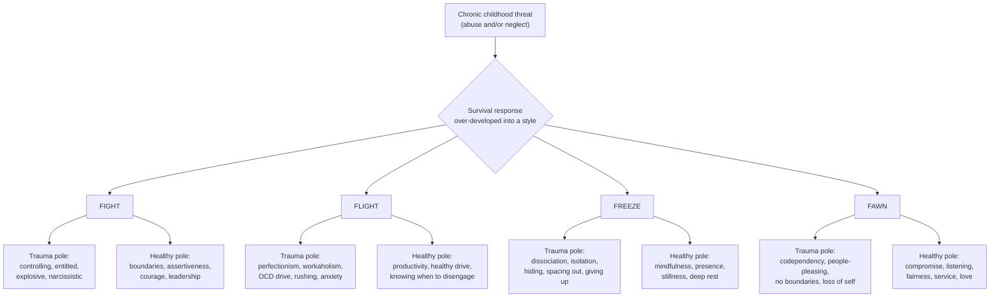
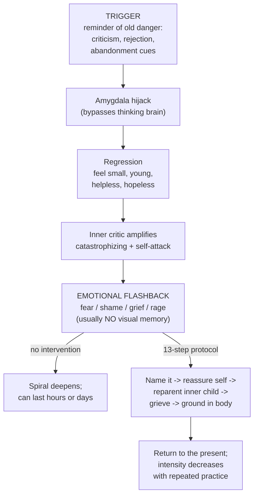
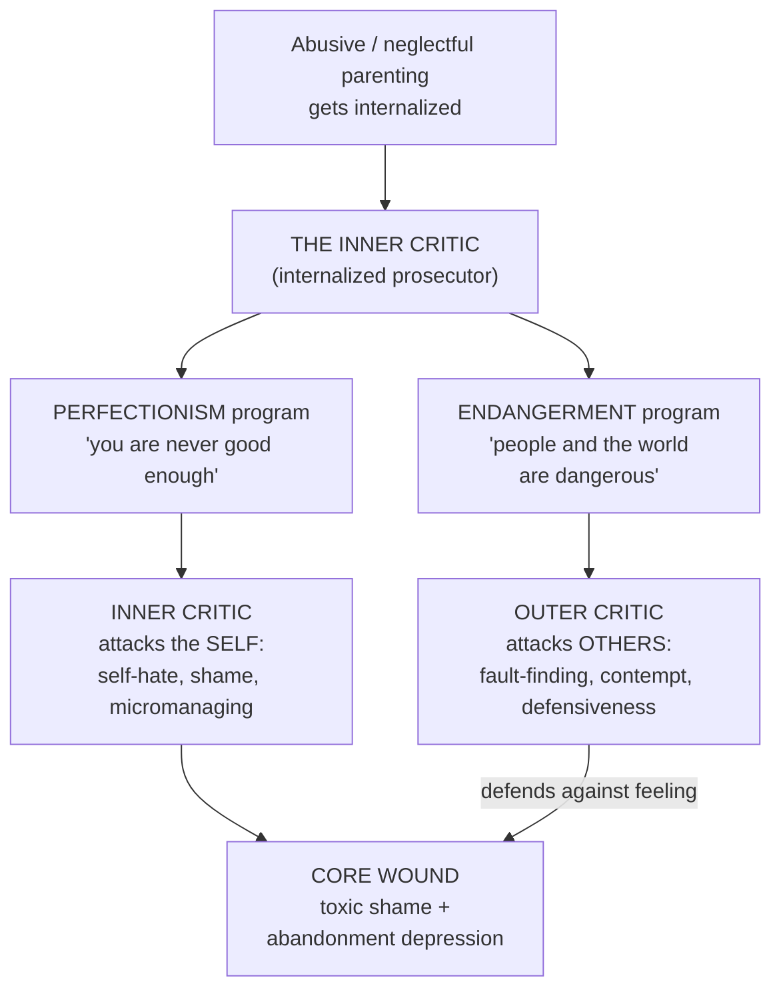
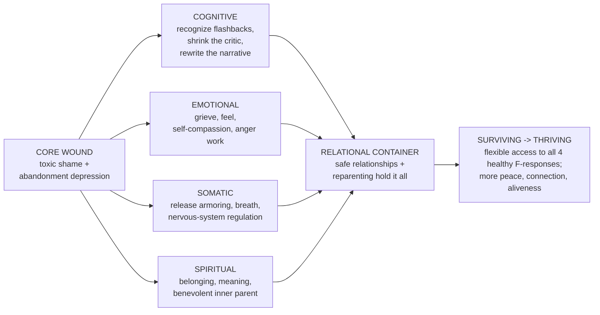
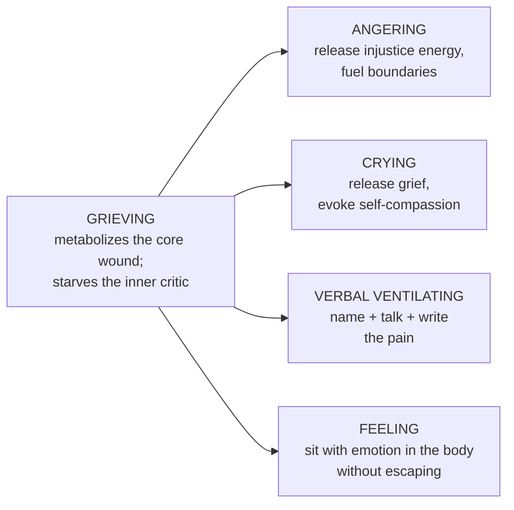

---
title: "Complex PTSD: From Surviving to Thriving — Comprehensive Field Guide"
author_source: "Pete Walker, M.A. (2013)"
type: book-summary
tags: [cptsd, trauma, inner-critic, emotional-flashbacks, 4Fs, reparenting, grieving]
status: reference
---

# Complex PTSD: From Surviving to Thriving — Comprehensive Field Guide

> An educational summary and working map of Pete Walker's *Complex PTSD: From Surviving to Thriving: A Guide and Map for Recovering from Childhood Trauma* (2013). Models are paraphrased and reorganized for reference, not reproduced verbatim. The cheat sheet at the very bottom is built to be printed and hung where you can see it (which is exactly how Walker intends the flashback steps to be used).

---

## Table of Contents

1. [The One-Paragraph Version](#1-the-one-paragraph-version)
2. [What Complex PTSD Actually Is](#2-what-complex-ptsd-actually-is)
3. [The Core Symptom Cluster](#3-the-core-symptom-cluster)
4. [Emotional Flashbacks — The Cornerstone Concept](#4-emotional-flashbacks--the-cornerstone-concept)
5. [The 4F Model — Trauma Typologies](#5-the-4f-model--trauma-typologies)
6. [The Inner Critic and the Outer Critic](#6-the-inner-critic-and-the-outer-critic)
7. [Toxic Shame and the Abandonment Depression](#7-toxic-shame-and-the-abandonment-depression)
8. ["What If I Was Never Hit?" — Emotional Neglect](#8-what-if-i-was-never-hit--emotional-neglect)
9. [The Recovery Framework — Healing Across Levels](#9-the-recovery-framework--healing-across-levels)
10. [Reparenting — Self-Mothering and Self-Fathering](#10-reparenting--self-mothering-and-self-fathering)
11. [Grieving — The Engine of Recovery](#11-grieving--the-engine-of-recovery)
12. [Shrinking the Critic — The Toolkit](#12-shrinking-the-critic--the-toolkit)
13. [Healing in Relationship](#13-healing-in-relationship)
14. [The Arc — Surviving to Thriving](#14-the-arc--surviving-to-thriving)
15. [Visual Models (Mermaid)](#15-visual-models-mermaid)
16. [The Cheat Sheet](#16-the-cheat-sheet)
17. [Glossary](#17-glossary)

---

## 1. The One-Paragraph Version

Complex PTSD is the injury that results from *prolonged, repeated* trauma in childhood — not a single catastrophic event, but a chronic atmosphere of abuse and/or neglect during the years a self is being built. Because the danger was relational and ongoing, the child develops a survival personality organized around defense. In adulthood, that defense system fires when it isn't needed, producing **emotional flashbacks** (sudden regressions into childhood feeling-states), a vicious **inner critic**, **toxic shame**, and **self-abandonment**. Walker's contribution is to make this legible and *workable*: he maps the survival styles (the **4Fs**), names the machinery (inner/outer critic), and lays out a multi-level recovery path whose core engine is **grieving** and whose container is **safe relationship**. The goal is not a cure or a "salvation moment" but a gradual shift from surviving to thriving — more peace, more presence, more aliveness, and flexible access to one's full range of healthy responses.

---

## 2. What Complex PTSD Actually Is

**The distinction from PTSD.** Classic PTSD typically follows a discrete, overwhelming event (a crash, a combat incident, an assault) and is often marked by visual, intrusive re-experiencing. Complex PTSD (Cptsd) is *developmental*: it arises from being marinated in danger over the formative years. The trauma is the relationship and the environment itself.

**Abuse and/or neglect.** A central Walker point: it is *not only* overt abuse that causes Cptsd. Chronic **emotional neglect** — never being soothed, mirrored, protected, or welcomed — is sufficient on its own. A child does not need to be hit to be traumatized; abandonment can be just as formative.

**Why it shapes the whole self.** A child cannot leave, cannot fight back effectively, and cannot conceptualize the abuse as the parent's failure. So the child does the only thing available: adapts. The developing personality molds itself around the threat. The defenses that kept the child psychologically alive then *persist* into adulthood, long after they've outlived their usefulness, because they were installed before conscious choice existed.

**A continuum, not a binary.** Walker frames Cptsd as a spectrum of severity rather than an on/off diagnosis. People land at different points depending on the intensity, duration, and type of childhood adversity — and on what protective factors (one safe adult, one refuge) they did or didn't have.

---

## 3. The Core Symptom Cluster

Walker describes a constellation of recurring features. The most diagnostic and frequently emphasized:

- **Emotional flashbacks** — the signature symptom (see §4).
- **A tyrannical inner critic** — relentless, perfectionistic self-attack (see §6).
- **Toxic shame** — the felt sense of being fundamentally defective (see §7).
- **Self-abandonment** — automatically siding against yourself; abandoning your own needs, feelings, and perceptions the way your caretakers did.
- **Social anxiety / attachment difficulty** — a learned sense that people are unsafe, that connection invites harm or humiliation.

Surrounding these are common downstream features: chronic abandonment depression, dissociation, hypervigilance and a nervous system stuck in sympathetic arousal, attachment disorders, addictions and other "managers" used to numb pain, oversensitivity to perceived rejection, and a shaky or absent sense of self-worth. Not everyone has every feature; the profile varies, partly along the 4F lines below.

---

## 4. Emotional Flashbacks — The Cornerstone Concept

If you remember one idea from Walker, make it this one.

**Definition (paraphrased).** Emotional flashbacks are sudden, often prolonged regressions into the overwhelming *feeling-states* of being an abused or abandoned child — floods of fear, shame, alienation, rage, grief, or despair, frequently with the fight/flight system triggered for no present-day reason.

**The key difference from PTSD flashbacks: usually no picture.** There is typically *no visual memory* attached. You don't see the past; you are suddenly *drowning in its emotions*. This is why they're so confusing and so often missed — there's no obvious "movie" to explain why you suddenly feel six years old, tiny, and in danger. The feeling seems to come from nowhere.

**How to recognize one (the tells):**
- The reaction is wildly disproportionate to the trigger.
- You suddenly feel **small, young, helpless, and hopeless**. (Feeling little is, per Walker, a near-certain sign.)
- Past and present "cross wires" — a minor present event carries the emotional charge of old wounds.
- The inner critic spikes, catastrophizing and attacking.
- Time distorts — it feels like this state is permanent and there's no way out ("eternity thinking").

**The mechanism.** A trigger (criticism, a raised voice, a hint of rejection or abandonment, certain situations) sets off an *amygdala hijack* that bypasses the thinking brain. You **regress**, the inner critic pours fuel on the fire, and the flashback intensifies and can run for hours or days if not interrupted.

**Why naming matters.** Simply recognizing *"I am having a flashback"* breaks the spell partway, because it relocates the experience: this is old, not now; this is a memory of danger, not present danger. That recognition is step one of the 13-step protocol (full version in the cheat sheet).

---

## 5. The 4F Model — Trauma Typologies

Walker's most widely cited framework. When chronically threatened, a child reaches for one (or a blend) of four instinctual survival strategies — **Fight, Flight, Freeze, Fawn** — and over time *over-relies* on it until it hardens into a defensive personality style. Walker is widely credited with naming and popularizing the **Fawn** response as a distinct trauma type.

Each F is best understood as a **continuum with a trauma pole and a healthy pole**. Recovery is not about deleting your type — it's about loosening its grip and *recovering access to the healthy version of all four*, plus the flexibility to choose the right one for the situation.

| Type | Underlying survival logic | Trauma-pole (over-developed) | Healthy-pole (the goal) | Often linked to |
|---|---|---|---|---|
| **Fight** | "If I dominate the threat, I'm safe." | Controlling, entitled, explosive, demanding, bullying; uses anger to keep others at bay | Healthy assertiveness, boundaries, courage, leadership, standing up for self and others | Narcissistic defenses |
| **Flight** | "If I outrun it / stay busy / get it perfect, I'm safe." | Perfectionism, workaholism, obsessive-compulsive drive, chronic rushing, anxiety, adrenaline-seeking | Industriousness, healthy drive and productivity, knowing when to disengage and exit | Obsessive-compulsive tendencies |
| **Freeze** | "If I disappear / go numb, it can't reach me." | Dissociation, isolation, hiding, spacing out, escape into sleep/fantasy/screens, giving up | Mindfulness, presence, stillness, the capacity to rest deeply and be at peace | Dissociative defenses |
| **Fawn** | "If I please and serve, I won't be hurt." | Codependency, compulsive people-pleasing, no boundaries, loss of self, merging into others' needs | Compromise, listening, fairness, service, love, healthy mutuality and negotiation | Codependent / relational defenses |

**Hybrids are the rule, not the exception.** Most people are blends — e.g., **Fight-Fawn** (charming but controlling), **Flight-Freeze** (driven, then crashes into shutdown), **Fawn-Freeze** ("the doormat" / servitude plus withdrawal). Walker uses hybrids to explain why people don't fit neatly into one box.

**The polarized pairing.** A classic dynamic: a Fawn type (gives endlessly, no boundaries) bonds with a Fight type (takes, dominates) — recreating the childhood power imbalance. Recognizing your default helps you spot and exit these re-enactments.

**Why it's useful.** The 4Fs turn "what's wrong with me?" into "which survival strategy did I have to over-build, and what's its healthy form?" That reframe is itself part of shrinking shame.

---

## 6. The Inner Critic and the Outer Critic

The inner critic is the *internalized voice of the abusive/neglectful caretakers*. The child, unable to blame the parent (too dangerous, too destabilizing), turns the criticism inward: "If I were just good enough / perfect enough / quiet enough, I'd be safe and loved." That bargain installs a permanent internal prosecutor.

**Two core programs drive it:**
- **Perfectionism** — *"You are never good enough."* All-or-nothing standards, micromanaging, harsh self-judgment, self-hate when you fall short. (Walker catalogs these as the *14 Common Inner Critic Attacks* — perfectionism, all-or-nothing thinking, self-hate/self-disgust, micromanaging/worrying, harsh judgment of self and others, and so on.)
- **Endangerment** — *"People and the world are dangerous; stay hypervigilant."* This program keeps the survivor scanning for threat and bracing for attack, sustaining chronic nervous-system arousal.

**The Outer Critic.** When the inner critic's self-attack becomes unbearable, the psyche can flip it outward: the **Outer Critic** projects the same perfectionism and endangerment onto *other people* — scanning them for flaws, contempt, defensiveness, fault-finding, "they're not safe / not good enough." It feels protective (better to attack than be attacked, better to find their flaw first) but it isolates and corrodes relationships. The inner and outer critic are two faces of the same machine; both are fueled by the same underlying pain.

**4F flavors of the critic.** Different types skew differently: Fight/flight types tend to externalize (outer critic, blame, control), while Fawn/freeze types tend to internalize (inner critic, self-blame, collapse). Recovery means catching the critic *in either direction* and refusing to obey it.

---

## 7. Toxic Shame and the Abandonment Depression

These are the **core wounds** underneath all the defenses. The 4Fs and the critic exist precisely to keep a person from having to *feel* these two things.

**Toxic shame.** Ordinary shame says *"I did something bad."* Toxic shame says *"I **am** bad"* — a global, identity-level conviction of being defective, disgusting, unlovable, fundamentally wrong. It's installed by being chronically treated as a burden, a disappointment, or a problem. It is the emotional engine of self-abandonment: if you believe you're worthless, siding against yourself feels natural.

**The abandonment depression.** Borrowing from Masterson, Walker describes the deep, almost *death-like* despair and emptiness a child sinks into when chronically left alone emotionally — the void beneath the defenses. As children, we couldn't survive feeling it fully, so we built the survival strategies to escape it. In adulthood, an emotional flashback is often a partial drop *back into this void*.

**Why this matters for recovery.** Healing is not about never feeling these states. It's about building enough internal and relational support that you can *feel and grieve* the shame and abandonment without being annihilated by them — which is what finally drains their power. The defenses can soften only when the wound underneath can be met.

---

## 8. "What If I Was Never Hit?" — Emotional Neglect

Walker devotes serious attention to survivors who doubt their own pain because nothing "bad enough" happened — no beatings, no overt catastrophe. His answer: **emotional neglect and verbal/emotional abuse are traumatizing in their own right.** A childhood of being unseen, unsoothed, unprotected, dismissed, or used as an emotional caretaker for the parent leaves the same core wounds — toxic shame, abandonment depression, a punishing critic — even with no visible bruises. This chapter exists to dissolve the gatekeeping ("it wasn't that bad, others had it worse") that keeps neglect survivors from claiming their experience and starting recovery.

---

## 9. The Recovery Framework — Healing Across Levels

Walker frames recovery as work that proceeds across several **levels/dimensions** at once, all held within a relational container. No single level is sufficient alone.

- **Cognitive.** Psychoeducation (understanding Cptsd, recognizing flashbacks), shrinking the inner critic, thought-correction and thought-substitution, and rebuilding an accurate, compassionate self-narrative. This is where "perspective" gets installed.
- **Emotional.** Reclaiming the right to feel; **grieving** the losses; building self-compassion; healthy anger work. This is the affective heart of recovery (see §11).
- **Spiritual.** A felt sense of belonging, meaning, and connection — and the cultivation of a *benevolent inner parent / source of self-compassion*. Not necessarily religious; it's about no longer being existentially alone inside yourself.
- **Somatic.** Body-based regulation: releasing chronic muscular *armoring*, slowing and deepening the breath, calming the nervous system, becoming *un-adrenalized*. The body holds the trauma, so the body must be part of the cure.

**The relational container.** Surrounding all four is the truth that **deep relational wounds heal in safe relationships** (see §13).

**Recovery is non-linear.** Walker is emphatic: there is no salvation moment, no permanent "fixed." Progress is *gradual and uneven* — often two steps forward, one step back. The realistic goal is to **increase the frequency, depth, and duration of periods of peace, connection, and aliveness**, and to recover faster from setbacks — not to eliminate setbacks.

---

## 10. Reparenting — Self-Mothering and Self-Fathering

Because the wounds came from inadequate parenting, a central task is to *become* the parent you needed — to your own inner child.

- **Self-mothering** = unconditional love, tenderness, comfort, soothing, gentleness, and emotional presence. The reassuring "I love you, you're safe, come to me when you're scared" voice. This directly counters toxic shame and abandonment.
- **Self-fathering** = structure, advocacy, protection, and *going to bat* for yourself — setting boundaries, standing up against mistreatment (internal and external), asserting your rights. This directly counters helplessness and self-abandonment.
- **Reparenting by committee.** You can't do it all from inside at first. Safe friends, a good therapist, a partner, a support group, even books and communities supplement the reparenting until your own internal parent is strong enough. Healing is a *we* before it's fully a *me*.

The inner child work — speaking reassuringly to the frightened younger self, especially mid-flashback — is woven through the whole approach (it's step 4 of the flashback protocol).

---

## 11. Grieving — The Engine of Recovery

Walker treats **grieving as the central metabolic process** that drains the abandonment depression, dissolves toxic shame, and starves the inner critic. (This connects to his earlier book, *The Tao of Fully Feeling*.) He identifies **four grieving processes** — ideally used in combination:

1. **Angering.** Healthy anger that *releases the energy of old injustice* and *fuels boundaries and self-protection* — assigning responsibility to where it belongs (the abuse and the perpetrators), and channeling that energy into "No." This is **not** acting out or venting at present-day people; it's the directed metabolizing of stored injustice.
2. **Crying.** Tears release grief and, crucially, **evoke self-compassion** — turning the pain inward as kindness rather than self-attack.
3. **Verbal ventilating.** *Naming, talking, and writing out* the pain — to a safe person, a journal, or in self-dialogue. Putting words to the wordless reduces its grip.
4. **Feeling.** Simply *sitting with* the emotion in the body without escaping, numbing, or reacting self-destructively — letting fear or grief move through as energy that "cannot hurt you if you don't run from it."

Grieving is how a flashback becomes useful: each one is an *opportunity* to release old, unexpressed fear/hurt/abandonment and to validate and then soothe the child's past helplessness — converting tears into self-compassion and anger into self-protection.

---

## 12. Shrinking the Critic — The Toolkit

You can't reason the critic away in one move, but you can shrink it over time with repeated practice:

- **Thought-stopping.** Catch the attack early and *interrupt* it — refuse to let it run its endless exaggeration of danger. A firm internal "Stop!" or "No."
- **Thought-correction / thought-substitution.** Replace the distortion with an accurate, fair thought — ideally from a **memorized list of your qualities, accomplishments, and rights** prepared in advance (so it's available when you're flooded). The *Human Bill of Rights* and recovery affirmations serve here.
- **Angering at the critic.** Channel the energy of self-attack *against the critic itself* — "No! I will not shame, hate, or abandon myself." This redirects the aggression productively.
- **Grieving.** Beneath the critic's noise is the original pain; grieving it (per §11) removes the critic's fuel supply.
- **Refusing self-abandonment.** The throughline: side *with* yourself. Treat the critic as the old internalized abuser, not as truth.

Apply the same toolkit to the **outer critic** — catch the reflexive fault-finding and contempt toward others, and redirect toward accurate perception and safe connection.

---

## 13. Healing in Relationship

Cptsd is a *relational* injury, so its deepest healing is *relational*. Key threads:

- **The corrective relationship.** A safe, attuned relationship — often a good therapeutic one — provides the consistent care the original caretakers didn't, slowly rewiring the expectation that closeness equals danger.
- **From isolation to safe connection.** Shame drives hiding; "feeling shame doesn't mean you are shameful." Recovery means letting trusted people *in*, including educating intimates about your flashbacks so they can help you talk and feel through them.
- **Distinguishing safe from unsafe people.** Learning, often for the first time, what genuine safety, reciprocity, and respect feel like — and steering toward them while exiting re-enactments of the old power imbalance.
- **Working the Fawn pattern.** For codependent/fawn survivors especially, relational healing means *reclaiming a self* inside relationship — boundaries, preferences, the right to take up space — rather than disappearing into the other person's needs.

---

## 14. The Arc — Surviving to Thriving

The title is the thesis. **Surviving** = a life run by the defense system: hypervigilant, self-abandoning, critic-ruled, periodically hijacked by flashbacks, isolated or merged. **Thriving** = the defenses relax their grip; you have flexible access to the *healthy* version of all four F-responses; you can feel and grieve without being destroyed; you can stay present in your body and connected to safe people; periods of peace, aliveness, and self-compassion grow longer and more frequent. It is gradual, never total, and worth it.

---

## 15. Visual Models (Mermaid)

### 15.1 The 4F Trauma Typology

### 15.2 The Emotional Flashback Loop (and the exit)

### 15.3 The Inner Critic / Outer Critic Machine

### 15.4 The Recovery Framework — Levels Held in a Relational Container

### 15.5 Grieving — The Four Processes

---

## 16. The Cheat Sheet

> Print this. Walker's own instruction for the flashback steps is to hang them where you can see them so they become automatic when you're flooded.

### A. "Am I having an emotional flashback?" — quick checklist

Check any that fit. Several yeses = likely a flashback.

- [ ] My reaction feels **way bigger** than the trigger.
- [ ] I suddenly feel **small, young, helpless, or hopeless**.
- [ ] There's intense **fear / shame / grief / rage** with **no clear present-day cause**.
- [ ] There's usually **no visual memory** — just a flood of feeling.
- [ ] My inner critic is **screaming** (catastrophizing, self-attack).
- [ ] It feels like **this will never end** (eternity thinking).

### B. The 13 Steps for Managing a Flashback (condensed, paraphrased)

1. **Name it.** "I am having a flashback." These feelings are old memories that can't hurt me now.
2. **Remind yourself: I'm safe.** "I feel afraid, but I am not in danger. I am safe now, in the present."
3. **Claim your right to boundaries.** No one gets to mistreat you; you can leave and protest.
4. **Reassure the inner child.** "I love you unconditionally. Come to me when you're scared."
5. **Deconstruct eternity thinking.** It felt endless in childhood — but this flashback *will pass*, as it always has.
6. **Remember you're an adult now.** You have a grown body, allies, skills, and resources you never had as a kid. (Feeling little = sure sign of a flashback.)
7. **Ease back into your body:** relax each muscle group → breathe slow and deep → *slow down* (rushing hits the panic button) → find a safe, soothing spot → feel the fear as energy without reacting.
8. **Resist the critic.** Thought-stop its catastrophizing; refuse to shame/hate/abandon yourself; thought-substitute with your memorized list of qualities.
9. **Let yourself grieve.** Release the old fear, hurt, and abandonment; turn tears into self-compassion and anger into self-protection.
10. **Reach for safe support.** Take alone-time if needed, but don't let shame isolate you. Shame ≠ being shameful. Let intimates help.
11. **Identify your triggers.** Learn the people/places/processes that set you off; avoid or prep for them.
12. **Figure out what you're flashing back to.** Each flashback points to a wound to heal and an unmet need to meet.
13. **Be patient — recovery is slow and uneven.** Two steps forward, one back. Don't beat yourself up for having a flashback.

### C. The 4F quick-ID — and where you're headed

| If your default is… | Watch for (trauma pole) | Aim for (healthy pole) |
|---|---|---|
| **Fight** | Control, blame, anger-as-wall, entitlement | Boundaries, assertiveness, courage, leadership |
| **Flight** | Perfectionism, overwork, rushing, anxiety | Healthy drive + the ability to *stop* |
| **Freeze** | Isolating, dissociating, escaping, giving up | Presence, mindfulness, restorative stillness |
| **Fawn** | People-pleasing, no boundaries, self-erasure | Mutuality, fair compromise, boundaried service |

*Most people are hybrids. Goal = flexible access to all four healthy poles.*

### D. Shrinking the critic — four moves

1. **Thought-stop** the attack the moment you catch it.
2. **Thought-substitute** with your prepared list of qualities/rights.
3. **Anger at the critic:** "No — I will not shame, hate, or abandon myself."
4. **Grieve** the pain underneath; it's the critic's fuel.

### E. Grieving toolkit — four processes

- **Anger** (release injustice → fuel boundaries) ·
- **Cry** (release grief → self-compassion) ·
- **Talk/Write** (name the pain) ·
- **Feel** (sit with it without escaping).

### F. Reparenting — two voices to keep on call

- **Mother voice:** "You're safe. I love you. You're not alone." *(soothes shame + abandonment)*
- **Father voice:** "I've got you. We don't accept that treatment. I'll stand up for us." *(counters helplessness + self-abandonment)*

### G. 60-second emergency reset (somatic)

Name it → "I'm safe, this is old" → unclench muscles → 5 slow deep breaths → **slow down** → wrap up / safe spot → speak gently to the child inside.

---

## 17. Glossary

- **Cptsd / Complex PTSD** — trauma response from prolonged, repeated childhood abuse and/or neglect.
- **Emotional flashback** — sudden regression into childhood feeling-states, usually without visual memory.
- **4Fs** — Fight, Flight, Freeze, Fawn: the four survival-response types, each with trauma and healthy poles.
- **Fawn** — the appease/serve survival type; the basis of codependency (popularized by Walker).
- **Inner critic** — internalized voice of the caretakers running *perfectionism* + *endangerment* programs.
- **Outer critic** — the same critic projected outward onto other people as fault-finding and contempt.
- **Toxic shame** — the identity-level conviction "I *am* bad/defective," not just "I did bad."
- **Abandonment depression** — the death-like emptiness/despair beneath the defenses, from chronic emotional abandonment.
- **Self-abandonment** — automatically siding against your own needs, feelings, and perceptions.
- **Reparenting** — becoming the protective, loving inner parent you needed (self-mothering + self-fathering), often "by committee" at first.
- **Grieving** — angering, crying, verbal ventilating, and feeling: the engine that metabolizes the core wound.
- **Salvation fantasy** — the false belief in a single moment of total cure; recovery is gradual and non-linear instead.

---

*Educational summary of Pete Walker's framework for personal study. For working with these wounds in depth, Walker himself stresses the value of a safe, attuned therapeutic relationship.*
