- [**1. Title: McKee’s Genre Framework**](#1-title-mckees-genre-framework)
  - [**1.1. Definition**](#11-definition)
- [**2. Key Concepts**](#2-key-concepts)
  - [**2.1. Genre Conventions**](#21-genre-conventions)
    - [**2.1.1. Components of Genre Conventions**](#211-components-of-genre-conventions)
      - [**2.1.1.1. Thematic Elements**](#2111-thematic-elements)
      - [**2.1.1.2. Character Archetypes**](#2112-character-archetypes)
      - [**2.1.1.3. Plot Structures**](#2113-plot-structures)
      - [**2.1.1.4. Stylistic Nuances**](#2114-stylistic-nuances)
  - [**2.2. Subverting Expectations**](#22-subverting-expectations)
    - [**2.2.1. Components of Subverting Expectations**](#221-components-of-subverting-expectations)
      - [**2.2.1.1. Innovative Twists**](#2211-innovative-twists)
      - [**2.2.1.2. Thematic Layering**](#2212-thematic-layering)
  - [**2.3. Genre Fusion**](#23-genre-fusion)
    - [**2.3.1. Components of Genre Fusion**](#231-components-of-genre-fusion)
      - [**2.3.1.1. Complementary Elements**](#2311-complementary-elements)
      - [**2.3.1.2. Creative Flexibility**](#2312-creative-flexibility)
- [**3. Implications of McKee’s Genre Framework**](#3-implications-of-mckees-genre-framework)
  - [**3.1. Balanced Familiarity and Innovation**](#31-balanced-familiarity-and-innovation)
  - [**3.2. Strategic Narrative Choices**](#32-strategic-narrative-choices)
  - [**3.3. Sustained Relevance and Appeal**](#33-sustained-relevance-and-appeal)
- [**Core Components Overview**](#core-components-overview)

---

---

### **1. Title: McKee’s Genre Framework**

#### **1.1. Definition**

McKee’s Genre Framework positions genre as a foundational element of storytelling. Each genre offers distinct conventions—shared themes, character archetypes, plot structures, and stylistic attributes—that guide audience expectations. Mastery of these conventions enables writers to satisfy, subvert, or combine genre elements, thus enriching narratives and engaging audiences on multiple levels.

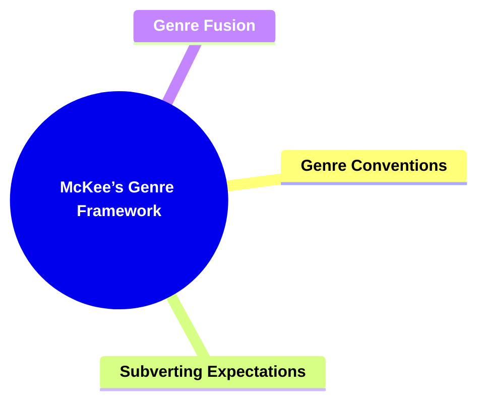

---

### **2. Key Concepts**

#### **2.1. Genre Conventions**

- **Definition:**
  The established patterns and traits that define a particular genre, providing a recognizable narrative blueprint.

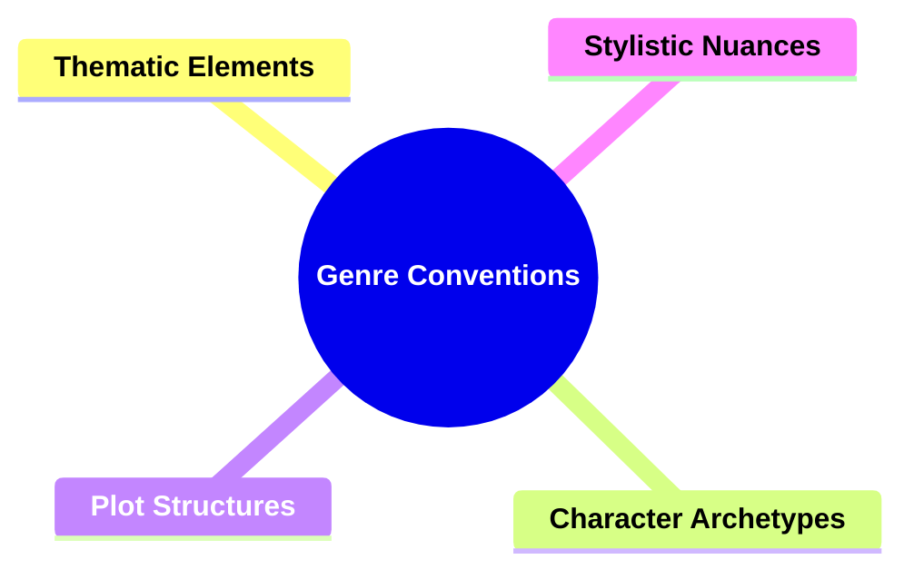

##### **2.1.1. Components of Genre Conventions**

###### **2.1.1.1. Thematic Elements**

- **Definition:**
  Recurring ideas or moral questions that consistently appear in a genre.
- **Characteristics:**
  - **Shared Concerns:** Common moral dilemmas or philosophical underpinnings.
  - **Emotional Resonance:** Themes that evoke predictable emotional responses.
  - **Cultural Familiarity:** Universally understood concepts that anchor the narrative.

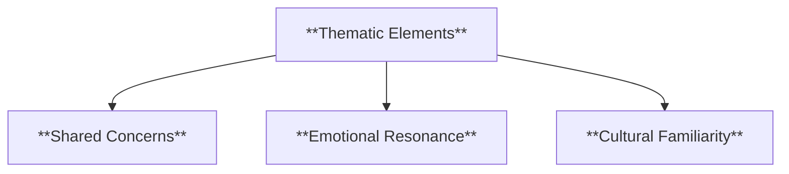

###### **2.1.1.2. Character Archetypes**

- **Definition:**
  Familiar character types that audiences expect within specific genres.
- **Characteristics:**
  - **Recognizable Roles:** Heroes, mentors, antagonists, or sidekicks that follow known patterns.
  - **Streamlined Introduction:** Less time is needed to establish motivations.
  - **Audience Anticipation:** Viewers or readers know what to expect from these roles.

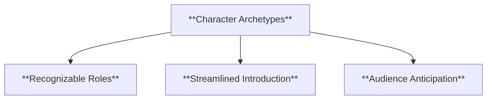

###### **2.1.1.3. Plot Structures**

- **Definition:**
  Traditional narrative patterns that shape the story’s progression.
- **Characteristics:**
  - **Predictable Milestones:** Inciting incidents, rising action, climax, and resolution adapted to genre norms.
  - **Clear Expectations:** Audiences anticipate certain conflicts or twists.
  - **Efficient Storytelling:** Writers use known patterns to streamline narrative development.

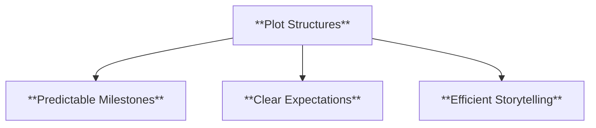

###### **2.1.1.4. Stylistic Nuances**

- **Definition:**
  Distinctive aesthetic or tonal features that distinguish one genre’s feel from another.
- **Characteristics:**
  - **Visual/Verbal Cues:** Lighting, color palettes, or linguistic style commonly associated with the genre.
  - **Atmospheric Consistency:** A unified mood that reinforces the genre’s identity.
  - **Immediate Recognition:** Audiences identify the genre through its style alone.

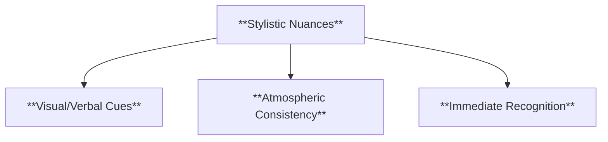

---

#### **2.2. Subverting Expectations**

- **Definition:**
  Intentionally challenging genre norms to surprise audiences and inject originality.

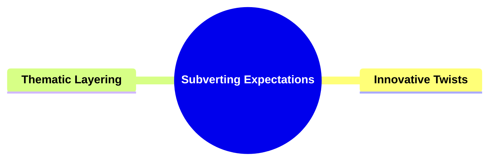

##### **2.2.1. Components of Subverting Expectations**

###### **2.2.1.1. Innovative Twists**

- **Definition:**
  Introducing plot turns or character traits that run counter to established genre formulas.
- **Characteristics:**
  - **Element of Surprise:** Defies audience predictions to maintain engagement.
  - **Refreshing Familiarity:** Utilizes known conventions as a base, then deviates to create novelty.
  - **Deeper Resonance:** Encourages audiences to reconsider their assumptions.

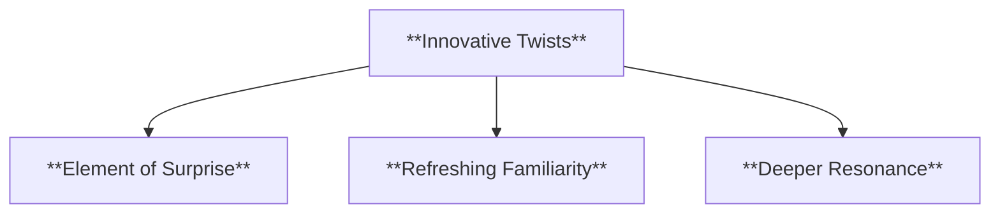

###### **2.2.1.2. Thematic Layering**

- **Definition:**
  Infusing the genre with new themes or social commentary that transcend traditional boundaries.
- **Characteristics:**
  - **Expanded Relevance:** Broadening the genre’s appeal and depth.
  - **Cultural Insight:** Addressing current societal issues or overlooked perspectives.
  - **Elevated Complexity:** Creating richer, more meaningful narratives within familiar frameworks.

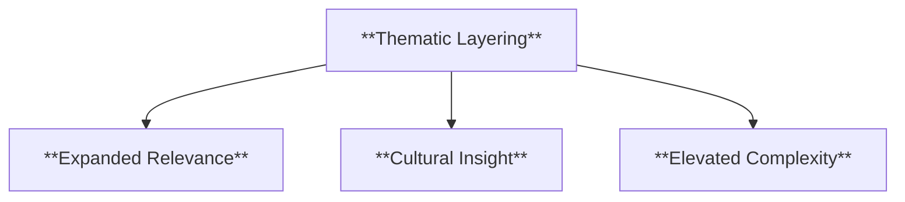

---

#### **2.3. Genre Fusion**

- **Definition:**
  Combining elements from multiple genres to form hybrid narratives that appeal to diverse tastes.

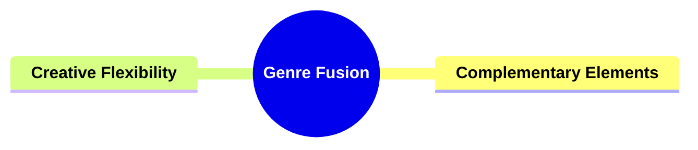

##### **2.3.1. Components of Genre Fusion**

###### **2.3.1.1. Complementary Elements**

- **Definition:**
  Selecting compatible features from different genres to enhance each other’s strengths.
- **Characteristics:**
  - **Harmonized Structures:** Blending narrative patterns that support, rather than conflict.
  - **Layered Atmosphere:** Coexisting tones and aesthetics that enrich narrative texture.
  - **Broader Audience Appeal:** Attracting fans from multiple genres.

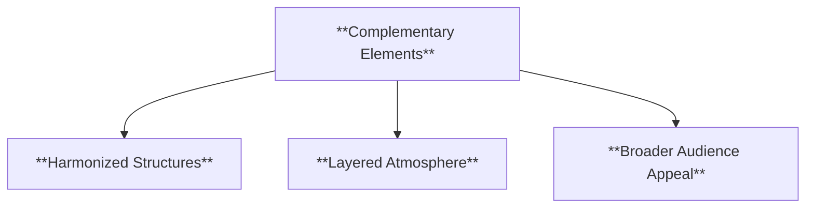

###### **2.3.1.2. Creative Flexibility**

- **Definition:**
  Leveraging mixed genres to experiment with storytelling forms, pacing, and character dynamics.
- **Characteristics:**
  - **Dynamic Innovation:** Freed from strict genre rules, writers explore new narrative possibilities.
  - **Adaptive Storytelling:** Adjusting tone, stakes, or style to fit a unique vision.
  - **Distinctive Identity:** Creating signature narratives that transcend conventional categorization.

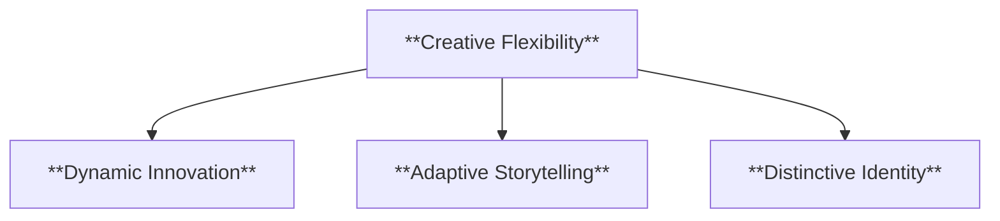

---

### **3. Implications of McKee’s Genre Framework**

#### **3.1. Balanced Familiarity and Innovation**

- **Description:**
  Writers who understand and respect genre conventions can deliver the comfort of familiarity while introducing surprising elements that keep audiences engaged.

#### **3.2. Strategic Narrative Choices**

- **Description:**
  Knowledge of genre norms and audience expectations informs deliberate storytelling decisions, ensuring coherent narratives that fulfill intended emotional and thematic goals.

#### **3.3. Sustained Relevance and Appeal**

- **Description:**
  Mastery of genre principles and flexible application through subversion or fusion contributes to narratives that remain resonant, memorable, and culturally significant.

---

### **Core Components Overview**

- **Genre Conventions**

  - Thematic Elements
  - Character Archetypes
  - Plot Structures
  - Stylistic Nuances

- **Subverting Expectations**

  - Innovative Twists
  - Thematic Layering

- **Genre Fusion**
  - Complementary Elements
  - Creative Flexibility

---

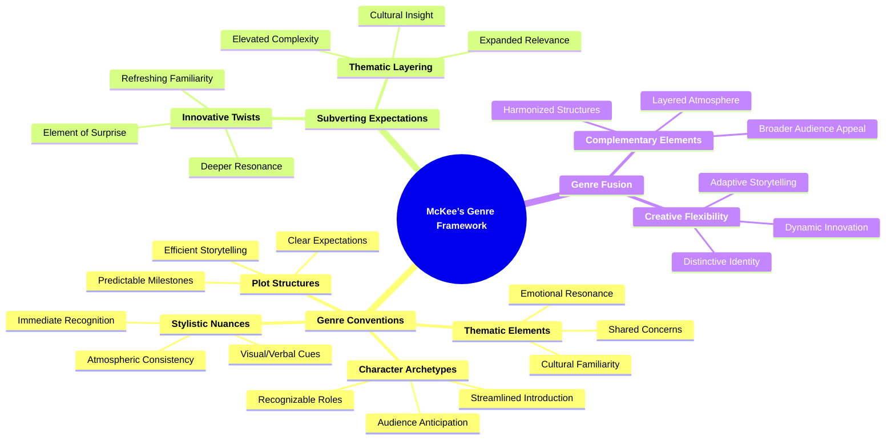
