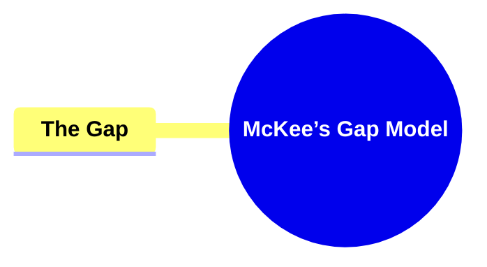
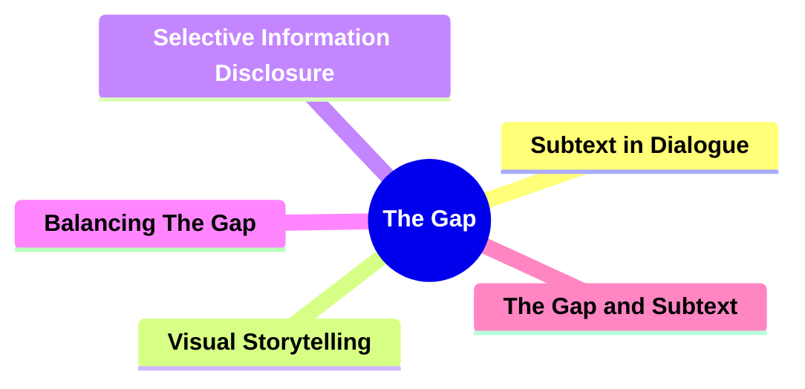
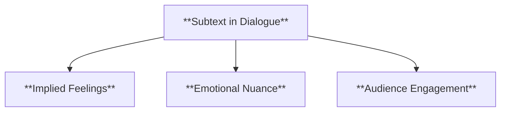
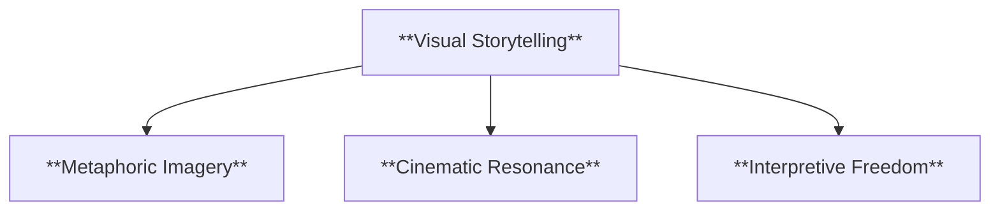
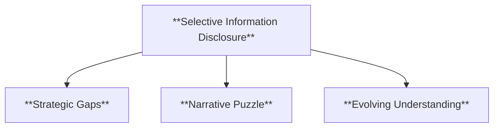
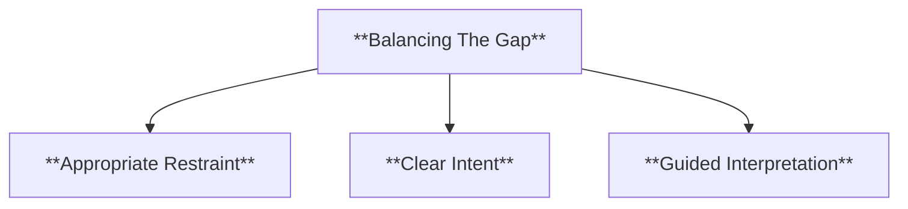
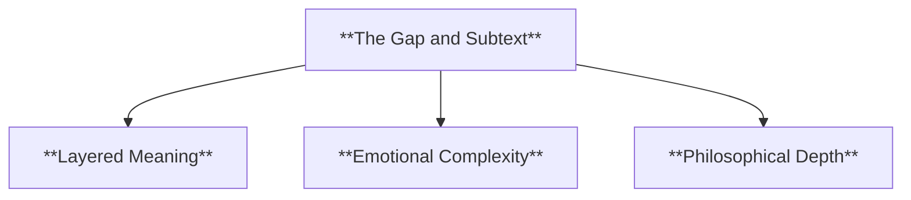
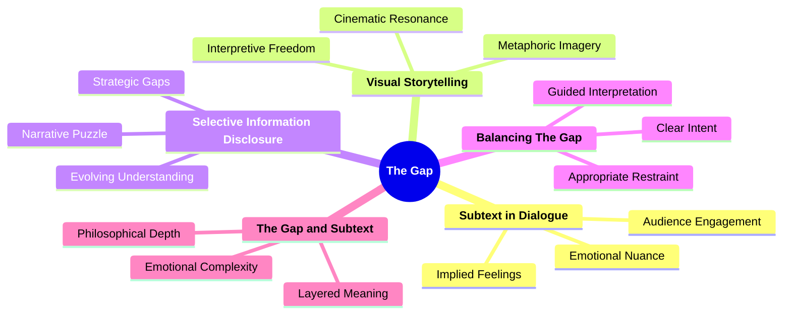

- [**1. Title: McKee’s Gap Model**](#1-title-mckees-gap-model)
  - [**1.1. Definition**](#11-definition)
- [**2. Key Concepts**](#2-key-concepts)
  - [**2.1. The Gap**](#21-the-gap)
    - [**2.1.1. Components of The Gap**](#211-components-of-the-gap)
      - [**2.1.1.1. Subtext in Dialogue**](#2111-subtext-in-dialogue)
      - [**2.1.1.2. Visual Storytelling**](#2112-visual-storytelling)
      - [**2.1.1.3. Selective Information Disclosure**](#2113-selective-information-disclosure)
      - [**2.1.1.4. Balancing The Gap**](#2114-balancing-the-gap)
      - [**2.1.1.5. The Gap and Subtext**](#2115-the-gap-and-subtext)
- [**3. Implications of McKee’s Gap Model**](#3-implications-of-mckees-gap-model)
  - [**3.1. Enhanced Audience Engagement**](#31-enhanced-audience-engagement)
  - [**3.2. Greater Emotional Resonance**](#32-greater-emotional-resonance)
  - [**3.3. Memorable and Enduring Impact**](#33-memorable-and-enduring-impact)
- [**Core Components Overview**](#core-components-overview)

---

### **1. Title: McKee’s Gap Model**

#### **1.1. Definition**

McKee’s Gap Model focuses on the intentional omission of information within a narrative. The “gap” represents the space between what is explicitly stated and what remains implied, allowing audiences to infer deeper meanings, engage emotionally, and find personal resonance within the story.

---

### **2. Key Concepts**

#### **2.1. The Gap**

- **Definition:**
  The gap is a deliberate absence of direct explanation, inviting audiences to read between the lines. By providing only essential details, the writer encourages viewers or readers to actively interpret subtext, symbolism, and emotional undercurrents.

##### **2.1.1. Components of The Gap**

###### **2.1.1.1. Subtext in Dialogue**

- **Definition:**
  Characters may communicate indirectly, conveying emotions and intentions beneath the literal meaning of their words.

- **Characteristics:**
  - **Implied Feelings:** Dialogue suggests motivations rather than stating them outright.
  - **Emotional Nuance:** Tension and conflict arise from what remains unsaid.
  - **Audience Engagement:** Viewers interpret tone, body language, and context to uncover hidden layers.

---

###### **2.1.1.2. Visual Storytelling**

- **Definition:**
  Symbolism, imagery, and non-verbal cues communicate themes and atmosphere without overt exposition.

- **Characteristics:**
  - **Metaphoric Imagery:** Objects, settings, or weather hint at mood or conflict.
  - **Cinematic Resonance:** Meaning is conveyed through visuals, enhancing depth.
  - **Interpretive Freedom:** Audiences assign personal significance to symbolic elements.

---

###### **2.1.1.3. Selective Information Disclosure**

- **Definition:**
  Controlling the timing and amount of information released to maintain suspense, mystery, and intrigue.

- **Characteristics:**
  - **Strategic Gaps:** Key details withheld, prompting speculation.
  - **Narrative Puzzle:** Viewers piece together clues, increasing involvement.
  - **Evolving Understanding:** Subsequent revelations reshape prior interpretations.

---

###### **2.1.1.4. Balancing The Gap**

- **Definition:**
  Ensuring the gap enhances the narrative rather than causing confusion or frustration.

- **Characteristics:**
  - **Appropriate Restraint:** Withholding enough detail to intrigue, not alienate.
  - **Clear Intent:** The gap enriches the story’s layers without obscuring core meaning.
  - **Guided Interpretation:** Audiences feel rewarded for their engagement, not misled.

---

###### **2.1.1.5. The Gap and Subtext**

- **Definition:**
  The gap is closely linked to subtext—the underlying messages and emotions that operate beneath the surface plot.

- **Characteristics:**
  - **Layered Meaning:** Stories function on multiple levels simultaneously.
  - **Emotional Complexity:** Unspoken tensions or desires inform character arcs.
  - **Philosophical Depth:** Audiences may discover personal or universal themes within the unstated elements.

---

### **3. Implications of McKee’s Gap Model**

#### **3.1. Enhanced Audience Engagement**

- **Description:**
  By leaving interpretive space, the gap invites audiences to actively participate in meaning-making, increasing their emotional investment and connection to the narrative.

#### **3.2. Greater Emotional Resonance**

- **Description:**
  Subtlety and suggestion allow for richer emotional experiences, as viewers internalize and project their own feelings onto the story’s implied dimensions.

#### **3.3. Memorable and Enduring Impact**

- **Description:**
  Stories that employ the gap linger in the audience’s mind. The interpretive work done by viewers fosters lasting impressions, encouraging repeated analysis and discussion.

---

### **Core Components Overview**

- **The Gap**
  - Subtext in Dialogue
  - Visual Storytelling
  - Selective Information Disclosure
  - Balancing The Gap
  - The Gap and Subtext

---

