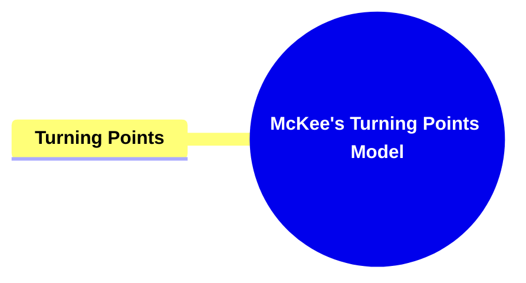
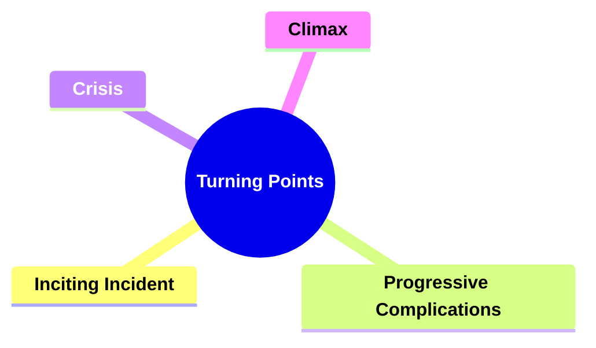
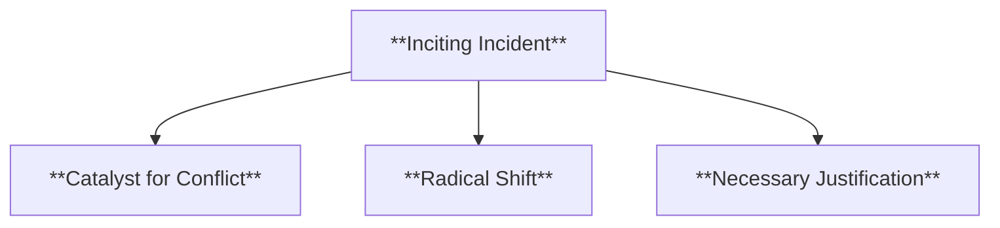
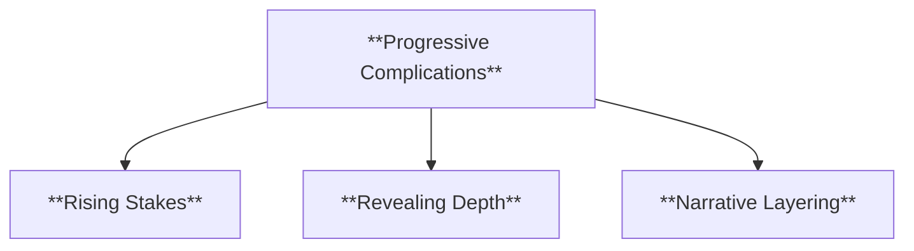
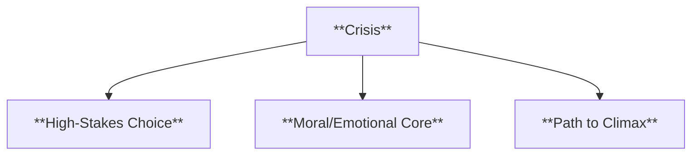
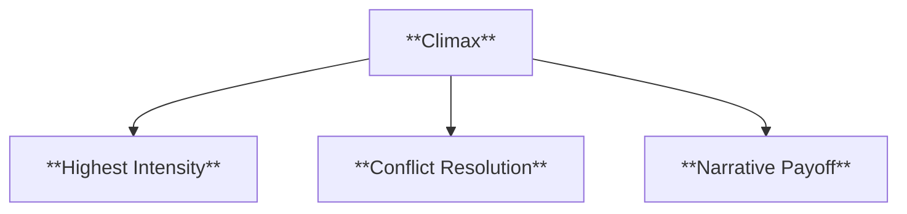
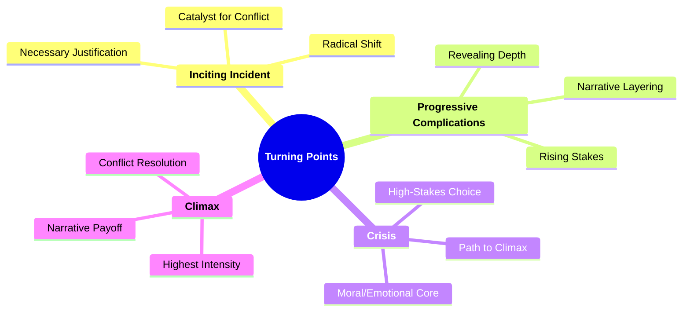

- [**1. Title: McKee's Turning Points Model**](#1-title-mckees-turning-points-model)
  - [**1.1. Definition**](#11-definition)
- [**2. Key Concepts**](#2-key-concepts)
  - [**2.1. Turning Points**](#21-turning-points)
    - [**2.1.1. Components of Turning Points**](#211-components-of-turning-points)
      - [**2.1.1.1. Inciting Incident**](#2111-inciting-incident)
      - [**2.1.1.2. Progressive Complications**](#2112-progressive-complications)
      - [**2.1.1.3. Crisis**](#2113-crisis)
      - [**2.1.1.4. Climax**](#2114-climax)
- [**3. Implications of McKee’s Turning Points Model**](#3-implications-of-mckees-turning-points-model)
  - [**3.1. Structured Narrative Momentum**](#31-structured-narrative-momentum)
  - [**3.2. Enhanced Character Development**](#32-enhanced-character-development)
  - [**3.3. Emotional Engagement**](#33-emotional-engagement)
- [**Core Components Overview**](#core-components-overview)

---

### **1. Title: McKee's Turning Points Model**

#### **1.1. Definition**

McKee’s Turning Points Model identifies key moments in a narrative that significantly alter the story’s direction. These turning points—such as the inciting incident, progressive complications, the crisis, and the climax—are pivotal junctures where tension escalates, stakes rise, and the protagonist’s path is reshaped. By strategically placing these moments, writers maintain narrative momentum and ensure continuous audience engagement.

---

### **2. Key Concepts**

#### **2.1. Turning Points**

- **Definition:**
  Turning points are critical junctures in the story that introduce change and propel the narrative forward. They break the status quo, increasing complexity and tension, and challenging the protagonist to adapt or transform.

##### **2.1.1. Components of Turning Points**

###### **2.1.1.1. Inciting Incident**

- **Definition:**
  The inciting incident is the event that disrupts the protagonist’s ordinary world, setting the central conflict into motion.

- **Characteristics:**
  - **Catalyst for Conflict:** Introduces the main problem or goal.
  - **Radical Shift:** Alters the protagonist’s routine or worldview.
  - **Necessary Justification:** Provides a compelling reason for the protagonist’s journey.

- **Example:**
  The murder of Bruce Wayne’s parents in _Batman_ initiates his quest for justice.

---

###### **2.1.1.2. Progressive Complications**

- **Definition:**
  Progressive complications are escalating obstacles and challenges that intensify the story’s tension and complexity as it unfolds.

- **Characteristics:**
  - **Rising Stakes:** Each complication increases the difficulty or danger.
  - **Revealing Depth:** Challenges often expose character flaws, strengths, and hidden motivations.
  - **Narrative Layering:** Introduces new elements, characters, or conflicts that enrich the storyline.

- **Example:**
  In _Jurassic Park_, dinosaurs escaping containment heightens danger, complicating the characters’ survival.

---

###### **2.1.1.3. Crisis**

- **Definition:**
  The crisis is the moment of greatest tension, forcing the protagonist to make a pivotal decision that will shape the story’s outcome.

- **Characteristics:**
  - **High-Stakes Choice:** The protagonist faces a dilemma with profound consequences.
  - **Moral/Emotional Core:** The crisis reflects the protagonist’s internal growth or struggle.
  - **Path to Climax:** This turning point sets the stage for the story’s peak resolution.

- **Example:**
  In _Harry Potter and the Sorcerer’s Stone_, Harry’s decision to pursue the Stone demonstrates his courage and commitment.

---

###### **2.1.1.4. Climax**

- **Definition:**
  The climax is the culmination of the narrative’s tension, where the central conflict reaches its peak and is resolved.

- **Characteristics:**
  - **Highest Intensity:** The story’s emotional and narrative energies converge.
  - **Conflict Resolution:** The protagonist either overcomes or fails against the primary challenge.
  - **Narrative Payoff:** Delivers a satisfying conclusion that feels both earned and impactful.

- **Example:**
  Frodo’s final struggle with Gollum over the One Ring in _The Lord of the Rings: The Return of the King_ determines Middle-earth’s fate.

---

### **3. Implications of McKee’s Turning Points Model**

#### **3.1. Structured Narrative Momentum**

- **Description:**
  By employing turning points at strategic intervals, writers ensure the narrative flows naturally. Each turning point propels the story into new territory, sustaining audience interest and preventing stagnation.

#### **3.2. Enhanced Character Development**

- **Description:**
  Turning points test the protagonist’s resolve, revealing deeper layers of their personality, morals, and desires. This leads to a more nuanced understanding of characters and their motivations.

#### **3.3. Emotional Engagement**

- **Description:**
  Well-crafted turning points elicit strong emotional responses from the audience, making the narrative more memorable. The tension and stakes inherent in these moments heighten audience investment in the outcome.

---

### **Core Components Overview**

- **Inciting Incident**

  - Catalyst for Conflict
  - Justifies the protagonist’s journey

- **Progressive Complications**

  - Escalate tension and complexity
  - Introduce new layers of conflict and character depth

- **Crisis**

  - Demands a pivotal, high-stakes decision
  - Reflects the protagonist’s growth

- **Climax**
  - Resolves the central conflict
  - Delivers emotional and narrative payoff

---

