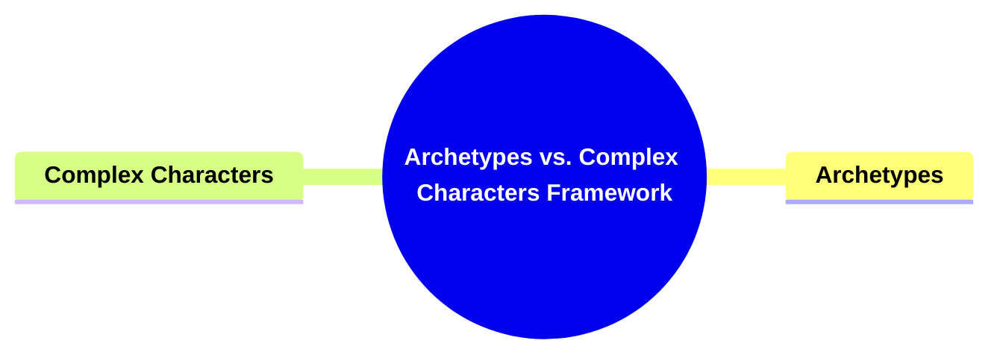

- [**1. Title: Archetypes vs. Complex Characters Framework**](#1-title-archetypes-vs-complex-characters-framework)
  - [**1.1. Definition**](#11-definition)
- [**2. Key Concepts**](#2-key-concepts)
  - [**2.1. Archetypes**](#21-archetypes)
    - [**2.1.1. Components of Archetypes**](#211-components-of-archetypes)
      - [**2.1.1.1. Simplified Functional Roles**](#2111-simplified-functional-roles)
      - [**2.1.1.2. Narrative Drivers**](#2112-narrative-drivers)
  - [**2.2. Complex Characters**](#22-complex-characters)
    - [**2.2.1. Components of Complex Characters**](#221-components-of-complex-characters)
      - [**2.2.1.1. Nuanced Personalities**](#2211-nuanced-personalities)
      - [**2.2.1.2. Intricate Interactions**](#2212-intricate-interactions)
- [**3. Implications of Archetypes vs. Complex Characters Framework**](#3-implications-of-archetypes-vs-complex-characters-framework)
  - [**3.1. Enhanced Narrative Structure**](#31-enhanced-narrative-structure)
  - [**3.2. Increased Emotional Engagement**](#32-increased-emotional-engagement)
  - [**3.3. Balanced Character Development**](#33-balanced-character-development)
- [**Core Components Overview**](#core-components-overview)

---

### **1. Title: Archetypes vs. Complex Characters Framework**

#### **1.1. Definition**

The **Archetypes vs. Complex Characters Framework** delineates the contrasting approaches to character development in narrative structures. This framework explores the utilization of archetypal roles—simplified, iconic representations—and complex characters—nuanced, multifaceted personalities—to drive storytelling. Its purpose is to provide writers, storytellers, and literary analysts with a structured understanding of how different character types influence narrative dynamics, depth, and audience engagement. By examining the roles and interactions of both archetypes and complex characters, the framework underscores their significance in crafting compelling and emotionally resonant narratives.

---

### **2. Key Concepts**

Outline the primary concepts or components that make up the framework. These should be broad enough to accommodate various subjects.

#### **2.1. Archetypes**

- **Definition:**
  Archetypes are simplified, idealized combinations of elements that represent iconic character functions within a narrative. They embody fundamental human motifs and serve as recognizable templates for character roles, such as Protagonist, Antagonist, Guardian, Contagonist, Reason, Emotion, Sidekick, and Skeptic. Archetypes provide clear and distinct functions that facilitate the structuring of the story’s conflict and resolution.

##### **2.1.1. Components of Archetypes**

###### **2.1.1.1. Simplified Functional Roles**

- **Definition:**
  Simplified Functional Roles refer to the clear and distinct character functions that archetypes embody within a narrative. These roles are idealized and serve as the backbone for character interactions and plot progression.

- **Characteristics:**
  - **Clarity:** Each role has a well-defined purpose, making it easily recognizable within the story.
  - **Iconicity:** Represents universal human experiences and motifs, allowing for immediate audience identification.
  - **Consistency:** Maintains similar traits and behaviors across different narratives, providing a familiar structure for storytelling.

###### **2.1.1.2. Narrative Drivers**

- **Definition:**
  Narrative Drivers are the elements within archetypes that propel the story forward by instigating conflict, challenges, and resolutions. They are essential in maintaining the momentum of the plot.

- **Characteristics:**
  - **Conflict Generation:** Archetypes often embody opposing forces that create tension and challenges within the narrative.
  - **Resolution Facilitation:** They play key roles in resolving conflicts, leading to the story’s climax and conclusion.
  - **Plot Structuring:** Serve as foundational elements that shape the overall narrative arc and direction.

---

#### **2.2. Complex Characters**

- **Definition:**
  Complex Characters are non-archetypal blends of elements that exhibit nuanced and multifaceted personalities. Unlike archetypes, they display intricate behaviors, motivations, and emotional depths, contributing to a more realistic and engaging narrative.

##### **2.2.1. Components of Complex Characters**

###### **2.2.1.1. Nuanced Personalities**

- **Definition:**
  Nuanced Personalities refer to the detailed and layered traits that define complex characters. These personalities encompass a wide range of emotions, motivations, and behavioral patterns, making the characters more relatable and believable.

- **Characteristics:**
  - **Depth:** Possess a rich inner life with diverse emotional responses and motivations.
  - **Ambiguity:** Exhibit traits that may conflict or evolve over time, adding to their realism.
  - **Development:** Undergo significant personal growth or change throughout the narrative.

###### **2.2.1.2. Intricate Interactions**

- **Definition:**
  Intricate Interactions are the sophisticated and meaningful engagements that complex characters have with each other and their environment. These interactions are driven by their multifaceted personalities and contribute to the story’s emotional and psychological richness.

- **Characteristics:**
  - **Dynamic Relationships:** Form and evolve relationships that reflect their complex nature and personal growth.
  - **Emotional Depth:** Interactions are laden with emotional significance, enhancing the narrative’s impact.
  - **Psychological Realism:** Reflect realistic human behaviors and motivations, making the story more immersive.

---

### **3. Implications of Archetypes vs. Complex Characters Framework**

#### **3.1. Enhanced Narrative Structure**

- **Description:**
  Utilizing archetypes provides a clear and structured foundation for storytelling, ensuring that fundamental character roles are fulfilled and the plot progresses coherently. This enhances the narrative’s clarity and ensures that essential story elements are effectively addressed.

#### **3.2. Increased Emotional Engagement**

- **Description:**
  Incorporating complex characters adds depth and realism to the narrative, fostering a stronger emotional connection between the audience and the characters. This leads to heightened engagement and a more immersive storytelling experience.

#### **3.3. Balanced Character Development**

- **Description:**
  The framework encourages a balance between archetypal roles and complex character traits, allowing for versatile storytelling that can cater to both traditional narrative structures and innovative, character-driven plots.

---

### **Core Components Overview**

- **Archetypes**

  - Simplified Functional Roles
  - Narrative Drivers

- **Complex Characters**
  - Nuanced Personalities
  - Intricate Interactions

---
