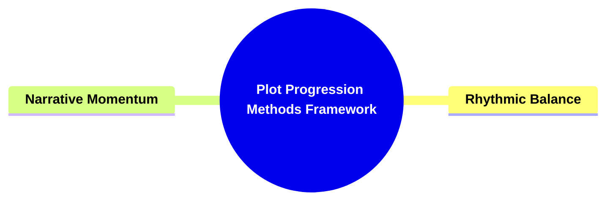

- [**1. Title: Plot Progression Methods Framework**](#1-title-plot-progression-methods-framework)
  - [**1.1. Definition**](#11-definition)
- [**2. Key Concepts**](#2-key-concepts)
  - [**2.1. Rhythmic Balance**](#21-rhythmic-balance)
    - [**2.1.1. Components of Rhythmic Balance**](#211-components-of-rhythmic-balance)
      - [**2.1.1.1. Stability and Flux**](#2111-stability-and-flux)
      - [**2.1.1.2. Sustained Engagement**](#2112-sustained-engagement)
  - [**2.2. Narrative Momentum**](#22-narrative-momentum)
    - [**2.2.1. Components of Narrative Momentum**](#221-components-of-narrative-momentum)
      - [**2.2.1.1. Continuous Drive**](#2211-continuous-drive)
      - [**2.2.1.2. Preventing Stagnation**](#2212-preventing-stagnation)
- [**3. Implications of Plot Progression Methods Framework**](#3-implications-of-plot-progression-methods-framework)
  - [**3.1. Enhanced Narrative Rhythm**](#31-enhanced-narrative-rhythm)
  - [**3.2. Sustained Audience Engagement**](#32-sustained-audience-engagement)
  - [**3.3. Balanced Story Structure**](#33-balanced-story-structure)
- [**Core Components Overview**](#core-components-overview)

---

### **1. Title: Plot Progression Methods Framework**

#### **1.1. Definition**

The **Plot Progression Methods Framework** delineates the strategies employed to advance a narrative through balanced rhythms and sustained momentum. This framework emphasizes the importance of harmonizing static Signposts with dynamic Journeys to mirror the complexities of real-life problem-solving. By integrating Rhythmic Balance and Narrative Momentum, the framework ensures that the story maintains its momentum while allowing for reflection and development. It serves as a guide for writers, storytellers, and literary analysts to construct narratives that are both engaging and coherent, preventing stagnation and fostering continuous audience investment.

---

### **2. Key Concepts**

Outline the primary concepts or components that make up the framework. These should be broad enough to accommodate various subjects.

#### **2.1. Rhythmic Balance**

- **Definition:**
  Rhythmic Balance involves the strategic interplay between static Signposts and dynamic Journeys within a narrative. This balance creates a rhythm of stability and flux, reflecting the multifaceted nature of real-life problem-solving and maintaining the story’s momentum while allowing for periods of reflection and development.

##### **2.1.1. Components of Rhythmic Balance**

###### **2.1.1.1. Stability and Flux**

- **Definition:**
  Stability and Flux refer to the equilibrium between unchanging Signposts and evolving Journeys within the narrative. This balance mirrors the complexities of real-life problem-solving by maintaining the story’s momentum while permitting moments of introspection and growth.

- **Characteristics:**
  - **Equilibrium:** Maintains a steady rhythm by balancing moments of stability with periods of change.
  - **Reflective Development:** Allows characters and plots to develop thoughtfully during stable periods.
  - **Dynamic Adaptation:** Enables the narrative to adapt and evolve through flux, keeping the story engaging.

###### **2.1.1.2. Sustained Engagement**

- **Definition:**
  Sustained Engagement is achieved through the rhythmic interplay between stable milestones and dynamic transitions. This balance keeps the audience engaged by providing a predictable yet flexible narrative structure that continuously evolves.

- **Characteristics:**
  - **Predictable Structure:** Offers a familiar framework that the audience can follow.
  - **Flexible Progression:** Allows for unexpected developments within a structured narrative.
  - **Continuous Interest:** Maintains audience interest by alternating between stability and change.

---

#### **2.2. Narrative Momentum**

- **Definition:**
  Narrative Momentum refers to the continuous drive that propels the story forward by alternating between established stages and evolving transitions. This momentum ensures that the audience remains invested in the narrative’s resolution by maintaining a dynamic and active storyline.

##### **2.2.1. Components of Narrative Momentum**

###### **2.2.1.1. Continuous Drive**

- **Definition:**
  Continuous Drive ensures that the narrative maintains its forward movement by consistently alternating between established stages and evolving transitions. This drive keeps the story progressing and the audience engaged.

- **Characteristics:**
  - **Uninterrupted Progression:** Maintains a steady pace without unnecessary pauses.
  - **Dynamic Advancement:** Propels the story through active developments and changes.
  - **Audience Investment:** Keeps the audience interested and invested in the story’s outcome.

###### **2.2.1.2. Preventing Stagnation**

- **Definition:**
  Preventing Stagnation involves managing the balance between Signposts and Journeys to ensure that the narrative remains active and compelling. This balance avoids prolonged periods of inactivity or repetitive plot points, keeping the story vibrant and engaging.

- **Characteristics:**
  - **Active Plot Development:** Ensures continuous and meaningful plot advancements.
  - **Varied Pacing:** Balances fast-paced action with slower, reflective moments.
  - **Engaging Storytelling:** Maintains a lively and interesting narrative flow.

---

### **3. Implications of Plot Progression Methods Framework**

#### **3.1. Enhanced Narrative Rhythm**

- **Description:**
  Implementing Rhythmic Balance creates a harmonious rhythm within the narrative, blending moments of stability with dynamic changes. This rhythm mirrors the natural flow of real-life problem-solving, making the story more relatable and engaging for the audience.

#### **3.2. Sustained Audience Engagement**

- **Description:**
  By maintaining Narrative Momentum, the framework ensures that the story continuously propels forward, keeping the audience invested in the narrative’s progression and resolution. This sustained engagement is crucial for maintaining interest and emotional investment throughout the story.

#### **3.3. Balanced Story Structure**

- **Description:**
  The framework promotes a well-structured narrative by balancing static milestones with dynamic transitions. This balance prevents the story from becoming stagnant or overly predictable, allowing for a flexible yet coherent plot development that adapts to the evolving needs of the narrative.

---

### **Core Components Overview**

- **Rhythmic Balance**

  - Stability and Flux
  - Sustained Engagement

- **Narrative Momentum**
  - Continuous Drive
  - Preventing Stagnation

---
