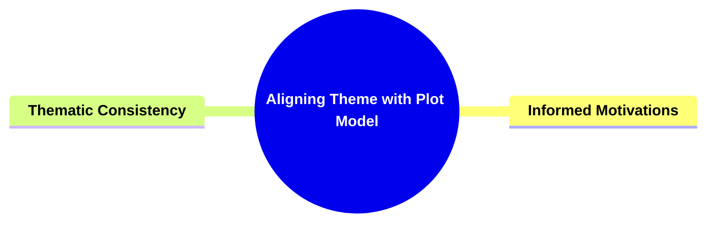

- [**Aligning Theme with Plot Model**](#aligning-theme-with-plot-model)
  - [**1. Title: Aligning Theme with Plot Model**](#1-title-aligning-theme-with-plot-model)
  - [**1.1. Definition**](#11-definition)
- [**2. Key Concepts**](#2-key-concepts)
  - [**2.1. Informed Motivations**](#21-informed-motivations)
    - [**2.1.1. Components of Informed Motivations**](#211-components-of-informed-motivations)
      - [**2.1.1.1. Plot-Driven Themes**](#2111-plot-driven-themes)
      - [**2.1.1.2. Thematic Reinforcement**](#2112-thematic-reinforcement)
  - [**2.2. Thematic Consistency**](#22-thematic-consistency)
    - [**2.2.1. Components of Thematic Consistency**](#221-components-of-thematic-consistency)
      - [**2.2.1.1. Coherent Narrative Structure**](#2211-coherent-narrative-structure)
      - [**2.2.1.2. Enhanced Audience Engagement**](#2212-enhanced-audience-engagement)
- [**3. Implications of Aligning Theme with Plot Model**](#3-implications-of-aligning-theme-with-plot-model)
  - [**3.1. Enhanced Thematic Reinforcement**](#31-enhanced-thematic-reinforcement)
  - [**3.2. Improved Narrative Coherence**](#32-improved-narrative-coherence)
  - [**3.3. Deeper Audience Engagement**](#33-deeper-audience-engagement)
- [**Core Components Overview**](#core-components-overview)

---

### **Aligning Theme with Plot Model**

#### **1. Title: Aligning Theme with Plot Model**

#### **1.1. Definition**

**Aligning Theme with Plot Model** involves strategically integrating a story’s themes into its plot structure. This alignment ensures that the narrative’s events, conflicts, and resolutions are deeply rooted in the underlying themes, enhancing the story’s coherence and thematic resonance. By embedding thematic elements within the plot, authors can create a unified and compelling narrative that consistently reinforces the story’s central messages and philosophical concerns.

---

### **2. Key Concepts**

Outline the primary concepts or components that make up the framework. These should be broad enough to accommodate various subjects.

#### **2.1. Informed Motivations**

- **Definition:**
  **Informed Motivations** involve the influence of themes on plot developments and the significance behind plot events. This ensures that all elements of the story carry moral and philosophical weight, grounding plot actions and decisions in the narrative’s thematic concerns.

##### **2.1.1. Components of Informed Motivations**

###### **2.1.1.1. Plot-Driven Themes**

- **Definition:**
  **Plot-Driven Themes** refer to how themes shape and influence the progression of the plot. This alignment ensures that the plot’s events and conflicts are deeply intertwined with the story’s thematic elements.

- **Characteristics:**
  - **Thematic Influence:** Themes directly impact plot events, driving the narrative forward and shaping the story’s direction.
  - **Moral Weight:** Ensures that plot actions carry moral and philosophical significance, adding depth to the narrative.
  - **Thematic Integration:** Plot developments are seamlessly integrated with the overarching themes, enhancing narrative cohesion.

###### **2.1.1.2. Thematic Reinforcement**

- **Definition:**
  **Thematic Reinforcement** involves strengthening the story’s central messages by aligning plot events with themes. This ensures that the narrative remains focused and that thematic elements are consistently emphasized throughout the story.

- **Characteristics:**
  - **Central Message Focus:** Maintains a clear focus on the story’s main themes through plot progression.
  - **Consistent Emphasis:** Themes are repeatedly reinforced through key plot events and turning points.
  - **Narrative Coherence:** Enhances the story’s coherence by ensuring that plot developments support and reflect the central themes.

---

#### **2.2. Thematic Consistency**

- **Definition:**
  **Thematic Consistency** ensures that the story’s plot activities, conflicts, and resolutions are aligned with its underlying themes. This alignment enhances narrative coherence and depth, making the story’s messages clear and effectively integrated into all aspects of the plot.

##### **2.2.1. Components of Thematic Consistency**

###### **2.2.1.1. Coherent Narrative Structure**

- **Definition:**
  **Coherent Narrative Structure** aligns the plot’s activities, conflicts, and resolutions with the story’s underlying themes. This alignment ensures that thematic messages are seamlessly integrated into every aspect of the narrative, enhancing its overall coherence and depth.

- **Characteristics:**
  - **Aligned Elements:** All plot elements (activities, conflicts, resolutions) are in harmony with the story’s themes.
  - **Structural Integrity:** Maintains a strong structural foundation where themes guide the narrative flow.
  - **Depth Enhancement:** Adds layers of meaning by ensuring that every plot component supports the thematic framework.

###### **2.2.1.2. Enhanced Audience Engagement**

- **Definition:**
  **Enhanced Audience Engagement** is achieved through thematic consistency, making the story’s messages more impactful and resonant. This fosters a deeper connection between the narrative and the audience, as themes are clearly and consistently presented through the plot.

- **Characteristics:**
  - **Impactful Messages:** Themes are presented in a way that leaves a lasting impression on the audience.
  - **Resonant Storytelling:** Ensures that thematic elements resonate emotionally and intellectually with the audience.
  - **Deeper Connection:** Builds a stronger emotional and intellectual bond between the audience and the narrative.

---

### **3. Implications of Aligning Theme with Plot Model**

#### **3.1. Enhanced Thematic Reinforcement**

- **Description:**
  By aligning themes with the plot, the framework ensures that the story’s central messages are consistently reinforced throughout the narrative. This alignment strengthens the thematic impact, making the story’s moral and philosophical dimensions more pronounced and meaningful.

#### **3.2. Improved Narrative Coherence**

- **Description:**
  The framework promotes a coherent narrative structure by ensuring that all plot elements are aligned with the underlying themes. This coherence enhances the overall quality of the storytelling, making the plot more logical and the events more motivated by thematic concerns.

#### **3.3. Deeper Audience Engagement**

- **Description:**
  Thematic consistency and reinforcement create a more engaging and immersive experience for the audience. By presenting clear and consistent thematic messages through the plot, the framework fosters a stronger emotional and intellectual connection between the audience and the narrative, increasing the story’s overall impact and resonance.

---

### **Core Components Overview**

- **Informed Motivations**

  - Plot-Driven Themes
  - Thematic Reinforcement

- **Thematic Consistency**
  - Coherent Narrative Structure
  - Enhanced Audience Engagement

---
