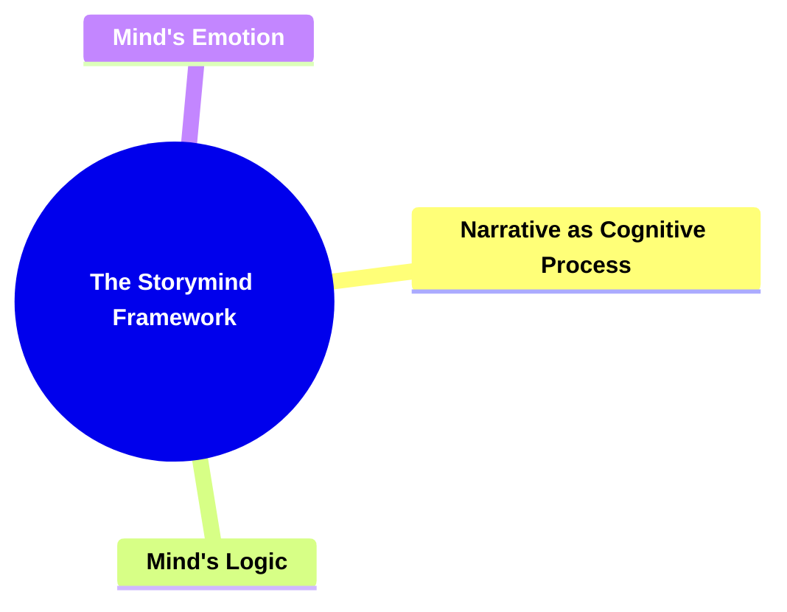

- [1. **Title: The Storymind Framework**](#1-title-the-storymind-framework)
  - [1.1. **Definition**](#11-definition)
- [2. **Key Concepts**](#2-key-concepts)
  - [2.1. **Narrative as Cognitive Process**](#21-narrative-as-cognitive-process)
    - [2.1.1. **Components of Narrative as Cognitive Process**](#211-components-of-narrative-as-cognitive-process)
      - [2.1.1.1. **Definition and Implications**](#2111-definition-and-implications)
      - [2.1.1.2. **Functional Representation**](#2112-functional-representation)
  - [2.2. **Mind's Logic**](#22-minds-logic)
    - [2.2.1. **Components of Mind's Logic**](#221-components-of-minds-logic)
      - [2.2.1.1. **Integration of Rational Elements**](#2211-integration-of-rational-elements)
      - [2.2.1.2. **Externalization of Cognitive Processes**](#2212-externalization-of-cognitive-processes)
  - [2.3. **Mind's Emotion**](#23-minds-emotion)
    - [2.3.1. **Components of Mind's Emotion**](#231-components-of-minds-emotion)
      - [2.3.1.1. **Integration of Emotional Elements**](#2311-integration-of-emotional-elements)
      - [2.3.1.2. **Externalization of Emotional Processes**](#2312-externalization-of-emotional-processes)
- [3. **Implications of The Storymind Framework**](#3-implications-of-the-storymind-framework)
  - [3.1. **Enhanced Narrative Coherence**](#31-enhanced-narrative-coherence)
  - [3.2. **Increased Emotional Engagement**](#32-increased-emotional-engagement)
- [4. **Core Components Overview**](#4-core-components-overview)

---

### 1. **Title: The Storymind Framework**

#### 1.1. **Definition**

The Storymind Framework conceptualizes a story as an analogous model of a single human mind. It posits that narratives are intricate representations of the cognitive processes inherent in human thought. This framework serves to elevate storytelling by aligning each narrative element with components of human cognition, thereby enhancing the depth, coherence, and relatability of stories. Its significance lies in providing a structured approach to understanding and crafting narratives that resonate on both intellectual and emotional levels.

---

### 2. **Key Concepts**

#### 2.1. **Narrative as Cognitive Process**

- **Definition:**
  The Narrative as Cognitive Process concept asserts that stories function as complex models reflecting the problem-solving mechanisms of the human mind. This perspective transforms storytelling into a sophisticated cognitive exercise, where every narrative element serves as a facet of a thinking entity.

##### 2.1.1. **Components of Narrative as Cognitive Process**

###### 2.1.1.1. **Definition and Implications**

- **Definition:**
  This component defines the premise that narratives are not just sequences of events but are structured to mirror the cognitive activities involved in human problem-solving.

- **Characteristics:**
  - **Complex Modeling:** Stories encapsulate multifaceted cognitive processes.
  - **Sophisticated Structure:** Narrative elements are intricately organized to reflect mental operations.
  - **Cognitive Alignment:** Ensures that the story's progression aligns with logical problem-solving methods.

###### 2.1.1.2. **Functional Representation**

- **Definition:**
  Functional Representation refers to the alignment of story elements—such as characters, plot points, and themes—with various aspects of human cognition, including logic, emotion, memory, and perception.

- **Characteristics:**
  - **Character Mapping:** Each character represents different cognitive functions.
  - **Plot Alignment:** Plot points correspond to problem-solving stages.
  - **Thematic Coherence:** Themes embody overarching cognitive and emotional narratives.

---

#### 2.2. **Mind's Logic**

- **Definition:**
  Mind's Logic focuses on the integration of rational reasoning and intellectual dimensions within a narrative, emphasizing the importance of logical coherence and problem-solving mechanisms.

##### 2.2.1. **Components of Mind's Logic**

###### 2.2.1.1. **Integration of Rational Elements**

- **Definition:**
  This subcomponent explores the incorporation of logical reasoning and structured problem-solving within the narrative, ensuring a coherent and believable progression of events.

- **Characteristics:**
  - **Logical Progression:** Events unfold in a rational and structured manner.
  - **Consistency:** Ensures the narrative adheres to internal logic.
  - **Clarity:** Makes the problem-solving process clear and relatable.

###### 2.2.1.2. **Externalization of Cognitive Processes**

- **Definition:**
  Externalization of Cognitive Processes involves presenting the logical workings of the mind on an external stage, enabling the audience to understand and follow the story's rational development.

- **Characteristics:**
  - **Transparency:** Reveals the underlying logical structure of the narrative.
  - **Engagement:** Encourages the audience to connect intellectually with the story.
  - **Accessibility:** Makes complex ideas comprehensible through clear representation.

---

#### 2.3. **Mind's Emotion**

- **Definition:**
  Mind's Emotion explores the integration of emotional responses and psychological depth within a narrative, highlighting the interplay between feelings and storytelling.

##### 2.3.1. **Components of Mind's Emotion**

###### 2.3.1.1. **Integration of Emotional Elements**

- **Definition:**
  This subcomponent emphasizes the inclusion of emotional arcs and relatable experiences that resonate with the audience, balancing intellectual and affective dimensions.

- **Characteristics:**
  - **Emotional Depth:** Creates complex and relatable characters.
  - **Audience Engagement:** Enhances connection through shared emotional experiences.
  - **Dramatic Impact:** Heightens narrative tension and resolution.

###### 2.3.1.2. **Externalization of Emotional Processes**

- **Definition:**
  Externalization of Emotional Processes involves portraying the emotional workings of the mind outwardly, allowing the audience to empathize with the characters and their journeys.

- **Characteristics:**
  - **Emotional Transparency:** Makes character emotions visible and accessible.
  - **Relatability:** Encourages audience identification with characters’ struggles.
  - **Empathy:** Fosters a deep connection between the audience and the narrative.

---

### 3. **Implications of The Storymind Framework**

#### 3.1. **Enhanced Narrative Coherence**

- **Description:**
  By aligning narrative elements with cognitive processes, the Storymind Framework ensures that the story maintains internal logic and coherence. This alignment makes the narrative more believable and satisfying, as it mirrors the natural problem-solving patterns of the human mind.

#### 3.2. **Increased Emotional Engagement**

- **Description:**
  Integrating both logical and emotional aspects within the story enhances emotional engagement. Audiences are more likely to connect with and invest in the narrative when they can relate to both the intellectual and emotional journeys of the Storymind.

---

### 4. **Core Components Overview**

- **Narrative as Cognitive Process**

  - Definition and Implications
  - Functional Representation

- **Mind's Logic**

  - Integration of Rational Elements
  - Externalization of Cognitive Processes

- **Mind's Emotion**
  - Integration of Emotional Elements
  - Externalization of Emotional Processes

---
