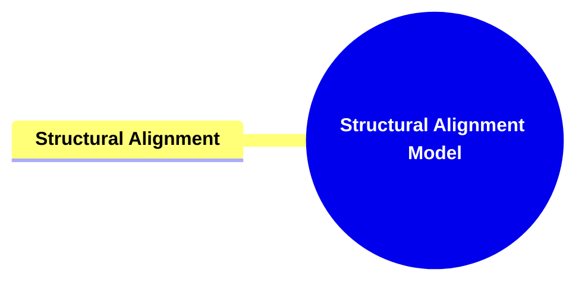

- [**Structural Alignment Model**](#structural-alignment-model)
  - [**1. Title: Structural Alignment**](#1-title-structural-alignment)
  - [**1.1. Definition**](#11-definition)
- [**2. Key Concepts**](#2-key-concepts)
  - [**2.1. Structural Alignment**](#21-structural-alignment)
    - [**2.1.1. Components of Structural Alignment**](#211-components-of-structural-alignment)
      - [**2.1.1.1. Genre Preferences**](#2111-genre-preferences)
- [**3. Implications of Structural Alignment**](#3-implications-of-structural-alignment)
  - [**3.1. Enhanced Genre Coherence and Appeal**](#31-enhanced-genre-coherence-and-appeal)
  - [**3.2. Consistent Narrative Identity**](#32-consistent-narrative-identity)
- [**Core Components Overview**](#core-components-overview)

---

### **Structural Alignment Model**

#### **1. Title: Structural Alignment**

#### **1.1. Definition**

**Structural Alignment** involves the strategic alignment of a story’s structure with genre-specific conventions. This ensures that the narrative maintains coherence and appeal within its chosen genre by emphasizing relevant structural classes and elements. By aligning structural components with genre norms, authors can create stories that resonate with audience expectations and deliver a satisfying genre-specific experience.

---

### **2. Key Concepts**

Outline the primary concepts or components that make up the framework. These should be broad enough to accommodate various subjects.

#### **2.1. Structural Alignment**

- **Definition:**
  Structural Alignment involves the strategic alignment of a story’s structure with genre-specific conventions. This ensures that the narrative maintains coherence and appeal within its chosen genre by emphasizing relevant structural classes and elements.

##### **2.1.1. Components of Structural Alignment**

###### **2.1.1.1. Genre Preferences**

- **Definition:**
  **Genre Preferences** guide which structural classes and elements are emphasized within a story, ensuring alignment with genre-specific conventions. This alignment enhances the story’s coherence and appeal within its chosen genre.
- **Characteristics:**
  - **Emphasizing Classes and Themes:** Guides which classes and thematic elements are emphasized, ensuring that the story’s structure and themes align with genre-specific conventions. This alignment enhances the story’s coherence and appeal within its chosen genre.
  - **Thematic Focus:** Certain genres may prioritize specific thematic elements, such as heroism in Action-Adventure or existentialism in Tragedy, guiding the narrative’s thematic exploration.

---

### **3. Implications of Structural Alignment**

#### **3.1. Enhanced Genre Coherence and Appeal**

- **Description:**
  By strategically aligning structural elements with genre-specific conventions, the framework ensures that the narrative remains coherent and appealing within its chosen genre. This alignment helps in meeting audience expectations and delivering a satisfying genre experience.

#### **3.2. Consistent Narrative Identity**

- **Description:**
  Structural Alignment maintains a consistent structure throughout the narrative, supporting the intended genre experience. This consistency strengthens the story’s identity, making it more recognizable and relatable to the target audience.

---

### **Core Components Overview**

- **Structural Alignment**
  - Genre Preferences

---

---
