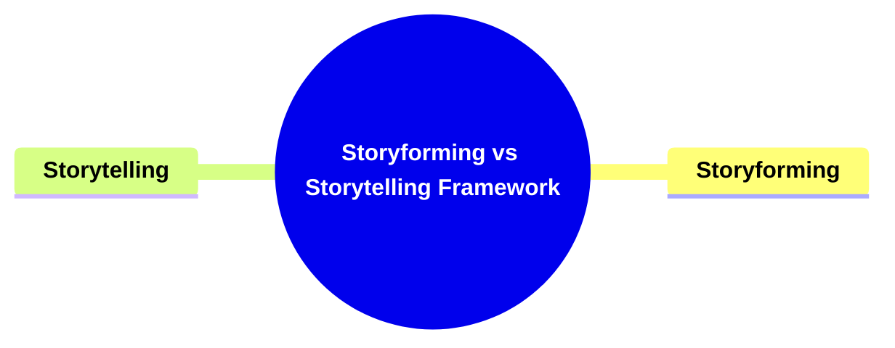

- [**Storyforming vs Storytelling Framework**](#storyforming-vs-storytelling-framework)
  - [**1. Title: Storyforming vs Storytelling Framework**](#1-title-storyforming-vs-storytelling-framework)
  - [**1.1. Definition**](#11-definition)
- [**2. Key Concepts**](#2-key-concepts)
  - [**2.1. Storyforming**](#21-storyforming)
    - [**2.1.1. Components of Storyforming**](#211-components-of-storyforming)
      - [**2.1.1.1. Conceptual Framework**](#2111-conceptual-framework)
      - [**2.1.1.2. Blueprint Development**](#2112-blueprint-development)
  - [**2.2. Storytelling (Encoding)**](#22-storytelling-encoding)
    - [**2.2.1. Components of Storytelling (Encoding)**](#221-components-of-storytelling-encoding)
      - [**2.2.1.1. Concrete Expression**](#2211-concrete-expression)
      - [**2.2.1.2. Dramatic Realization**](#2212-dramatic-realization)
- [**3. Implications of Translating Structural Meaning into Concrete Storytelling Choices**](#3-implications-of-translating-structural-meaning-into-concrete-storytelling-choices)
  - [**3.1. Enhanced Narrative Coherence**](#31-enhanced-narrative-coherence)
  - [**3.2. Increased Emotional Impact**](#32-increased-emotional-impact)
- [**Core Components Overview**](#core-components-overview)

---

### **Storyforming vs Storytelling Framework**

#### **1. Title: Storyforming vs Storytelling Framework**

#### **1.1. Definition**

"Translating Structural Meaning into Concrete Storytelling Choices" is a comprehensive framework designed to bridge the gap between the abstract structural elements of a narrative and their tangible expressions within a story. This framework guides authors through the process of defining the internal logic of their narratives (Storyforming) and effectively bringing those structures to life through detailed storytelling (Encoding). The purpose of this framework is to ensure narrative coherence, thematic depth, and emotional resonance, making stories both engaging and impactful for audiences.

---

### **2. Key Concepts**

Outline the primary concepts or components that make up the framework. These should be broad enough to accommodate various subjects.

#### **2.1. Storyforming**

- **Definition:**
  Storyforming is the conceptual phase where authors select structural elements (Classes, Types, Variations, Elements) that define the story’s internal logic. This phase involves deliberate planning to ensure narrative coherence and thematic depth.

##### **2.1.1. Components of Storyforming**

###### **2.1.1.1. Conceptual Framework**

- **Definition:**
  The conceptual framework encompasses the selection and organization of structural elements that form the backbone of the narrative. It defines the rules and logic that govern how different parts of the story interact and develop.

- **Characteristics:**
  - **Classes:** Broad categories that define major aspects of the story.
  - **Types:** Subcategories that provide more specific distinctions within classes.
  - **Variations:** Different instances or versions that add diversity and complexity.
  - **Elements:** Fundamental components that make up the narrative structure.

###### **2.1.1.2. Blueprint Development**

- **Definition:**
  Blueprint Development involves creating a detailed outline that maps out how each narrative component will function and interact. This ensures that the story adheres to the logical structure defined by the Storymind.

- **Characteristics:**
  - **Functionality Mapping:** Assigning roles and interactions for each component.
  - **Interaction Design:** Planning how different elements influence and support each other.
  - **Coherence Assurance:** Ensuring that all components work together to maintain narrative consistency.

---

#### **2.2. Storytelling (Encoding)**

- **Definition:**
  Storytelling, or encoding, involves assigning specific subject matter—characters, settings, dialogues, and imagery—to express the structural choices made during storyforming. This phase brings the abstract framework to life through tangible narrative elements.

##### **2.2.1. Components of Storytelling (Encoding)**

###### **2.2.1.1. Concrete Expression**

- **Definition:**
  Concrete Expression refers to the process of translating structural elements into specific narrative components such as characters, settings, dialogues, and imagery.

- **Characteristics:**
  - **Character Development:** Crafting detailed and relatable characters that embody the structural elements.
  - **Setting Design:** Creating immersive environments that reflect the story’s internal logic.
  - **Dialogue Crafting:** Writing conversations that reveal character traits and advance the plot.
  - **Imagery Utilization:** Using descriptive language to enhance the emotional and visual impact of the story.

###### **2.2.1.2. Dramatic Realization**

- **Definition:**
  Dramatic Realization ensures that the abstract concepts and structural elements achieve dramatic clarity and emotional resonance, making the story engaging and impactful for the audience.

- **Characteristics:**
  - **Emotional Resonance:** Creating moments that evoke strong emotional responses from the audience.
  - **Clarity of Themes:** Ensuring that the story’s themes are clearly conveyed through its narrative.
  - **Engagement Strategies:** Implementing techniques that maintain the audience’s interest and investment in the story.

---

### **3. Implications of Translating Structural Meaning into Concrete Storytelling Choices**

#### **3.1. Enhanced Narrative Coherence**

- **Description:**
  By systematically defining and organizing structural elements during storyforming, authors can create narratives that are logically consistent and thematically unified. This coherence enhances the reader’s understanding and immersion in the story.

#### **3.2. Increased Emotional Impact**

- **Description:**
  Effective encoding transforms abstract structural choices into vivid and emotionally charged storytelling elements. This results in a deeper emotional connection between the audience and the narrative, making the story more memorable and impactful.

---

### **Core Components Overview**

- **Storyforming**

  - Conceptual Framework
  - Blueprint Development

- **Storytelling (Encoding)**
  - Concrete Expression
  - Dramatic Realization

---
