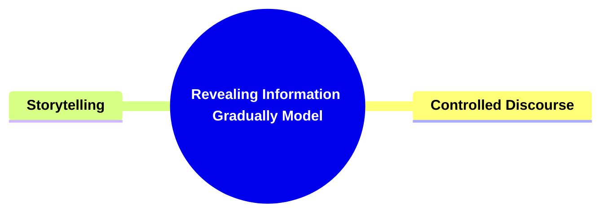

- [**Revealing Information Gradually Model**](#revealing-information-gradually-model)
  - [**1. Title: Revealing Information Gradually**](#1-title-revealing-information-gradually)
  - [**1.1. Definition**](#11-definition)
- [**2. Key Concepts**](#2-key-concepts)
  - [**2.1. Controlled Disclosure**](#21-controlled-disclosure)
    - [**2.1.1. Components of Controlled Disclosure**](#211-components-of-controlled-disclosure)
      - [**2.1.1.1. Pacing Information Release**](#2111-pacing-information-release)
      - [**2.1.1.2. Strategic Plot Unfolding**](#2112-strategic-plot-unfolding)
  - [**2.2. Natural Understanding Growth**](#22-natural-understanding-growth)
    - [**2.2.1. Components of Natural Understanding Growth**](#221-components-of-natural-understanding-growth)
      - [**2.2.1.1. Organic Comprehension**](#2211-organic-comprehension)
      - [**2.2.1.2. Layered Narrative Depth**](#2212-layered-narrative-depth)
- [**3. Implications of Revealing Information Gradually**](#3-implications-of-revealing-information-gradually)
  - [**3.1. Sustained Tension and Engagement**](#31-sustained-tension-and-engagement)
  - [**3.2. Enhanced Narrative Clarity and Depth**](#32-enhanced-narrative-clarity-and-depth)
- [**Core Components Overview**](#core-components-overview)

---

### **Revealing Information Gradually Model**

#### **1. Title: Revealing Information Gradually**

#### **1.1. Definition**

"Revealing Information Gradually" is a narrative framework designed to manage the timing and manner in which information is disclosed within a story. This approach ensures sustained tension, engagement, and clarity by preventing information overload and maintaining suspense. By strategically unfolding critical plot points and character developments, and allowing the audience’s understanding to grow organically, this framework fosters a deeper emotional and intellectual connection between the audience and the narrative.

---

### **2. Key Concepts**

Outline the primary concepts or components that make up the framework. These should be broad enough to accommodate various subjects.

#### **2.1. Controlled Disclosure**

- **Definition:**
  Controlled Disclosure involves managing the timing and manner of information revelation from each throughline to sustain tension, engagement, and clarity within the narrative.

##### **2.1.1. Components of Controlled Disclosure**

###### **2.1.1.1. Pacing Information Release**

- **Definition:**
  Pacing Information Release manages the timing and manner in which information is revealed to prevent overload and maintain suspense.

- **Characteristics:**
  - **Timing Management:** Determines the optimal moments to release key information.
  - **Manner of Disclosure:** Utilizes various methods (e.g., dialogue, flashbacks) to reveal information effectively.
  - **Suspense Maintenance:** Ensures that information is released in a way that keeps the audience engaged and anticipating future developments.

###### **2.1.1.2. Strategic Plot Unfolding**

- **Definition:**
  Strategic Plot Unfolding involves the deliberate unveiling of critical plot points and character developments to keep the audience intrigued.

- **Characteristics:**
  - **Critical Plot Points:** Identifies and reveals major turning points at appropriate times.
  - **Character Development:** Introduces and develops characters gradually to enhance their complexity.
  - **Narrative Intrigue:** Uses techniques to maintain the audience’s interest and investment in the story.

---

#### **2.2. Natural Understanding Growth**

- **Definition:**
  Natural Understanding Growth structures scenes and information flow to allow the audience’s comprehension of the story to develop organically over time.

##### **2.2.1. Components of Natural Understanding Growth**

###### **2.2.1.1. Organic Comprehension**

- **Definition:**
  Organic Comprehension structures scenes to enable the audience to gradually understand the unfolding narrative naturally.

- **Characteristics:**
  - **Progressive Disclosure:** Introduces information in a logical sequence that builds on previous details.
  - **Contextual Clues:** Provides subtle hints and cues that aid in the audience’s understanding.
  - **Engagement Enhancement:** Encourages the audience to actively interpret and engage with the narrative.

###### **2.2.1.2. Layered Narrative Depth**

- **Definition:**
  Layered Narrative Depth involves building the story’s complexity by gradually adding information and thematic elements, allowing the audience to uncover and appreciate the story’s intricacies.

- **Characteristics:**
  - **Thematic Layering:** Introduces multiple themes that interconnect and evolve over time.
  - **Information Stacking:** Adds new layers of information that enhance the narrative’s depth without overwhelming the audience.
  - **Complexity Development:** Develops the story’s complexity in a manageable and engaging manner.

---

### **3. Implications of Revealing Information Gradually**

#### **3.1. Sustained Tension and Engagement**

- **Description:**
  By controlling the disclosure of information, the framework maintains a consistent level of suspense and interest, preventing the narrative from becoming predictable or dull.

#### **3.2. Enhanced Narrative Clarity and Depth**

- **Description:**
  Gradual information release allows for a clearer understanding of the story's complexities as they are revealed in a manageable and coherent manner, enriching the overall narrative experience.

---

### **Core Components Overview**

- **Controlled Disclosure**

  - Pacing Information Release
  - Strategic Plot Unfolding

- **Natural Understanding Growth**
  - Organic Comprehension
  - Layered Narrative Depth

---
