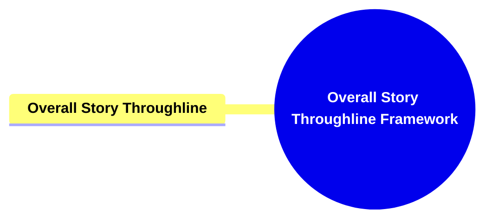

- [**Overall Story Throughline Framework**](#overall-story-throughline-framework)
  - [**1. Title: Overall Story Throughline**](#1-title-overall-story-throughline)
  - [**1.1. Definition**](#11-definition)
- [**2. Key Concepts**](#2-key-concepts)
  - [**2.1. Overall Story Throughline**](#21-overall-story-throughline)
    - [**2.1.1. Components of Overall Story Throughline**](#211-components-of-overall-story-throughline)
      - [**2.1.1.1. Big Picture Conflict**](#2111-big-picture-conflict)
      - [**2.1.1.2. Collective Perspective**](#2112-collective-perspective)
- [**3. Implications of The Four Throughlines Framework**](#3-implications-of-the-four-throughlines-framework)
  - [**3.1. Comprehensive Conflict Integration**](#31-comprehensive-conflict-integration)
  - [**3.2. Enhanced Narrative Cohesion**](#32-enhanced-narrative-cohesion)
- [**Core Components Overview**](#core-components-overview)

---

### **Overall Story Throughline Framework**

#### **1. Title: Overall Story Throughline**

#### **1.1. Definition**

The Overall Story Throughline encompasses the primary conflict that involves all characters, setting the stage for the narrative’s main tension. It represents the universal challenge that the story’s characters must collectively address and resolve. This throughline establishes the central tension that drives the narrative forward, ensuring that all character arcs and plot developments are aligned with the overarching conflict.

### **2. Key Concepts**

Outline the primary concepts or components that make up the framework. These should be broad enough to accommodate various subjects.

#### **2.1. Overall Story Throughline**

- **Definition:**
  The Overall Story Throughline encompasses the primary conflict that involves all characters, setting the stage for the narrative’s main tension. It represents the universal challenge that the story’s characters must collectively address and resolve.

##### **2.1.1. Components of Overall Story Throughline**

###### **2.1.1.1. Big Picture Conflict**

- **Definition:**
  Big Picture Conflict refers to the central problem that involves all characters, establishing the main tension within the narrative.

- **Characteristics:**
  - **Central Problem Involvement:** Encompasses the primary conflict that affects all characters, creating a unified source of tension.
  - **Objective World Presentation:** Focuses on a central problem that impacts everyone, ensuring that the main conflict is universally recognized and significant.

###### **2.1.1.2. Collective Perspective**

- **Definition:**
  Collective Perspective establishes the universal stakes and the overarching conflict that binds the characters together, serving as the foundation upon which individual character stories are built.

- **Characteristics:**
  - **Shared Narrative Context:** Sets up the universal stakes and overarching conflict, ensuring that all narrative threads are interconnected.
  - **Universal Stakes:** Defines what is at stake for the entire narrative world, heightening the story’s tension and urgency as characters strive to overcome the central problem.

---

### **3. Implications of The Four Throughlines Framework**

#### **3.1. Comprehensive Conflict Integration**

- **Description:**
  By incorporating the Overall Story Throughline, the framework ensures that the central conflict is universally acknowledged and addressed by all characters. This integration fosters a cohesive narrative where individual character arcs are aligned with the overarching story tension, enhancing the story’s overall impact and coherence.

#### **3.2. Enhanced Narrative Cohesion**

- **Description:**
  The Collective Perspective within the Overall Story Throughline provides a shared foundation for all narrative elements. This shared context ensures that individual stories and character developments are interwoven seamlessly, resulting in a unified and harmonious narrative structure.

---

### **Core Components Overview**

- **Overall Story Throughline**
  - Big Picture Conflict
  - Collective Perspective

---
