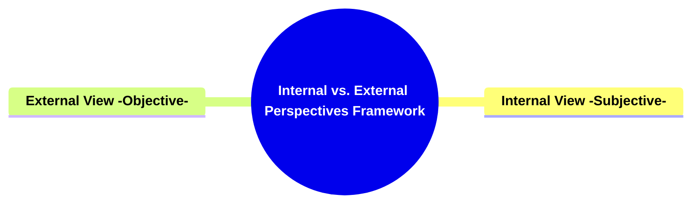

- [**Internal vs. External Perspectives Framework**](#internal-vs-external-perspectives-framework)
  - [**1. Title: Internal vs. External Perspectives Framework**](#1-title-internal-vs-external-perspectives-framework)
  - [**1.1. Definition**](#11-definition)
- [**2. Key Concepts**](#2-key-concepts)
  - [**2.1. Internal View (Subjective)**](#21-internal-view-subjective)
    - [**2.1.1. Components of Internal View (Subjective)**](#211-components-of-internal-view-subjective)
      - [**2.1.1.1. Audience Identification**](#2111-audience-identification)
      - [**2.1.1.2. Subjective Narrative Experience**](#2112-subjective-narrative-experience)
  - [**2.2. External View (Objective)**](#22-external-view-objective)
    - [**2.2.1. Components of External View (Objective)**](#221-components-of-external-view-objective)
      - [**2.2.1.1. Broader Conflict Analysis**](#2211-broader-conflict-analysis)
      - [**2.2.1.2. Balanced Narrative Structure**](#2212-balanced-narrative-structure)
- [**3. Implications of Internal vs. External Perspectives**](#3-implications-of-internal-vs-external-perspectives)
  - [**3.1. Enhanced Audience Empathy and Engagement**](#31-enhanced-audience-empathy-and-engagement)
  - [**3.2. Balanced Narrative Depth and Complexity**](#32-balanced-narrative-depth-and-complexity)
- [**Core Components Overview**](#core-components-overview)

---

### **Internal vs. External Perspectives Framework**

#### **1. Title: Internal vs. External Perspectives Framework**

#### **1.1. Definition**

"Internal vs. External Perspectives" is a comprehensive framework that explores the dual viewpoints through which a narrative can be experienced and analyzed. This framework delineates the subjective, character-focused internal perspective and the objective, broader conflict-oriented external perspective. By balancing these two viewpoints, the framework ensures a multifaceted and balanced storytelling approach that fosters deep audience engagement and a holistic understanding of the narrative's central conflicts and themes.

---

### **2. Key Concepts**

Outline the primary concepts or components that make up the framework. These should be broad enough to accommodate various subjects.

#### **2.1. Internal View (Subjective)**

- **Definition:**
  The Internal View (Subjective) focuses on the narrative experience from the perspective of specific characters, primarily the Main Character. This viewpoint emphasizes the emotional and psychological journey of these characters, fostering empathy and personal investment from the audience.

##### **2.1.1. Components of Internal View (Subjective)**

###### **2.1.1.1. Audience Identification**

- **Definition:**
  Audience Identification enables the audience to closely identify with specific characters, enhancing empathy and personal investment in the character’s journey and development.

- **Characteristics:**
  - **Empathy Building:** Creates emotional connections between the audience and the characters.
  - **Personal Investment:** Encourages the audience to care deeply about the character’s outcomes.
  - **Character Focus:** Highlights the internal struggles and growth of the Main Character.

###### **2.1.1.2. Subjective Narrative Experience**

- **Definition:**
  Subjective Narrative Experience allows the story to be perceived through the emotional and psychological lens of the character, providing an intimate understanding of their motivations, fears, and growth.

- **Characteristics:**
  - **Emotional Depth:** Delves into the character’s internal emotions and psychological state.
  - **Intimate Perspective:** Offers a close-up view of the character’s personal journey.
  - **Motivational Insight:** Reveals the underlying motivations and fears driving the character’s actions.

---

#### **2.2. External View (Objective)**

- **Definition:**
  The External View (Objective) provides a broader perspective of the narrative, allowing the audience to observe and analyze conflicts that impact all characters collectively. This viewpoint offers a macro-level understanding of the story’s central problems and their implications on the entire narrative world.

##### **2.2.1. Components of External View (Objective)**

###### **2.2.1.1. Broader Conflict Analysis**

- **Definition:**
  Broader Conflict Analysis enables the audience to observe and evaluate conflicts that affect all characters collectively, offering a comprehensive understanding of the story’s central issues.

- **Characteristics:**
  - **Macro-Level Insight:** Provides an overview of the main conflicts affecting the entire narrative.
  - **Collective Impact:** Examines how conflicts influence multiple characters and the story world.
  - **Strategic Understanding:** Facilitates analysis of the overarching problems and their resolutions.

###### **2.2.1.2. Balanced Narrative Structure**

- **Definition:**
  Balanced Narrative Structure ensures the harmonious integration of both internal and external perspectives, offering a well-rounded storytelling experience that encompasses personal and universal dimensions of conflict and resolution.

- **Characteristics:**
  - **Dual Perspective Integration:** Combines subjective and objective viewpoints seamlessly.
  - **Thematic Balance:** Maintains equilibrium between character-focused and conflict-focused narrative elements.
  - **Unified Storytelling:** Creates a cohesive narrative that reflects both personal and collective storylines.

---

### **3. Implications of Internal vs. External Perspectives**

#### **3.1. Enhanced Audience Empathy and Engagement**

- **Description:**
  By incorporating both internal and external perspectives, the framework fosters a deeper emotional connection between the audience and the characters while simultaneously providing a comprehensive understanding of the narrative’s central conflicts. This dual approach enhances overall audience engagement and investment in the story.

#### **3.2. Balanced Narrative Depth and Complexity**

- **Description:**
  The integration of subjective and objective viewpoints adds layers of depth and complexity to the narrative. This balance ensures that the story is both emotionally resonant and intellectually stimulating, offering a multifaceted exploration of themes and conflicts that enrich the storytelling experience.

---

### **Core Components Overview**

- **Internal View (Subjective)**

  - Audience Identification
  - Subjective Narrative Experience

- **External View (Objective)**
  - Broader Conflict Analysis
  - Balanced Narrative Structure

---
