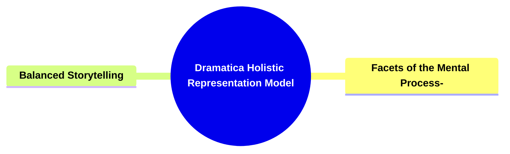

- [**Dramatica Holistic Representation Model**](#dramatica-holistic-representation-model)
  - [**1. Title: Dramatica Holistic Representation Model**](#1-title-dramatica-holistic-representation-model)
  - [**1.1. Definition**](#11-definition)
- [**2. Key Concepts**](#2-key-concepts)
  - [**2.1. Facets of the Mental Process**](#21-facets-of-the-mental-process)
    - [**2.1.1. Components of Facets of the Mental Process**](#211-components-of-facets-of-the-mental-process)
      - [**2.1.1.1. Comprehensive Symbolism**](#2111-comprehensive-symbolism)
      - [**2.1.1.2. Interdependence of Elements**](#2112-interdependence-of-elements)
  - [**2.2. Balanced Storytelling**](#22-balanced-storytelling)
    - [**2.2.1. Components of Balanced Storytelling**](#221-components-of-balanced-storytelling)
      - [**2.2.1.1. Ensuring Coherence and Depth**](#2211-ensuring-coherence-and-depth)
      - [**2.2.1.2. Thematic Richness**](#2212-thematic-richness)
- [**3. Implications of Holistic Representation**](#3-implications-of-holistic-representation)
  - [**3.1. Coherent and Integrated Cognitive Model**](#31-coherent-and-integrated-cognitive-model)
  - [**3.2. Enhanced Narrative Depth and Thematic Exploration**](#32-enhanced-narrative-depth-and-thematic-exploration)
- [**Core Components Overview**](#core-components-overview)

---

### **Dramatica Holistic Representation Model**

#### **1. Title: Dramatica Holistic Representation Model**

#### **1.1. Definition**

"Dramatica Holistic Representation Model" is a comprehensive framework designed to mirror the complexities of the human mental process within a narrative structure. This framework emphasizes the use of comprehensive symbolism and the interdependence of narrative elements to create a cohesive and cognitively rich storytelling experience. By treating every narrative component—such as characters, plot points, themes, and conflicts—as symbolic facets of the human mind, Holistic Representation ensures that the story operates as an integrated unit. This approach fosters narrative coherence, depth, and thematic richness, enabling the audience to engage deeply with the story's intellectual and emotional dimensions.

---

### **2. Key Concepts**

Outline the primary concepts or components that make up the framework. These should be broad enough to accommodate various subjects.

#### **2.1. Facets of the Mental Process**

- **Definition:**
  Facets of the Mental Process involve the symbolic representation of different aspects of human cognition and emotion through narrative elements. This concept ensures that each component of the story contributes to a unified cognitive model, reflecting the interconnected nature of human thought and emotion.

##### **2.1.1. Components of Facets of the Mental Process**

###### **2.1.1.1. Comprehensive Symbolism**

- **Definition:**
  Comprehensive Symbolism ensures that every narrative element—characters, plot points, themes, and conflicts—symbolizes different aspects of the human mental process. This symbolism creates a cohesive narrative where each element plays a role in representing cognitive and emotional facets.

- **Characteristics:**
  - **Symbolic Integration:** Each story element is carefully chosen to represent specific cognitive or emotional aspects.
  - **Cohesive Unit:** All symbolic elements work together to form a unified representation of the mental process.
  - **Enhanced Cognitive Mapping:** Facilitates the audience's understanding of complex mental processes through symbolic storytelling.

###### **2.1.1.2. Interdependence of Elements**

- **Definition:**
  Interdependence of Elements highlights the interconnectedness of characters, plot developments, and thematic explorations within the narrative. This interdependence mirrors the interconnected nature of human thought and emotion, ensuring that all narrative components influence and support each other.

- **Characteristics:**
  - **Mutual Influence:** Narrative elements affect and are affected by one another, creating a dynamic storytelling environment.
  - **Structural Harmony:** Ensures that all elements contribute to a balanced and harmonious narrative structure.
  - **Thematic Cohesion:** Reinforces the story's themes through the interplay of interdependent elements.

---

#### **2.2. Balanced Storytelling**

- **Definition:**
  Balanced Storytelling focuses on maintaining narrative coherence and depth by treating all narrative elements as components of a single cognitive model. This approach ensures that the story remains unified and thoughtfully engages with its central conflict, preventing disjointed or superficial storytelling.

##### **2.2.1. Components of Balanced Storytelling**

###### **2.2.1.1. Ensuring Coherence and Depth**

- **Definition:**
  Ensuring Coherence and Depth involves structuring narrative elements to function as parts of a unified mental process. This method maintains the story’s coherence and depth, allowing for a thoughtful exploration of its central conflict.

- **Characteristics:**
  - **Unified Structure:** All narrative elements are organized to support a single, coherent storyline.
  - **Depth of Exploration:** Provides a thorough and nuanced exploration of themes and conflicts.
  - **Preventing Superficiality:** Avoids shallow or fragmented storytelling by ensuring all elements are meaningfully integrated.

###### **2.2.1.2. Thematic Richness**

- **Definition:**
  Thematic Richness allows for the exploration of complex themes and moral questions through a holistic narrative approach. This richness enhances the story’s intellectual and emotional resonance, providing the audience with a multifaceted understanding of the narrative’s core messages.

- **Characteristics:**
  - **Complex Themes:** Incorporates intricate and layered themes that invite deep reflection.
  - **Moral and Ethical Questions:** Engages the audience with challenging moral and ethical dilemmas.
  - **Intellectual Engagement:** Encourages the audience to think critically about the story’s themes and their implications.

---

### **3. Implications of Holistic Representation**

#### **3.1. Coherent and Integrated Cognitive Model**

- **Description:**
  By using comprehensive symbolism and ensuring the interdependence of narrative elements, the framework creates a coherent and integrated cognitive model within the story. This integration allows the audience to perceive the narrative as a unified representation of the human mental process, enhancing their understanding and engagement with the story’s intellectual and emotional layers.

#### **3.2. Enhanced Narrative Depth and Thematic Exploration**

- **Description:**
  The holistic approach facilitates the exploration of complex themes and moral questions, adding significant depth to the narrative. This depth enriches the storytelling experience, making it more intellectually stimulating and emotionally resonant for the audience. The balanced and integrated narrative structure prevents superficial storytelling, allowing for a more meaningful and impactful narrative.

---

### **Core Components Overview**

- **Facets of the Mental Process**

  - Comprehensive Symbolism
  - Interdependence of Elements

- **Balanced Storytelling**
  - Ensuring Coherence and Depth
  - Thematic Richness

---
