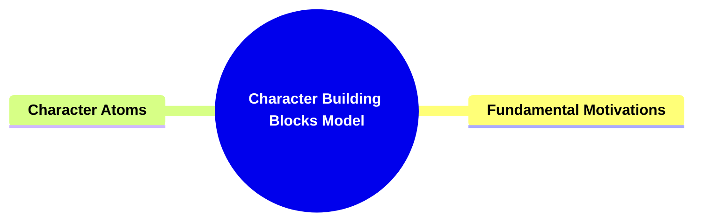

- [**Character Building Blocks Model**](#character-building-blocks-model)
  - [**1. Title: Character Building Blocks Model**](#1-title-character-building-blocks-model)
  - [**1.1. Definition**](#11-definition)
- [**2. Key Concepts**](#2-key-concepts)
  - [**2.1. Fundamental Motivations**](#21-fundamental-motivations)
    - [**2.1.1. Components of Fundamental Motivations**](#211-components-of-fundamental-motivations)
      - [**2.1.1.1. Motivations**](#2111-motivations)
      - [**2.1.1.2. Methodologies**](#2112-methodologies)
      - [**2.1.1.3. Evaluations**](#2113-evaluations)
      - [**2.1.1.4. Purposes**](#2114-purposes)
  - [**2.2. Character Atoms**](#22-character-atoms)
    - [**2.2.1. Components of Character Atoms**](#221-components-of-character-atoms)
      - [**2.2.1.1. Unique Composition**](#2211-unique-composition)
      - [**2.2.1.2. Structural Contribution**](#2212-structural-contribution)
      - [**2.2.1.3. Perspective Diversity**](#2213-perspective-diversity)
- [**3. Implications of Characters Are Constructed from Essential Motivational and Functional Elements**](#3-implications-of-characters-are-constructed-from-essential-motivational-and-functional-elements)
  - [**3.1. Enhanced Narrative Depth**](#31-enhanced-narrative-depth)
  - [**3.2. Dynamic Conflict Resolution**](#32-dynamic-conflict-resolution)
  - [**3.3. Facilitated Character Development**](#33-facilitated-character-development)
  - [**3.4. Enhanced Thematic Complexity**](#34-enhanced-thematic-complexity)
- [**Core Components Overview**](#core-components-overview)

---

---

### **Character Building Blocks Model**

#### **1. Title: Character Building Blocks Model**

#### **1.1. Definition**

"Character Building Blocks Model" is a comprehensive framework within the Storymind framework designed to develop intricate and compelling characters in narrative construction. This framework focuses on two primary components: **Fundamental Motivations** and **Character Atoms**. These components serve as the cornerstone for character psychology, behavior, and the nuanced interplay of motivations within a story. By leveraging these building blocks, authors can create multifaceted characters that contribute meaningfully to the narrative's depth and complexity.

---

### **2. Key Concepts**

Outline the primary concepts or components that make up the framework. These should be broad enough to accommodate various subjects.

#### **2.1. Fundamental Motivations**

- **Definition:**
  Fundamental Motivations represent the most granular units of story structure, encapsulating the core drivers behind a character's actions and decisions. They define a character's motivations, methodologies, evaluations, and purposes.

##### **2.1.1. Components of Fundamental Motivations**

###### **2.1.1.1. Motivations**

- **Definition:**
  Motivations are the intrinsic desires or needs that propel a character to act within the narrative.

- **Characteristics:**
  - **Desire-Driven Actions:** Characters act based on their deep-seated desires or needs.
  - **Goal Orientation:** Motivations provide clear objectives for characters to pursue.
  - **Emotional Basis:** Often rooted in emotional states or experiences.

###### **2.1.1.2. Methodologies**

- **Definition:**
  Methodologies are the strategies or approaches a character employs to achieve their goals.

- **Characteristics:**
  - **Strategic Planning:** Characters use deliberate tactics to pursue their objectives.
  - **Adaptability:** Methods may evolve in response to changing circumstances.
  - **Consistency:** Reflects the character’s personality and values.

###### **2.1.1.3. Evaluations**

- **Definition:**
  Evaluations are the criteria or standards a character uses to assess situations and make decisions.

- **Characteristics:**
  - **Decision-Making Framework:** Guides characters in choosing actions.
  - **Moral Compass:** Reflects the character’s ethical and moral beliefs.
  - **Prioritization:** Helps in determining which goals or actions take precedence.

###### **2.1.1.4. Purposes**

- **Definition:**
  Purposes are the overarching objectives or aims that give direction to a character's actions.

- **Characteristics:**

  - **Long-Term Goals:** Provide a sense of direction and ultimate objectives.
  - **Narrative Alignment:** Align with the story’s central themes and conflicts.
  - **Character Development:** Facilitate growth and transformation over the course of the narrative.

- **Role in Story Structure:**
  - **Character Psychology:** These motivations form the psychological foundation of characters, influencing their behaviors and interactions.
  - **Behavioral Blueprint:** They act as a blueprint for how characters respond to challenges and opportunities within the narrative.
  - **Narrative Consistency:** Ensures that characters act in ways that are consistent with their established motivations, maintaining narrative coherence.

#### **2.2. Character Atoms**

- **Definition:**
  Character Atoms are the embodiment of Elements within characters, making each character an "atom" of personality and viewpoint within the Storymind framework.

##### **2.2.1. Components of Character Atoms**

###### **2.2.1.1. Unique Composition**

- **Definition:**
  Each character is composed of a distinct set of Elements, ensuring their individuality within the narrative.

- **Characteristics:**
  - **Unique Contributions:** Each character atom brings distinct perspectives and skills to the narrative.
  - **Modular Construction:** Characters are built from interchangeable atoms, allowing for flexibility and diversity in character design.
  - **Thematic Integration:** Character atoms align with the story’s themes, ensuring cohesive and meaningful character development.

###### **2.2.1.2. Structural Contribution**

- **Definition:**
  Characters, as atoms, contribute uniquely to the overall structure and thematic development of the story.

- **Characteristics:**
  - **Unique Contributions:** Each character atom brings distinct perspectives and skills to the narrative.
  - **Modular Construction:** Characters are built from interchangeable atoms, allowing for flexibility and diversity in character design.
  - **Thematic Integration:** Character atoms align with the story’s themes, ensuring cohesive and meaningful character development.

###### **2.2.1.3. Perspective Diversity**

- **Definition:**
  By embodying different Elements, characters offer varied perspectives, enriching the narrative's depth and complexity.

- **Characteristics:**

  - **Unique Contributions:** Each character atom brings distinct perspectives and skills to the narrative.
  - **Modular Construction:** Characters are built from interchangeable atoms, allowing for flexibility and diversity in character design.
  - **Thematic Integration:** Character atoms align with the story’s themes, ensuring cohesive and meaningful character development.

- **Role in Story Structure:**
  - **Individuality:** Guarantees that each character has a unique psychological and behavioral profile.
  - **Thematic Alignment:** Aligns characters with the story's themes through their intrinsic Elements.
  - **Interpersonal Dynamics:** Facilitates diverse interactions and relationships based on differing or complementary Elements.

---

### **3. Implications of Characters Are Constructed from Essential Motivational and Functional Elements**

#### **3.1. Enhanced Narrative Depth**

- **Description:**
  By constructing characters with distinct motivational and functional elements, the framework adds layers of complexity to the narrative. Each character's unique approach to problem-solving contributes to a richer and more nuanced story, allowing for deeper engagement with the audience.

#### **3.2. Dynamic Conflict Resolution**

- **Description:**
  The functional diversity among characters leads to dynamic and unpredictable outcomes in conflict resolution. This unpredictability keeps the narrative engaging, as multiple perspectives and methods contribute to the resolution process.

#### **3.3. Facilitated Character Development**

- **Description:**
  The interplay of diverse problem-solving approaches encourages continuous character growth. Characters adapt and evolve in response to the central conflict and their interactions with others, leading to more developed and relatable personas.

#### **3.4. Enhanced Thematic Complexity**

- **Description:**
  Incorporating Classes (Domains) introduces structured layers of conflict and meaning, allowing for a nuanced exploration of various thematic elements. This layered approach ensures that the story delves into both broad societal issues and intricate personal struggles, enriching the narrative's philosophical and ethical dimensions.

---

### **Core Components Overview**

- **Fundamental Motivations**

  - Motivations
  - Methodologies
  - Evaluations
  - Purposes

- **Character Atoms**
  - Unique Composition
  - Structural Contribution
  - Perspective Diversity

---
