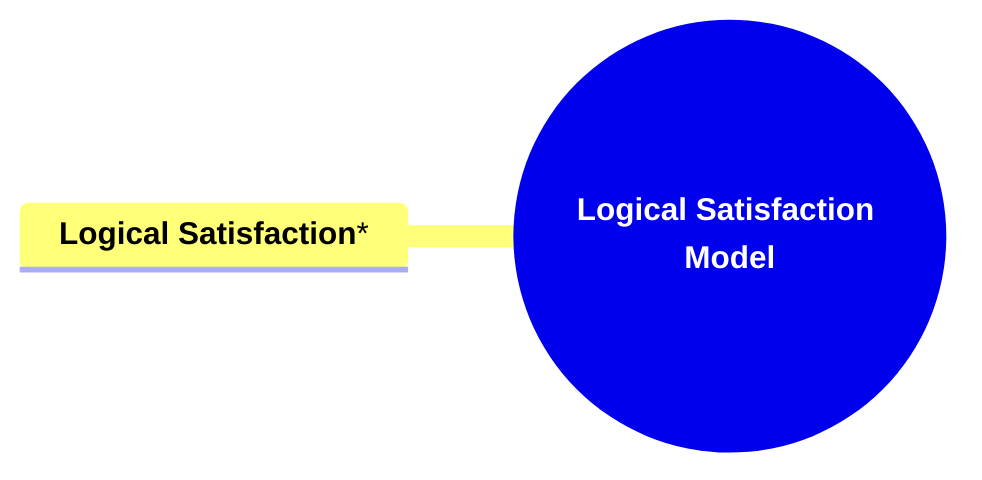

- [**Logical Satisfaction Model**](#logical-satisfaction-model)
  - [**1. Title: Logical Satisfaction**](#1-title-logical-satisfaction)
  - [**1.1. Definition**](#11-definition)
- [**2. Key Concepts**](#2-key-concepts)
  - [**2.1. Logical Satisfaction**](#21-logical-satisfaction)
    - [**2.1.1. Components of Logical Satisfaction**](#211-components-of-logical-satisfaction)
      - [**2.1.1.1. Balanced Resolution**](#2111-balanced-resolution)
      - [**2.1.1.2. Narrative Cohesion**](#2112-narrative-cohesion)
- [**3. Implications of Logical Satisfaction**](#3-implications-of-logical-satisfaction)
  - [**3.1. Fulfilled Audience Intellectual Expectations**](#31-fulfilled-audience-intellectual-expectations)
  - [**3.2. Enhanced Narrative Credibility and Trust**](#32-enhanced-narrative-credibility-and-trust)
- [**Core Components Overview**](#core-components-overview)

---

### **Logical Satisfaction Model**

#### **1. Title: Logical Satisfaction**

#### **1.1. Definition**

"Logical Satisfaction" is a narrative framework component that ensures the story provides a coherent and intellectually fulfilling resolution to its central conflicts. This involves delivering logically consistent conclusions and developments that meet the audience's expectations for narrative integrity and reasoned problem-solving. By achieving narrative cohesion and balanced resolution, the framework enhances the story’s ability to satisfy the audience’s intellectual engagement, fostering a sense of trust and credibility in the narrative structure.

---

### **2. Key Concepts**

Outline the primary concepts or components that make up the framework. These should be broad enough to accommodate various subjects.

#### **2.1. Logical Satisfaction**

- **Definition:**
  Logical Satisfaction involves ensuring that the narrative provides a complete and logically consistent resolution to its central conflicts. This component focuses on delivering endings and developments that make sense within the story’s internal logic, fulfilling the audience's intellectual expectations for coherence and problem-solving.

##### **2.1.1. Components of Logical Satisfaction**

###### **2.1.1.1. Balanced Resolution**

- **Definition:**
  Balanced Resolution ensures that both emotional and logical aspects of the central conflict are resolved, providing a holistic sense of satisfaction that aligns with the story’s internal logic.

- **Characteristics:**
  - **Equitable Closure:** Resolves conflicts in a manner that considers both emotional and logical dimensions, ensuring that neither aspect is neglected.
  - **Consistency with Story Logic:** Resolutions adhere to the established rules and logic of the story’s universe, maintaining narrative integrity.
  - **Integrated Problem-Solving:** Combines emotional fulfillment with logical reasoning to address the story’s central conflicts comprehensively.

###### **2.1.1.2. Narrative Cohesion**

- **Definition:**
  Narrative Cohesion ensures that the story remains consistent and unified, regardless of varying individual interpretations of its thematic elements. This consistency maintains the integrity of the narrative, preventing thematic dissonance and ensuring a coherent storytelling experience.

- **Characteristics:**
  - **Consistent Internal Logic:** The story’s events and resolutions follow a logical progression that aligns with the established narrative rules.
  - **Unified Storyform:** Maintains a coherent structure that ties together different plot points and character developments seamlessly.
  - **Avoidance of Plot Holes:** Ensures that all narrative elements are accounted for and resolved logically, preventing inconsistencies and unresolved questions.

---

### **3. Implications of Logical Satisfaction**

#### **3.1. Fulfilled Audience Intellectual Expectations**

- **Description:**
  By providing complete and logically consistent resolutions, the framework ensures that the audience's intellectual expectations for narrative coherence and problem-solving are met, enhancing their overall satisfaction with the story's structure.

#### **3.2. Enhanced Narrative Credibility and Trust**

- **Description:**
  Logical Satisfaction fosters trust in the narrative’s internal logic, making the story more believable and credible. This credibility enhances the audience’s engagement and investment in the story, as they feel confident in the narrative’s consistency and reliability.

---

### **Core Components Overview**

- **Logical Satisfaction**
  - Balanced Resolution
  - Narrative Cohesion

---
