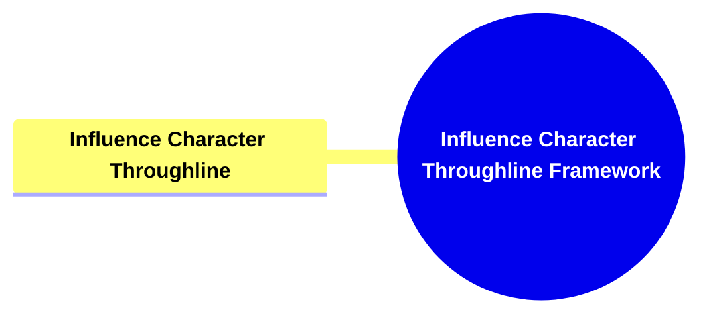

- [0.1. **Influence Character Throughline**](#01-influence-character-throughline)
  - [0.1.1. **Title: Influence Character Throughline**](#011-title-influence-character-throughline)
- [0.2. **Key Concepts**](#02-key-concepts)
  - [0.2.1. **Influence Character Throughline**](#021-influence-character-throughline)
    - [0.2.1.1. **Components of Influence Character Throughline**](#0211-components-of-influence-character-throughline)
      - [0.2.1.1.1. **Worldview Challenge**](#02111-worldview-challenge)
      - [0.2.1.1.2. **Catalyst**](#02112-catalyst)
      - [0.2.1.1.3. **Foil**](#02113-foil)
- [1.1. **Implications of The Four Throughlines Framework**](#11-implications-of-the-four-throughlines-framework)
  - [1.1.1. **Comprehensive Conflict Integration**](#111-comprehensive-conflict-integration)
  - [1.1.2. **Enhanced Narrative Cohesion**](#112-enhanced-narrative-cohesion)
  - [1.1.3. **Deepened Moral and Ethical Exploration**](#113-deepened-moral-and-ethical-exploration)
- [1.2. **Core Components Overview**](#12-core-components-overview)

---

### 0.1. **Influence Character Throughline**

#### 0.1.1. **Title: Influence Character Throughline**

- **Definition:**
  The **Influence Character Throughline** introduces a character who serves as a direct challenge to the Main Character’s beliefs and perspectives. This throughline adds complexity to the narrative by presenting alternative viewpoints and moral dilemmas that catalyze the Main Character’s personal growth and development. By embodying contrasting ideologies and ethical considerations, the Influence Character drives the Main Character to confront and reassess their own values and decisions, thereby deepening the narrative’s thematic exploration and emotional resonance.

---

### 0.2. **Key Concepts**

#### 0.2.1. **Influence Character Throughline**

- **Definition:**
  The Influence Character Throughline introduces a character who serves as a direct challenge to the Main Character’s beliefs and perspectives. This throughline adds complexity to the narrative by presenting alternative viewpoints and moral dilemmas that catalyze the Main Character’s personal growth and development.

##### 0.2.1.1. **Components of Influence Character Throughline**

###### 0.2.1.1.1. **Worldview Challenge**

- **Definition:**
  Worldview Challenge involves the Influence Character directly confronting the Main Character’s beliefs and perspectives. This contrast creates internal conflict, compelling the protagonist to question and reassess their stance on the central problem.

- **Characteristics:**
  - **Contrast with Main Character:** The Influence Character serves as a direct challenge to the Main Character’s beliefs and perspectives, fostering internal conflict.
  - **Catalyst for Change:** By presenting alternative viewpoints and moral dilemmas, the Influence Character acts as a catalyst for the Main Character’s personal growth and development.

###### 0.2.1.1.2. **Catalyst**

- **Definition:** The Catalyst role of the Influence Character introduces transformative ideas, moral dilemmas, or actions that compel the Main Character to confront and reassess their beliefs and behaviors.

- **Characteristics:**
  - **Instigator of Change:** The Catalyst actively challenges the Main Character's perspective, forcing them to evaluate and adapt.
  - **Driving Conflict:** Introduces situations or ideas that heighten tension and propel the narrative forward.
  - **Motivator for Growth:** Acts as a pivotal force that stimulates the Main Character’s personal development and change.

###### 0.2.1.1.3. **Foil**

- **Definition:**
  The Foil role of the Influence Character highlights contrasting values, ideologies, or methods, emphasizing the differences between the Influence Character and the Main Character.

- **Characteristics:**
  - **Highlighting Strengths:**  
    By contrast, the Foil emphasizes the Main Character’s strengths, showcasing their core values and positive attributes.
  - **Highlighting Weaknesses:**  
    The Foil exposes the Main Character’s flaws and vulnerabilities, creating opportunities for growth and introspection.
  - **Moral Tensions:**  
    The Foil’s contrasting moral framework introduces dilemmas that challenge the Main Character’s sense of right and wrong.
  - **Ethical Tensions:**
  1. The Foil’s differing ethical approach creates conflict over actions and decisions, deepening the story's thematic complexity.

---

### 1.1. **Implications of The Four Throughlines Framework**

#### 1.1.1. **Comprehensive Conflict Integration**

- **Description:**
  By incorporating the Overall Story Throughline, the framework ensures that the central conflict is universally acknowledged and addressed by all characters. This integration fosters a cohesive narrative where individual character arcs are aligned with the overarching story tension, enhancing the story’s overall impact and coherence.

#### 1.1.2. **Enhanced Narrative Cohesion**

- **Description:**
  The Collective Perspective within the Overall Story Throughline provides a shared foundation for all narrative elements. This shared context ensures that individual stories and character developments are interwoven seamlessly, resulting in a unified and harmonious narrative structure.

#### 1.1.3. **Deepened Moral and Ethical Exploration**

- **Description:**
  The Influence Character Throughline introduces contrasting viewpoints and moral dilemmas, enriching the narrative’s thematic depth. This addition fosters intellectual engagement and encourages audiences to explore complex ethical landscapes, thereby enhancing the story’s overall richness and resonance.

---

### 1.2. **Core Components Overview**

- **Overall Story Throughline**

  - Big Picture Conflict
  - Collective Perspective

- **Main Character Throughline**

  - Personal Viewpoint
  - Internal Drive and Growth

- **Influence Character Throughline**
  - Worldview Challenge
  - Catalyst and Foil

---
