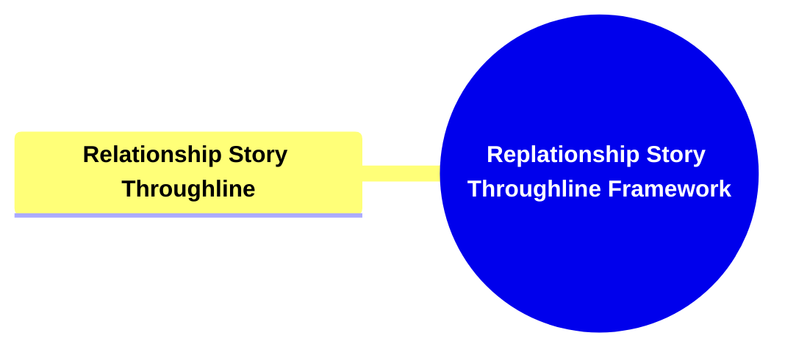

- [**Relationship Story Throughline Model**](#relationship-story-throughline-model)
  - [**1. Title: Relationship Story Throughline**](#1-title-relationship-story-throughline)
  - [**1.1. Definition**](#11-definition)
- [**2. Key Concepts**](#2-key-concepts)
  - [**2.1. Relationship Story Throughline**](#21-relationship-story-throughline)
    - [**2.1.1. Components of Relationship Story Throughline**](#211-components-of-relationship-story-throughline)
      - [**2.1.1.1. Dynamic Interaction**](#2111-dynamic-interaction)
      - [**2.1.1.2. Thematic Heart**](#2112-thematic-heart)
- [**3. Implications of The Four Throughlines Framework**](#3-implications-of-the-four-throughlines-framework)
  - [**3.1. Comprehensive Conflict Integration**](#31-comprehensive-conflict-integration)
  - [**3.2. Enhanced Narrative Cohesion**](#32-enhanced-narrative-cohesion)
  - [**3.3. Deepened Moral and Ethical Exploration**](#33-deepened-moral-and-ethical-exploration)
  - [**3.4. Enhanced Emotional and Thematic Depth**](#34-enhanced-emotional-and-thematic-depth)
- [**Core Components Overview**](#core-components-overview)

---

### **Relationship Story Throughline Model**

#### **1. Title: Relationship Story Throughline**

#### **1.1. Definition**

The **Relationship Story Throughline** explores the evolving relationship between the Main Character and the Influence Character, highlighting personal and emotional tensions. It examines how their interactions and conflicts shape the narrative’s emotional landscape and drive the story’s thematic elements. By focusing on the dynamics between these two central characters, this throughline adds depth to the narrative, fostering emotional resonance and enhancing the exploration of complex themes.

### **2. Key Concepts**

Outline the primary concepts or components that make up the framework. These should be broad enough to accommodate various subjects.

#### **2.1. Relationship Story Throughline**

- **Definition:**
  The Relationship Story Throughline explores the evolving relationship between the Main Character and the Influence Character, highlighting personal and emotional tensions. It examines how their interactions and conflicts shape the narrative’s emotional landscape and drive the story’s thematic elements.

##### **2.1.1. Components of Relationship Story Throughline**

###### **2.1.1.1. Dynamic Interaction**

- **Definition:**
  Dynamic Interaction focuses on the evolving relationship between the Main Character and the Influence Character, emphasizing personal and emotional tensions. It examines how their interactions and conflicts influence character motivations and narrative progression.

- **Characteristics:**
  - **Interpersonal Relationship Focus:** Explores the evolving relationship between the Main Character and the Influence Character, highlighting personal and emotional tensions.
  - **Emotional and Psychological Dynamics:** Delves into the complexities of interpersonal dynamics, showcasing how relationships influence character motivations and narrative progression.

###### **2.1.1.2. Thematic Heart**

- **Definition:**
  Thematic Heart refers to how the evolving relationship between the Main Character and the Influence Character embodies and drives the story’s thematic elements. It illustrates how personal relationships reflect and influence broader thematic conflicts.

- **Characteristics:**
  - **Embodiment of Themes:** The relationship serves as the narrative’s emotional core, embodying and driving the story’s thematic elements.
  - **Emotional Resonance:** Focuses on the relationship’s emotional depth, ensuring that the narrative resonates emotionally with the audience and fosters a deeper connection to the story’s themes and characters.

---

### **3. Implications of The Four Throughlines Framework**

#### **3.1. Comprehensive Conflict Integration**

- **Description:**
  By incorporating the Overall Story Throughline, the framework ensures that the central conflict is universally acknowledged and addressed by all characters. This integration fosters a cohesive narrative where individual character arcs are aligned with the overarching story tension, enhancing the story’s overall impact and coherence.

#### **3.2. Enhanced Narrative Cohesion**

- **Description:**
  The Collective Perspective within the Overall Story Throughline provides a shared foundation for all narrative elements. This shared context ensures that individual stories and character developments are interwoven seamlessly, resulting in a unified and harmonious narrative structure.

#### **3.3. Deepened Moral and Ethical Exploration**

- **Description:**
  The Influence Character Throughline introduces contrasting viewpoints and moral dilemmas, enriching the narrative’s thematic depth. This addition fosters intellectual engagement and encourages audiences to explore complex ethical landscapes, thereby enhancing the story’s overall richness and resonance.

#### **3.4. Enhanced Emotional and Thematic Depth**

- **Description:**
  The Relationship Story Throughline adds emotional and thematic layers to the narrative by focusing on the evolving dynamics between key characters. This throughline ensures that personal relationships are not only central to character development but also serve as vessels for the story’s overarching themes. By highlighting the emotional and psychological interactions between characters, the framework deepens the audience’s emotional investment and reinforces the story’s thematic messages.

---

### **Core Components Overview**

- **Overall Story Throughline**

  - Big Picture Conflict
  - Collective Perspective

- **Main Character Throughline**

  - Personal Viewpoint
  - Internal Drive and Growth

- **Influence Character Throughline**

  - Worldview Challenge
  - Catalyst and Foil

- **Relationship Story Throughline**
  - Dynamic Interaction
  - Thematic Heart

---
