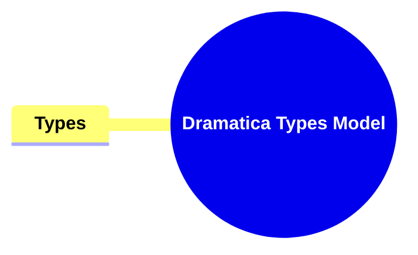

- [**Dramatica Types Model**](#dramatica-types-model)
  - [**1. Title: Types**](#1-title-types)
  - [**1.1. Definition**](#11-definition)
- [**2. Key Concepts**](#2-key-concepts)
  - [**2.1. Types**](#21-types)
    - [**2.1.1. Components of Types**](#211-components-of-types)
      - [**2.1.1.1. Medium-Scale Topics**](#2111-medium-scale-topics)
      - [**2.1.1.2. Contextual Specificity**](#2112-contextual-specificity)
- [**3. Implications of Types**](#3-implications-of-types)
  - [**3.1. Enhanced Narrative Precision**](#31-enhanced-narrative-precision)
  - [**3.2. Nuanced Conflict Exploration**](#32-nuanced-conflict-exploration)
  - [**3.3. Improved Thematic Alignment**](#33-improved-thematic-alignment)
- [**Core Components Overview**](#core-components-overview)

---

### **Dramatica Types Model**

#### **1. Title: Types**

#### **1.1. Definition**

"Types" categorize the conflicts within each Fundamental Conflict Area into more specific contexts, allowing for a detailed and precise exploration of narrative challenges. This subdivision facilitates targeted storytelling and thematic alignment within each Class, enhancing the narrative’s thematic clarity and coherence by providing structured contexts for conflict exploration.

---

### **2. Key Concepts**

Outline the primary concepts or components that make up the framework. These should be broad enough to accommodate various subjects.

#### **2.1. Types**

- **Definition:**
  Types categorize the conflicts within each Fundamental Conflict Area into more specific contexts, allowing for a detailed and precise exploration of narrative challenges. This subdivision facilitates targeted storytelling and thematic alignment within each Class.

##### **2.1.1. Components of Types**

###### **2.1.1.1. Medium-Scale Topics**

- **Definition:**
  Medium-Scale Topics involve specific contextual focuses within each Class, providing a more detailed setting for narrative exploration.

- **Characteristics:**
  - **Specific Contextual Focus:** Each Class is subdivided into Types that narrow the focus of conflict, providing a more specific context for narrative exploration. For example, the Physics Class includes Types such as “Understanding,” “Doing,” “Obtaining,” and “Learning,” each contextualizing different aspects of activities and actions.
  - **Enhanced Narrative Precision:** Types allow authors to pinpoint the exact nature of conflicts within each Class, facilitating a more precise and targeted narrative structure. This precision enhances the story’s thematic clarity and coherence.

###### **2.1.1.2. Contextual Specificity**

- **Definition:**
  Contextual Specificity offers tailored contexts that guide the narrative’s exploration of conflict, ensuring that each aspect is examined in detail.

- **Characteristics:**
  - **Tailored Conflict Contexts:** Types offer tailored contexts that guide the narrative’s exploration of conflict, ensuring that each aspect is examined in detail. This specificity prevents broad, unfocused storytelling, promoting a more nuanced and engaging narrative.
  - **Thematic Direction:** By defining specific Types, authors can steer the narrative’s thematic direction, aligning plot developments and character actions with the story’s overarching themes.

---

### **3. Implications of Types**

#### **3.1. Enhanced Narrative Precision**

- **Description:**
  By categorizing conflicts into specific Types, authors can create more precise and targeted narrative structures. This precision allows for a clearer thematic focus and helps prevent narrative dissonance by ensuring that conflicts are contextually appropriate and thematically aligned.

#### **3.2. Nuanced Conflict Exploration**

- **Description:**
  Types enable a more nuanced exploration of conflicts by providing detailed contexts for narrative challenges. This allows for deeper thematic exploration and richer storytelling, as conflicts are examined from multiple, well-defined angles.

#### **3.3. Improved Thematic Alignment**

- **Description:**
  Thematic Direction facilitated by Types ensures that plot developments and character actions are consistently aligned with the story’s overarching themes. This alignment enhances the story’s coherence and ensures that thematic elements are effectively reinforced throughout the narrative.

---

### **Core Components Overview**

- **Types**
  - Medium-Scale Topics
  - Contextual Specificity

---
