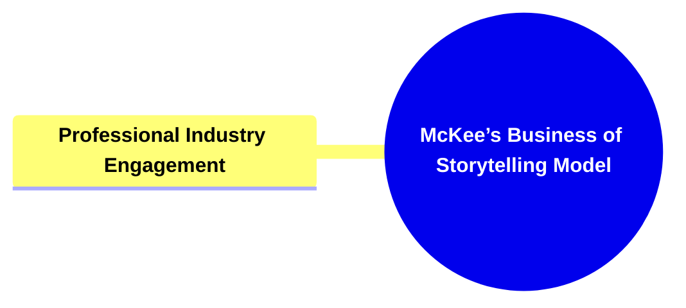
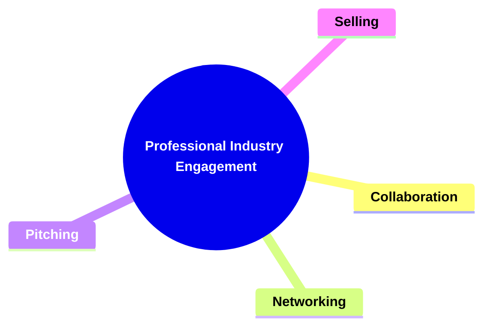
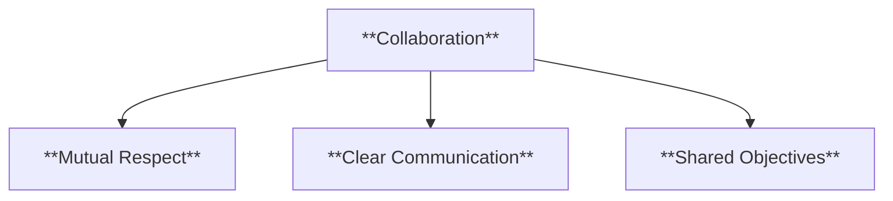
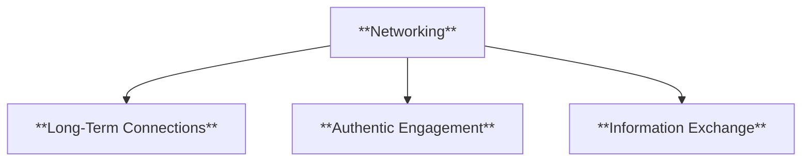
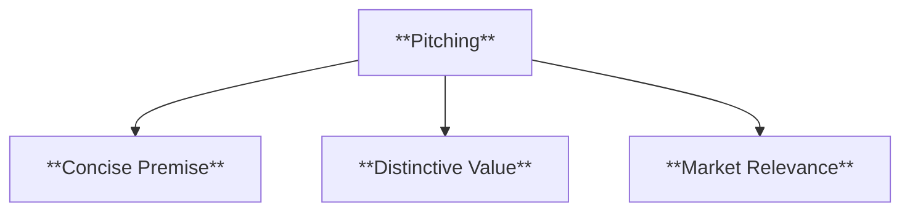
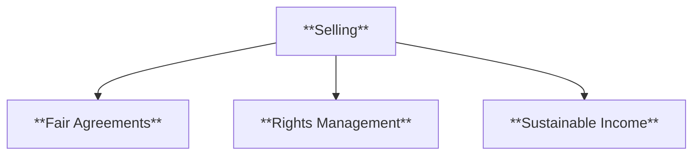
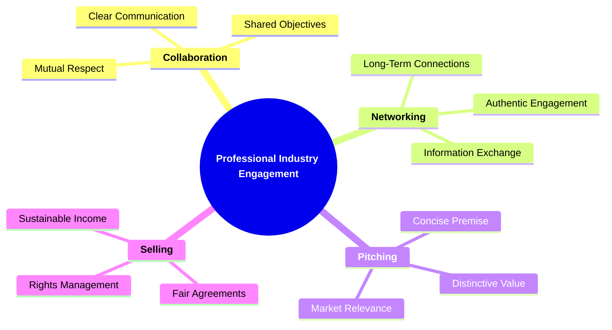

- [**1. Title: McKee’s Business of Storytelling Model**](#1-title-mckees-business-of-storytelling-model)
  - [**1.1. Definition**](#11-definition)
- [**2. Key Concepts**](#2-key-concepts)
  - [**2.1. Professional Industry Engagement**](#21-professional-industry-engagement)
    - [**2.1.1. Components of Professional Industry Engagement**](#211-components-of-professional-industry-engagement)
      - [**2.1.1.1. Collaboration**](#2111-collaboration)
      - [**2.1.1.2. Networking**](#2112-networking)
      - [**2.1.1.3. Pitching**](#2113-pitching)
      - [**2.1.1.4. Selling**](#2114-selling)
- [**3. Implications of McKee’s Business of Storytelling Model**](#3-implications-of-mckees-business-of-storytelling-model)
  - [**3.1. Professional Sustainability**](#31-professional-sustainability)
  - [**3.2. Strategic Creative Control**](#32-strategic-creative-control)
  - [**3.3. Expanded Opportunities**](#33-expanded-opportunities)
- [**Core Components Overview**](#core-components-overview)

---

### **1. Title: McKee’s Business of Storytelling Model**

#### **1.1. Definition**

McKee’s Business of Storytelling Model emphasizes the professional aspects of writing for the entertainment industry. Beyond narrative craft, understanding how to collaborate effectively, establish networks, pitch ideas, and sell stories is essential for achieving commercial success and creative influence.

---

### **2. Key Concepts**

#### **2.1. Professional Industry Engagement**

- **Definition:**
  Engaging strategically with industry players and market realities to move stories from concept to production.

##### **2.1.1. Components of Professional Industry Engagement**

###### **2.1.1.1. Collaboration**

- **Definition:**
  Working productively with producers, directors, writers, and other creatives to bring a shared vision to life.

- **Characteristics:**
  - **Mutual Respect:** Acknowledging each contributor’s expertise and perspective.
  - **Clear Communication:** Expressing ideas openly and constructively.
  - **Shared Objectives:** Aligning creative goals to strengthen narrative coherence and impact.

---

###### **2.1.1.2. Networking**

- **Definition:**
  Building relationships with industry professionals to access opportunities, resources, and insights.

- **Characteristics:**
  - **Long-Term Connections:** Cultivating relationships that foster ongoing support.
  - **Authentic Engagement:** Showing genuine interest in colleagues’ work and goals.
  - **Information Exchange:** Gaining knowledge about trends, best practices, and emerging markets.

---

###### **2.1.1.3. Pitching**

- **Definition:**
  Presenting story concepts persuasively to producers, studios, or investors to secure development deals.

- **Characteristics:**
  - **Concise Premise:** Distilling the story’s essence into a compelling pitch.
  - **Distinctive Value:** Highlighting unique elements that differentiate the narrative.
  - **Market Relevance:** Demonstrating familiarity with audience expectations and industry trends.

---

###### **2.1.1.4. Selling**

- **Definition:**
  Negotiating contracts, rights, and distribution arrangements to ensure fair compensation and appropriate exposure.

- **Characteristics:**
  - **Fair Agreements:** Structuring deals that reflect the story’s worth.
  - **Rights Management:** Retaining key intellectual property privileges.
  - **Sustainable Income:** Creating revenue streams that support long-term career stability.

---

### **3. Implications of McKee’s Business of Storytelling Model**

#### **3.1. Professional Sustainability**

- **Description:**
  By mastering collaboration, networking, pitching, and selling, writers can cultivate lasting careers, safeguard their interests, and navigate the industry confidently.

#### **3.2. Strategic Creative Control**

- **Description:**
  Understanding the business environment empowers writers to maintain artistic integrity while meeting market demands and audience expectations.

#### **3.3. Expanded Opportunities**

- **Description:**
  Effective professional engagement opens pathways to new projects, partnerships, and platforms, allowing writers to diversify their portfolios and reach wider audiences.

---

### **Core Components Overview**

- **Professional Industry Engagement**
  - Collaboration
  - Networking
  - Pitching
  - Selling

---

