- [**1. Title: McKee's Three Levels of Storytelling Model**](#1-title-mckees-three-levels-of-storytelling-model)
  - [**1.1. Definition**](#11-definition)
- [**2. Key Concepts**](#2-key-concepts)
  - [**2.1. Substance**](#21-substance)
    - [**2.1.1. Components of Substance**](#211-components-of-substance)
      - [**2.1.1.1. Characters**](#2111-characters)
      - [**2.1.1.2. Conflicts**](#2112-conflicts)
      - [**2.1.1.3. Themes**](#2113-themes)
      - [**2.1.1.4. Underlying Ideas**](#2114-underlying-ideas)
  - [**2.2. Structure**](#22-structure)
    - [**2.2.1. Components of Structure**](#221-components-of-structure)
      - [**2.2.1.1. Plot Points**](#2211-plot-points)
      - [**2.2.1.2. Pacing**](#2212-pacing)
      - [**2.2.1.3. Architectural Framework**](#2213-architectural-framework)
  - [**2.3. Style**](#23-style)
    - [**2.3.1. Components of Style**](#231-components-of-style)
      - [**2.3.1.1. Narrative Techniques**](#2311-narrative-techniques)
      - [**2.3.1.2. Dialogue**](#2312-dialogue)
      - [**2.3.1.3. Aesthetic Choices**](#2313-aesthetic-choices)
- [**3. Implications of McKee's Three Levels of Storytelling Model**](#3-implications-of-mckees-three-levels-of-storytelling-model)
  - [**3.1. Holistic Narrative Development**](#31-holistic-narrative-development)
  - [**3.2. Enhanced Emotional Resonance**](#32-enhanced-emotional-resonance)
  - [**3.3. Increased Artistic Integrity**](#33-increased-artistic-integrity)
- [**Core Components Overview**](#core-components-overview)

---

Below is the entire document, now including all the Mermaid diagrams. The structure and formatting remain consistent with the previously established template.

---

### **1. Title: McKee's Three Levels of Storytelling Model**

#### **1.1. Definition**

McKee's Three Levels of Storytelling Model delineates storytelling into three distinct yet interdependent levels: Substance, Structure, and Style. Each level contributes to the overall impact and effectiveness of the narrative. This model emphasizes that mastering these three levels enables writers to create stories that are well-constructed, rich in meaning, and emotionally resonant.

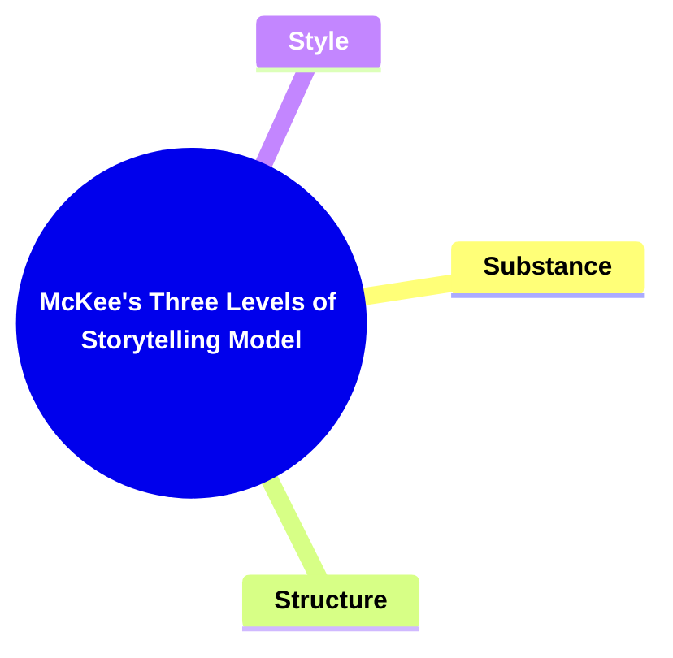

---

### **2. Key Concepts**

Outline the primary concepts or components that make up the framework. These should be broad enough to accommodate various subjects.

#### **2.1. Substance**

- **Definition:**
  Substance pertains to the **content** of the story. It encompasses the characters, conflicts, themes, and the underlying ideas that drive the narrative forward. Substance is about the "what" of the story—the elements that provide depth and meaning.

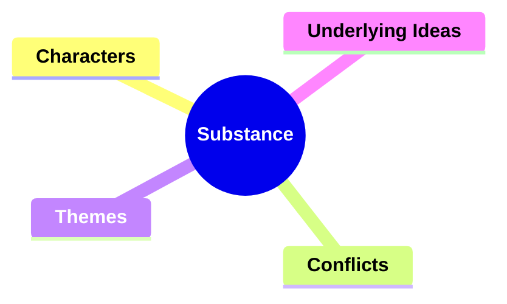

##### **2.1.1. Components of Substance**

###### **2.1.1.1. Characters**

- **Definition:**
  The individuals who populate the story, each with distinct personalities, motivations, and development arcs.
- **Characteristics:**
  - **Complexity:** Multi-dimensional personalities that evolve over time
  - **Relatability:** Characters that audiences can connect with on an emotional level
  - **Development:** Progressive growth or transformation throughout the narrative

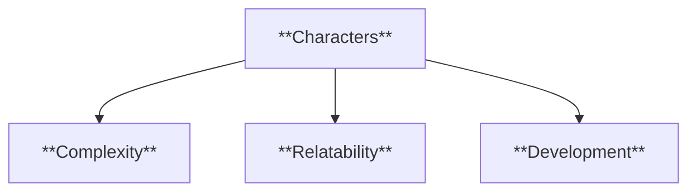

###### **2.1.1.2. Conflicts**

- **Definition:**
  The challenges and obstacles that characters face, driving the narrative forward and creating tension.
- **Characteristics:**
  - **Internal Conflicts:** Struggles within a character’s mind or emotions
  - **External Conflicts:** Challenges arising from outside forces or other characters
  - **Escalation:** Increasing intensity of conflicts to heighten suspense

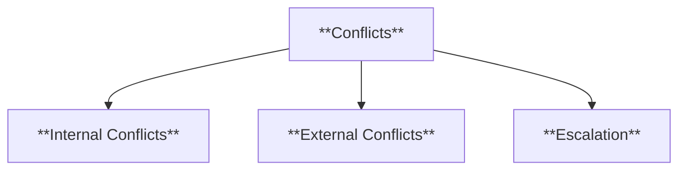

###### **2.1.1.3. Themes**

- **Definition:**
  The central ideas or messages that the story explores, providing deeper meaning and resonance.
- **Characteristics:**
  - **Universality:** Themes that are widely relatable and timeless
  - **Depth:** Complex ideas that invite reflection and interpretation
  - **Integration:** Seamlessly woven into the narrative and character arcs

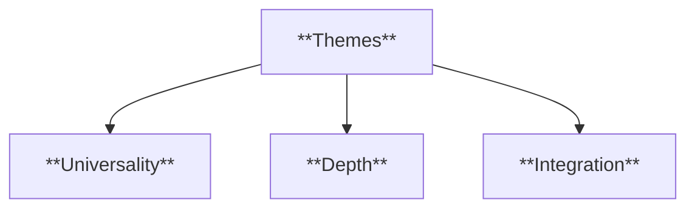

###### **2.1.1.4. Underlying Ideas**

- **Definition:**
  The foundational concepts and philosophies that inform the story’s direction and purpose.
- **Characteristics:**
  - **Philosophical Insights:** Exploration of fundamental questions about existence, morality, etc.
  - **Moral Lessons:** Ethical takeaways that influence character decisions and plot outcomes
  - **Symbolism:** Use of symbols to represent broader ideas and themes

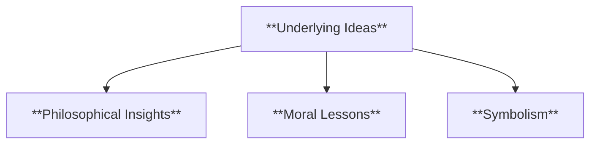

---

#### **2.2. Structure**

- **Definition:**
  Structure refers to the **framework** that organizes the story’s events into a coherent and compelling sequence. It involves the arrangement of plot points, pacing, and the overall architecture that ensures the story unfolds in a logical and engaging manner.

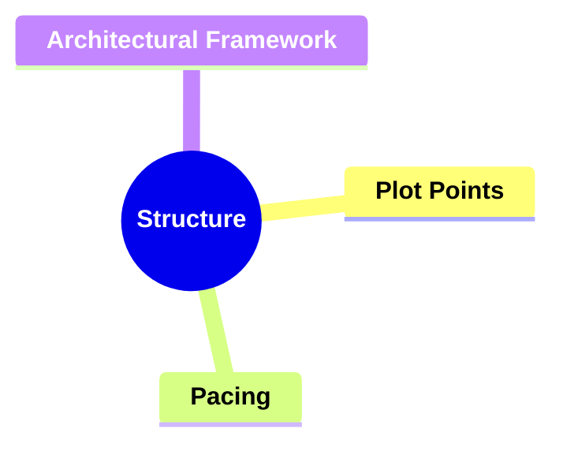

##### **2.2.1. Components of Structure**

###### **2.2.1.1. Plot Points**

- **Definition:**
  Key events that shape the direction of the story and influence character decisions.
- **Characteristics:**
  - **Inciting Incident:** The event that sets the story in motion
  - **Climax:** The peak of the story’s tension and conflict
  - **Resolution:** The conclusion where conflicts are resolved

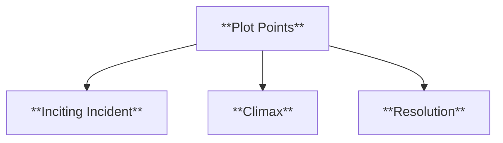

###### **2.2.1.2. Pacing**

- **Definition:**
  The speed and rhythm at which the story progresses, affecting the audience’s engagement and emotional response.
- **Characteristics:**
  - **Variety:** Alternating between fast-paced and slower, more reflective moments
  - **Rhythm:** Consistent flow that maintains audience interest
  - **Timing:** Strategic placement of key events to maximize impact

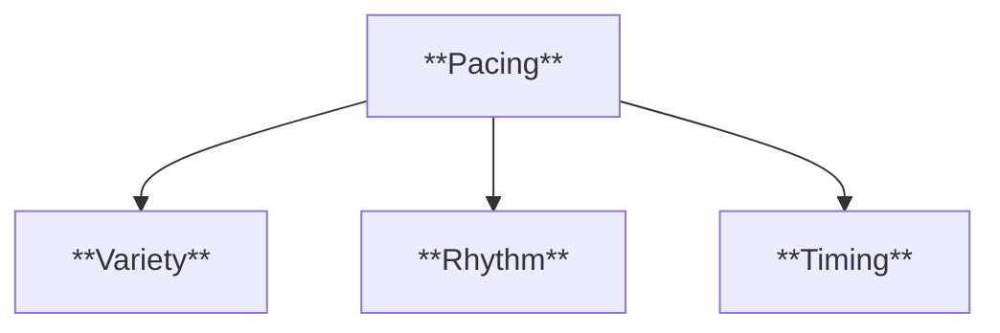

###### **2.2.1.3. Architectural Framework**

- **Definition:**
  The overall structure that provides a roadmap for the story’s progression, ensuring coherence and logical flow.
- **Characteristics:**
  - **Three-Act Structure:** Division of the story into Setup, Confrontation, and Resolution
  - **Narrative Arcs:** Individual storylines that interweave to form the complete narrative
  - **Scene Organization:** Logical arrangement of scenes to build towards the climax

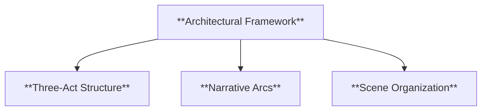

---

#### **2.3. Style**

- **Definition:**
  Style is the **unique voice, tone, and presentation** that distinguish one story from another. It includes the narrative techniques, dialogue, and aesthetic choices that give the story its distinctive identity and flavor.

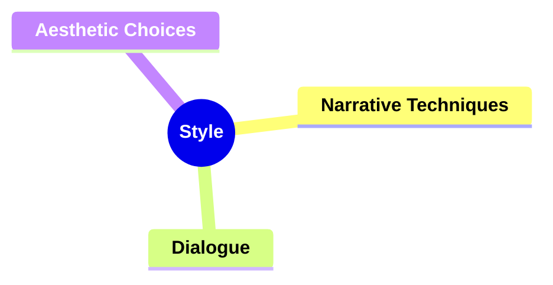

##### **2.3.1. Components of Style**

###### **2.3.1.1. Narrative Techniques**

- **Definition:**
  The methods and approaches used to tell the story, influencing how the audience perceives and experiences the narrative.
- **Characteristics:**
  - **Point of View:** First-person, third-person, omniscient, etc.
  - **Foreshadowing:** Hints or clues about future events
  - **Flashbacks:** Scenes set in a time earlier than the main narrative

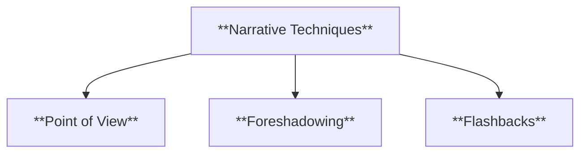

###### **2.3.1.2. Dialogue**

- **Definition:**
  The spoken interactions between characters, contributing to character development and plot advancement.
- **Characteristics:**
  - **Authenticity:** Natural and believable speech patterns
  - **Subtext:** Underlying meanings and emotions conveyed through dialogue
  - **Distinctiveness:** Unique voices that differentiate characters

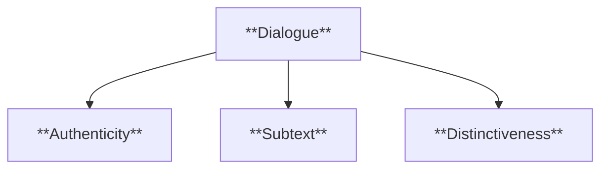

###### **2.3.1.3. Aesthetic Choices**

- **Definition:**
  The visual and sensory elements that shape the story’s presentation and atmosphere.
- **Characteristics:**
  - **Symbolism:** Use of symbols to convey deeper meanings
  - **Imagery:** Descriptive language that creates vivid mental pictures
  - **Tone:** The overall mood or feeling conveyed by the story

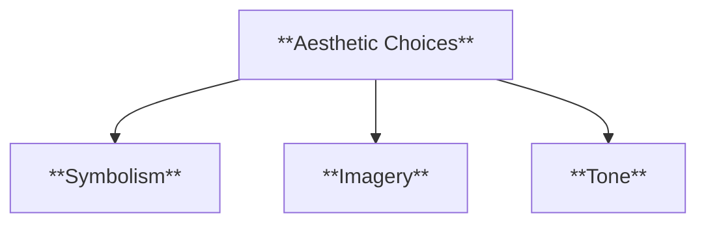

---

### **3. Implications of McKee's Three Levels of Storytelling Model**

#### **3.1. Holistic Narrative Development**

- **Description:**
  By addressing Substance, Structure, and Style, McKee's model ensures that stories are developed comprehensively. This holistic approach prevents narratives from being one-dimensional, promoting depth and balance across all aspects of storytelling.

#### **3.2. Enhanced Emotional Resonance**

- **Description:**
  Mastery of the three levels allows writers to craft stories that resonate emotionally with audiences. Substance provides meaningful content, Structure ensures a coherent and engaging journey, and Style delivers a unique and impactful presentation, together fostering a deep emotional connection.

#### **3.3. Increased Artistic Integrity**

- **Description:**
  McKee's emphasis on Style encourages originality and authenticity, allowing writers to develop their unique voices. This focus on artistic integrity elevates the quality of storytelling, making narratives not only effective but also memorable and distinctive.

---

### **Core Components Overview**

- **Substance**

  - Characters
  - Conflicts
  - Themes
  - Underlying Ideas

- **Structure**

  - Plot Points
  - Pacing
  - Architectural Framework

- **Style**
  - Narrative Techniques
  - Dialogue
  - Aesthetic Choices

---

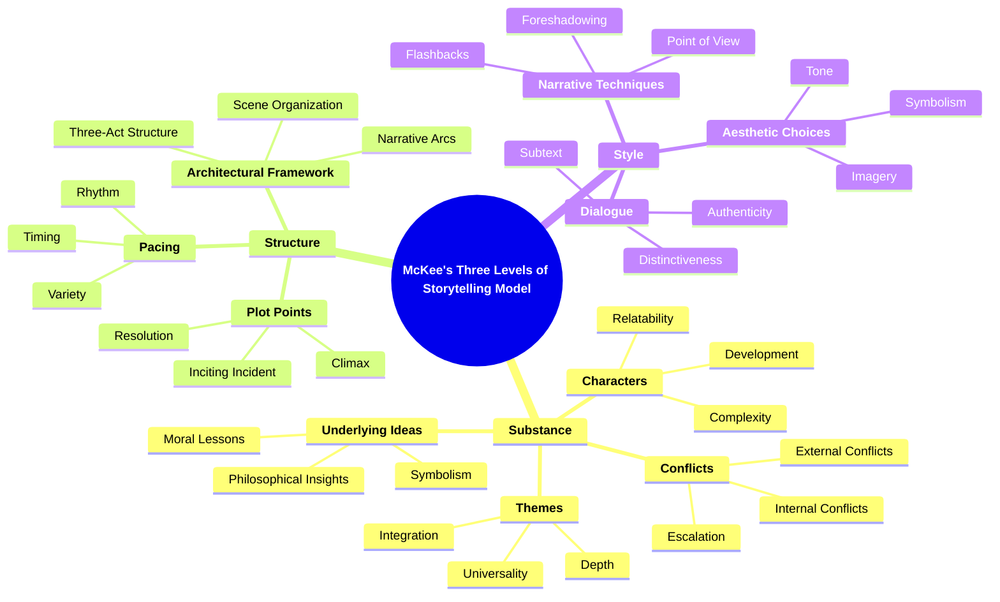
