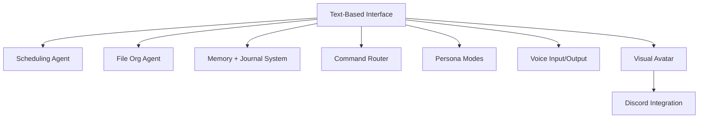

Here's your **PMP-style overview document** in clean, markdown-compatible format. This will serve as your master reference while you build your **AI Executive Assistant System (text-first, eventually Neurosama-style)**.

---

````markdown
# 🧠 Project Overview: AI Executive Assistant System (Lola-sama)

**Project Name**: Lola-sama  
**Version**: 0.1 (Text-Based MVP → Long-Term Visual/Voice Companion)  
**Type**: Private Executive Productivity + Creative Assistant  
**Primary Goal**: Replace/augment human EA/Chief of Staff with a custom AI agent tailored to adult/creative workflows.

---

## 🗂️ 1. Scope Statement

### **Objective**

Design and deploy a modular, local-first AI system that:

- Responds in natural language
- Manages scheduling, tasks, and files
- Understands and supports NSFW/creative work
- Eventually evolves into a real-time embodied assistant (Live2D + Voice I/O)

### **In Scope**

- Text-based interface (CLI or desktop UI)
- Agent routing and memory modules
- Scheduling, journaling, and tagging tools
- File and content organization support
- Discord and voice integration (future phases)

### **Out of Scope (for v0.1)**

- Full emotional modeling
- Live avatar video generation
- Multi-user management

---

## 🛠️ 2. Technical Stack (v0.1 MVP)

| Component        | Tool                            | Notes                              |
| ---------------- | ------------------------------- | ---------------------------------- |
| Core LLM         | Ollama (Nous-Hermes / Mixtral)  | Local, customizable, NSFW-friendly |
| Interface        | TUI / React / Electron          | Text-first UI                      |
| Memory           | SQLite / JSON / Markdown        | Long + short term memory logging   |
| Scheduling Agent | Google Calendar API / iCal      | Time-blocking, event creation      |
| File Org Agent   | Python + OS tools / Dropbox API | Organize, tag, sort local or cloud |
| Voice (future)   | Whisper.cpp + Piper/VoiceVox    | Real-time STT and TTS pipeline     |
| Visual (future)  | VTube Studio + OBS              | Avatar-based front-end             |
| Comms Bridge     | Discord bot                     | Optional call/chat bridge          |

---

## 📆 3. Project Phases

### **Phase 1: Interface MVP**

- [ ] Text console
- [ ] Prompt/response loop
- [ ] Basic memory logging
- [ ] Journal command

### **Phase 2: Functional Agents**

- [ ] Calendar integration
- [ ] File organizer
- [ ] Tagging + task manager
- [ ] Command routing system

### **Phase 3: Personality + Dialogue**

- [ ] Mode switching (assistant/waifu/dom/etc.)
- [ ] Memory reinforcement and tone variation
- [ ] Config-based personalities

### **Phase 4: Real-Time Companion**

- [ ] Voice input/output
- [ ] Visual avatar integration
- [ ] Discord/OBS compatibility

---

## 👥 4. Roles and Responsibilities

| Role                | Owner         | Responsibility                                   |
| ------------------- | ------------- | ------------------------------------------------ |
| Creative Director   | You           | Persona definition, tone, naming, interface flow |
| Technical Architect | ChatGPT / You | Stack decisions, modularity, performance tuning  |
| DevOps              | You           | Deployment, hosting, local tuning                |
| Tester              | You           | Prompt evaluation, task feedback, memory QA      |

---

## 🧩 5. Features Map


````

---

## 📊 6. KPIs and Success Criteria

- ✅ Can summarize daily activity on command
- ✅ Responds with personality tone modes
- ✅ Creates and updates Google Calendar events
- ✅ Tags and sorts files using defined taxonomy
- ✅ Logs and recalls personal notes and events
- 🧪 Can be extended to voice/visual within same logic structure

---

## 🛑 7. Risks & Constraints

| Risk                      | Mitigation                         |
| ------------------------- | ---------------------------------- |
| Latency with local models | Optimize models, preload memory    |
| NSFW conflict with APIs   | Run locally where needed           |
| Voice timing mismatch     | Pre-batch voice while testing      |
| Feature creep             | Lock MVP per phase                 |
| Memory drift              | Test long-context integrity weekly |

---

## ✅ 8. Status & Next Steps

**Current Phase**: Phase 1: Text-Based MVP
**Next Milestones**:

- [ ] Build folder structure
- [ ] Initialize CLI or simple UI shell
- [ ] Connect to LLM and begin prompt/response testing
- [ ] Add journaling and calendar agent stubs

---

## 🧪 Internal Tags

`Lola-sama` `AI assistant` `PMP` `NSFW tools` `local agent` `agent architecture` `RTX3090-ready` `live2d waifu pipeline` `guts99`

```

---

Want a version with embedded file links, sprint boards, or Airtable structure next?
```
