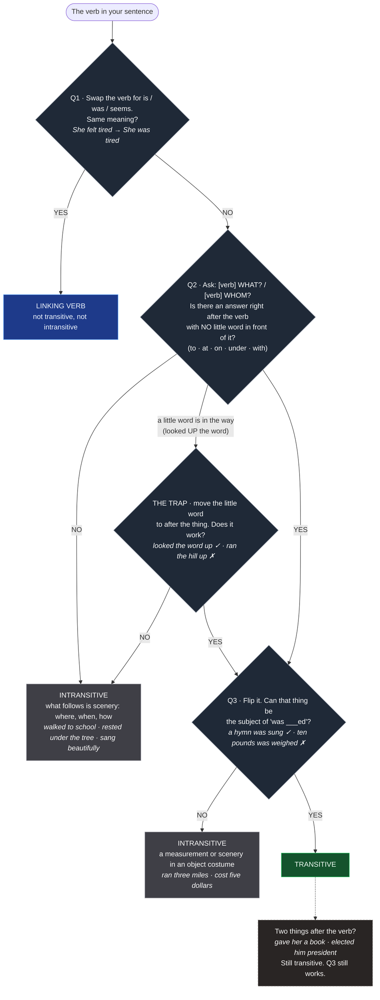

# Is this verb transitive? — the head version

Three questions. Stop at the first answer.

```
                 THE VERB IN YOUR SENTENCE
                           |
   Q1  Swap the verb for "is/was" or "seems".
       Same meaning?   ("She felt tired" -> "She was tired")
           |
      YES -+-> LINKING VERB. Not transitive, not intransitive. Done.
           |
       NO -+
           |
   Q2  Ask "[verb] WHAT?" or "[verb] WHOM?"
       Is there an answer sitting right after the verb,
       with NO little word (to / at / on / under / with) in front of it?
           |
       NO -+-> INTRANSITIVE. Whatever follows is scenery:
           |   where, when, how.  ("walked to school", "rested under the tree",
           |   "sang beautifully")  Done.
           |
      YES -+
           |
   Q3  Flip it. Can that thing become the subject of "was ___ed"?
       ("sang a hymn" -> "a hymn was sung"   YES)
       ("weighs ten pounds" -> "ten pounds was weighed"   NO)
           |
       NO -+-> INTRANSITIVE. It is a measurement or scenery wearing
           |   an object costume. ("ran three miles", "cost five dollars")
           |
      YES -+-> TRANSITIVE. Done.
```

## The one trap worth carrying

A little word sits between the verb and the thing: "looked UP the word" vs "ran UP the hill".
Try moving the little word to after the thing.

- "looked the word up" works -> it is part of the verb -> go to Q3 -> transitive.
- "ran the hill up" does not work -> it is a preposition -> intransitive.

## Two things after the verb

"gave her a book", "elected him president". Still transitive. Q3 still works ("a book was given", "he was elected"). The second thing does not change the answer.

## When you are writing, not reading

Decide whether the action needs something to land on.

- It lands on something -> give the verb a bare object. Transitive.
- It just happens -> no object, add scenery if you want. Intransitive.
- It describes the subject -> use a linking verb (is, seems, feels, becomes).

## Mermaid


