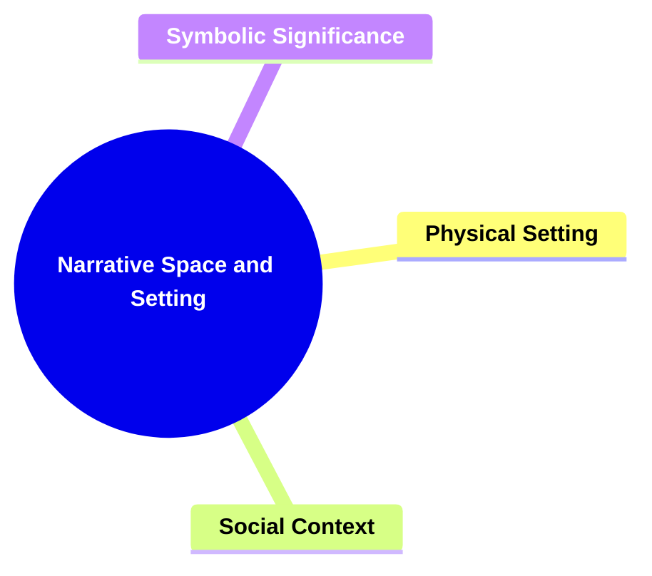
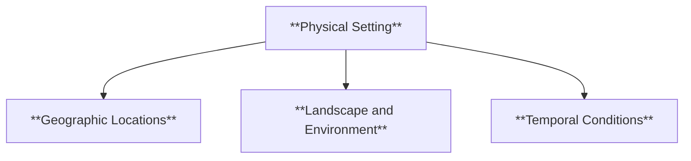
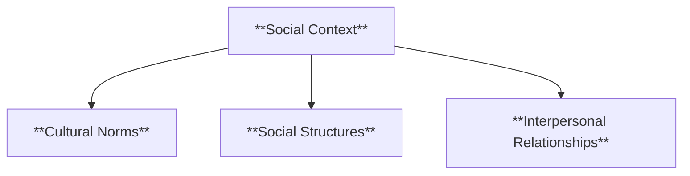
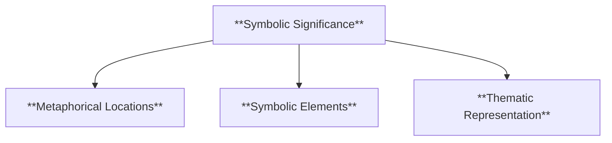
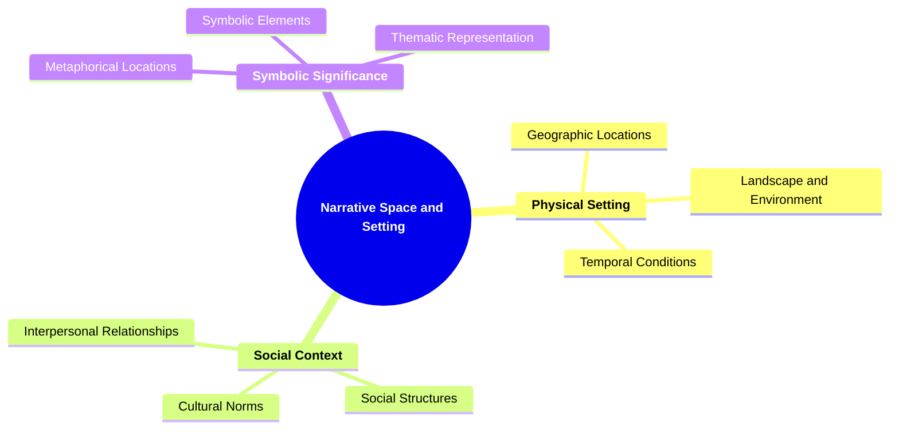

# 04 SS-3304 NARRATIVE SPACE AND SETTING

### **Narrative Space and Setting**

- **Analyzing how the physical and social environments affect the characters and plot.**
  - **Aspects**:
    - **Physical Setting**
    - **Social Context**
    - **Symbolic Significance**
  - **Importance**: The setting influences characters and plot; it's fundamental to the narrative world.

---

### **Key Concepts**

---

#### **Narrative Space and Setting**

- **Definition**:
  - In narratology, narrative space and setting refer to the environments in which the story takes place, encompassing both the physical locations and the social frameworks that shape the narrative. These elements play a critical role in influencing character behavior, plot development, and the overall atmosphere of the story.

##### **Components of Narrative Space and Setting**

###### **Physical Setting**

- **Definition**:
  - The tangible, geographic, and environmental aspects of the narrative world, including locations, landscapes, and physical conditions that provide a backdrop for the story's events.

- **Characteristics**:
  - **Geographic Locations**: Specific places where events occur, such as cities, countries, or fictional worlds.
  - **Landscape and Environment**: The physical surroundings, including natural elements like forests, deserts, or urban environments.
  - **Temporal Conditions**: The time period in which the story is set, affecting the cultural and technological context.

###### **Social Context**

- **Definition**:
  - The societal structures, cultural norms, and interpersonal relationships that define the social environment of the narrative, influencing character interactions and plot dynamics.

- **Characteristics**:
  - **Cultural Norms**: The accepted behaviors and beliefs within the story's society, shaping characters' actions and conflicts.
  - **Social Structures**: Hierarchies, institutions, and roles that organize the society and impact the plot.
  - **Interpersonal Relationships**: The dynamics between characters, including power relations, alliances, and conflicts.

###### **Symbolic Significance**

- **Definition**:
  - The deeper meanings and symbolic representations of the setting elements, where locations and environments symbolize broader themes and ideas within the narrative.

- **Characteristics**:
  - **Metaphorical Locations**: Places that represent abstract concepts or themes, adding depth to the narrative.
  - **Symbolic Elements**: Specific objects, landmarks, or environmental features that carry symbolic weight.
  - **Thematic Representation**: How the setting reflects and reinforces the story's central themes and messages.

---

### **Theoretical Significance**

- **Importance of Narrative Space and Setting**:

  - In narratology, the analysis of space and setting is essential for understanding how the environment influences characters' development and plot progression. It provides context for characters' actions and motivations, creating a rich backdrop that enhances the narrative's depth and realism.

- **Application in Narratological Analysis**:

  - Scholars utilize narrative space and setting analysis to explore how different environments shape narrative structures, influence character interactions, and convey thematic elements. This analysis helps in identifying patterns in how settings are used to support the story's objectives and emotional impact.

- **Enhancing Narrative Comprehension**:
  - A thorough understanding of the narrative space and setting allows for a deeper appreciation of the story's context and the forces that drive the characters and plot. It facilitates a more nuanced interpretation of how the environment interacts with narrative elements to create a cohesive and engaging story world.

---

