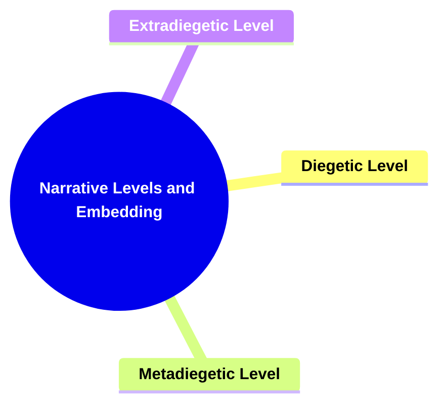
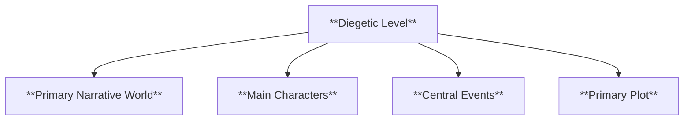
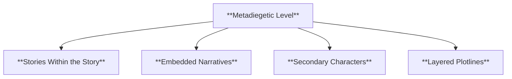
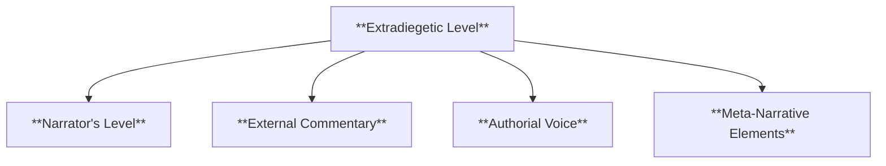
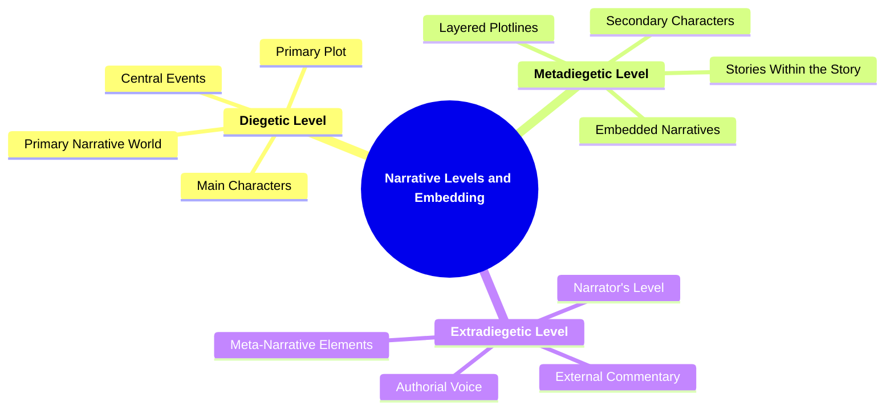

# 12 NLE-3501 NARRATIVE LEVELS AND EMBEDDING

### **Narrative Levels and Embedding**

- **Recognizing shifts between different narrative levels.**
  - **Levels**:
    - **Diegetic Level**: Primary narrative world.
    - **Metadiegetic Level**: Stories within the story.
    - **Extradiegetic Level**: Narrator's level outside the primary narrative.
  - **Importance**: Requires strong understanding of narrative structure and narrator analysis.

---

### **Key Concepts**

---

#### **Narrative Levels and Embedding**

- **Definition**:
  - In narratology, narrative levels and embedding refer to the different layers or strata within a narrative that allow for the inclusion of stories within stories. This concept helps in understanding how multiple narratives coexist and interact within a single overarching narrative framework, enhancing the complexity and depth of storytelling.

##### **Components of Narrative Levels and Embedding**

###### **Diegetic Level**

- **Definition**:
  - The diegetic level is the primary narrative world where the main story unfolds. It encompasses the main characters, events, settings, and actions that constitute the central plot of the narrative.

- **Characteristics**:
  - **Primary Narrative World**: The main setting where the central actions and events take place.
  - **Main Characters**: The principal figures driving the primary plot forward.
  - **Central Events**: Key happenings that shape the main storyline.
  - **Primary Plot**: The main sequence of events that constitutes the core of the narrative.

###### **Metadiegetic Level**

- **Definition**:
  - The metadiegetic level involves stories that are embedded within the primary narrative. These are secondary narratives that characters within the diegetic level may tell, read, or experience, adding layers and complexity to the overall story.

- **Characteristics**:
  - **Stories Within the Story**: Secondary narratives that exist inside the main narrative framework.
  - **Embedded Narratives**: Tales that are integrated into the primary story, often serving specific functions such as providing backstory or thematic depth.
  - **Secondary Characters**: Characters who may not be central to the primary plot but play significant roles in the embedded stories.
  - **Layered Plotlines**: Multiple interconnected storylines that enrich the main narrative.

###### **Extradiegetic Level**

- **Definition**:
  - The extradiegetic level refers to the narrative perspective or voice that exists outside the primary and metadiegetic levels. This includes the external narrator who may provide commentary, analysis, or additional information beyond the scope of the diegetic narrative.

- **Characteristics**:
  - **Narrator's Level**: The perspective from which the story is told, distinct from the characters within the diegetic world.
  - **External Commentary**: Insights or opinions provided by the narrator that are not part of the characters' experiences.
  - **Authorial Voice**: The distinct voice of the author that may influence the storytelling beyond the diegetic and metadiegetic levels.
  - **Meta-Narrative Elements**: References or structures that acknowledge the narrative as a constructed story, often breaking the fourth wall.

---

### **Theoretical Significance**

- **Understanding Narrative Complexity**:

  - Analyzing narrative levels and embedding is crucial for comprehending how stories are layered and how multiple narratives interact within a single framework. This understanding reveals the depth and sophistication of narrative structures, allowing for a more nuanced appreciation of storytelling techniques.

- **Enhancing Narrative Depth**:

  - The use of metadiegetic levels introduces additional layers of meaning and context, enriching the primary narrative. It allows authors to explore themes, provide background information, and develop characters in a more intricate manner.

- **Facilitating Critical Analysis**:

  - Recognizing shifts between narrative levels aids scholars in dissecting the structure of complex narratives. It enables the identification of how embedded stories contribute to the overall themes and messages, and how the extradiegetic perspective shapes the reader's understanding.

- **Influence on Reader Engagement**:

  - Multiple narrative levels can enhance reader engagement by offering varied perspectives and deeper immersion into the story world. It creates a more interactive and layered reading experience, encouraging readers to explore connections between different narrative strands.

- **Supporting Narrative Techniques**:
  - Understanding narrative levels and embedding supports the analysis of various narrative techniques such as framing, storytelling within storytelling, and meta-narrative commentary. These techniques are essential for creating rich, multi-dimensional narratives that resonate with readers on multiple levels.

---

