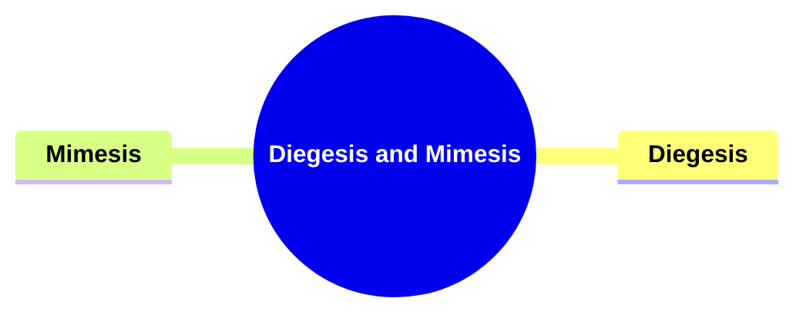
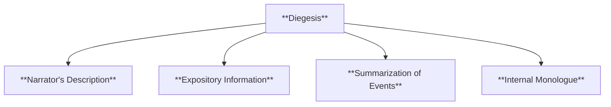
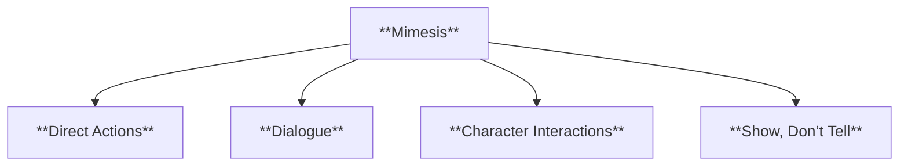
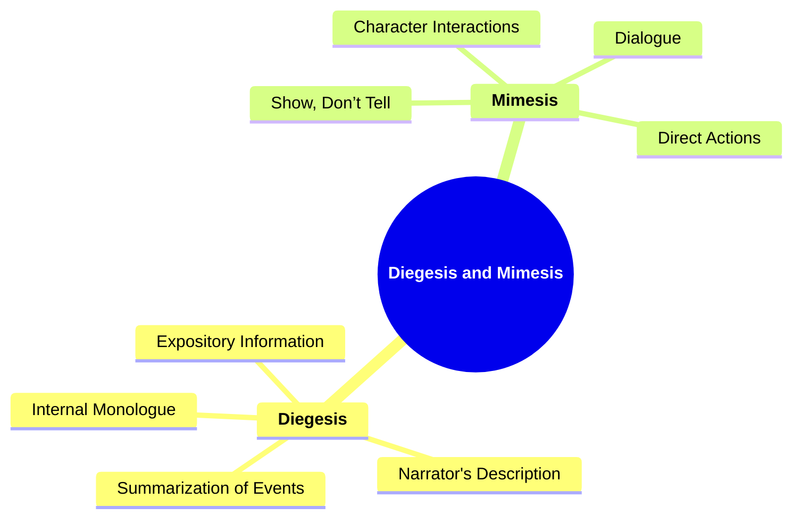

# 14 DM-3503 DIEGESIS AND MIMESIS

### **Diegesis and Mimesis**

- **Diegesis**: Narrative told through the narrator's description.
- **Mimesis**: Narrative shown through direct representation, such as dialogue.

**Application**: Understanding the balance between showing and telling.

---

### **Key Concepts**

---

#### **Diegesis and Mimesis**

- **Definition**:
  - In narratology, **diegesis** and **mimesis** represent two fundamental modes of storytelling. **Diegesis** refers to the narrative that is conveyed through the narrator's exposition, descriptions, and summaries, effectively "telling" the story to the audience. **Mimesis**, on the other hand, involves the direct portrayal of events through actions, dialogues, and scenes, "showing" the story without explicit narration. Balancing these two modes enhances the narrative's depth and engagement.

##### **Components of Diegesis and Mimesis**

###### **Diegesis**

- **Definition**:
  - Diegesis encompasses the elements of the story that are narrated by an external voice. This includes the narrator's descriptions, background information, and any exposition that provides context to the narrative.

- **Characteristics**:
  - **Narrator's Description**: The narrator provides detailed descriptions of settings, characters, and events.
  - **Expository Information**: Background details and contextual information that are essential for understanding the narrative.
  - **Summarization of Events**: Brief overviews of events without delving into detailed scenes.
  - **Internal Monologue**: Insights into a character's thoughts conveyed through narration.

###### **Mimesis**

- **Definition**:
  - Mimesis involves the direct representation of the story through actions, dialogues, and interactions between characters. It creates an immersive experience by allowing the audience to witness events unfold in real-time.

- **Characteristics**:
  - **Direct Actions**: Characters perform actions that advance the plot without external narration.
  - **Dialogue**: Conversations between characters that reveal personality, motivations, and relationships.
  - **Character Interactions**: Interplay between characters that drives the narrative forward.
  - **Show, Don’t Tell**: Emphasizes demonstrating events and emotions through vivid scenes rather than exposition.

---

### **Theoretical Significance**

- **Balancing Show and Tell**:
  - Achieving an effective balance between diegesis and mimesis is crucial for maintaining narrative flow and keeping the audience engaged. Over-reliance on either mode can lead to a story feeling either overly descriptive and expository or too sparse and lacking context.
- **Enhancing Narrative Depth**:
  - Combining diegetic and mimetic elements enriches the storytelling by providing both the necessary background and the immersive, detailed scenes that allow readers to experience the story firsthand.
- **Influence on Reader Engagement**:
  - Mimesis tends to create a more immediate and visceral connection with the audience, while diegesis ensures that the narrative remains coherent and well-informed. The interplay between the two can heighten emotional responses and deepen understanding.
- **Supporting Character Development**:
  - Diegetic narration can offer insights into a character’s internal thoughts and backstory, while mimetic scenes can showcase their actions and interactions, providing a well-rounded portrayal.
- **Facilitating Thematic Exploration**:
  - Through diegesis, themes can be explicitly discussed and examined, whereas mimesis allows for themes to be subtly conveyed through character behavior and plot developments.

---

