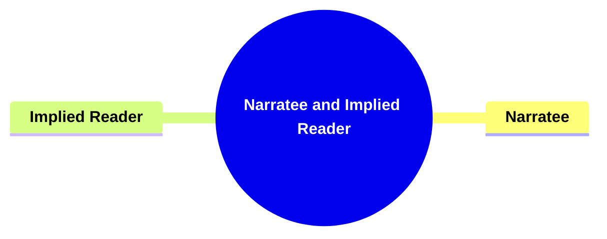
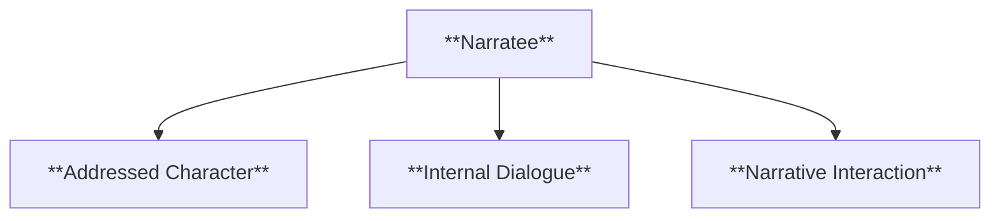
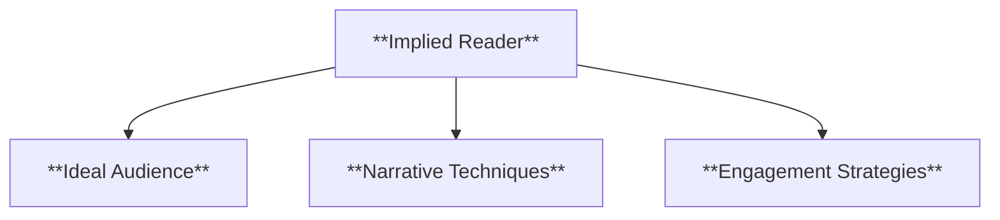
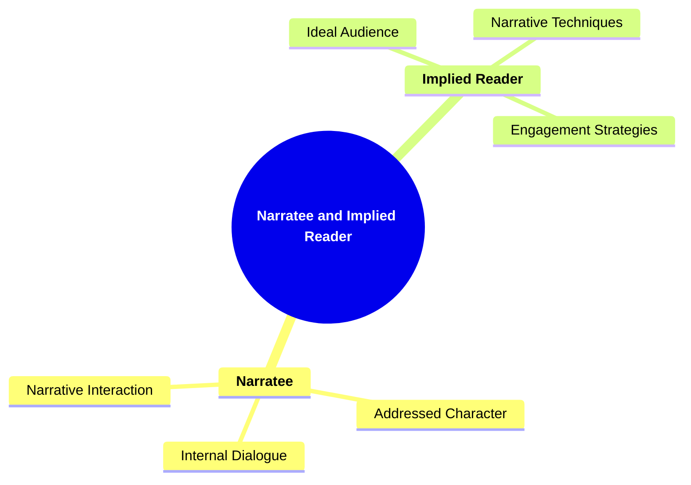

# 18 NR-3507 NARRATEE AND IMPLIED READER

### **Narratee and Implied Reader**

- **Recognizing the audience within the narrative.**
  - **Concepts**:
    - **Narratee**: Character within the story being addressed.
    - **Implied Reader**: Ideal reader envisioned by the text.
  - **Importance**: Involves abstract concepts about audience engagement.

---

### **Key Concepts**

---

#### **Narratee and Implied Reader**

- **Definition**:
  - In narratology, **narratee** and **implied reader** are concepts that pertain to the intended audience of a narrative. The **narratee** refers to a character within the story to whom the narrator addresses certain elements, creating a layer of interaction within the diegesis. The **implied reader**, on the other hand, represents the ideal or hypothetical reader that the text envisions, shaping how the narrative is constructed to engage and communicate with its audience effectively.

##### **Components of Narratee and Implied Reader**

###### **Narratee**

- **Definition**:
  - The **narratee** is a character within the narrative who is directly addressed or spoken to by the narrator. This creates an internal dialogue or interaction that can influence the storytelling and the engagement of other characters within the story.

- **Characteristics**:
  - **Addressed Character**: The specific character within the narrative to whom the narrator directs comments, questions, or information.
  - **Internal Dialogue**: Facilitates conversations or reflections that occur within the story world, adding depth to character relationships and narrative layers.
  - **Narrative Interaction**: Enhances the complexity of the narrative by introducing multiple layers of communication and perspective.

###### **Implied Reader**

- **Definition**:
  - The **implied reader** is the idealized audience that the narrative anticipates and addresses. This concept shapes how the story is told, influencing narrative techniques, language choice, and the presentation of information to cater to the perceived preferences and expectations of the reader.

- **Characteristics**:
  - **Ideal Audience**: Represents the type of reader the text is aiming to engage, often embodying specific traits, knowledge levels, and interests.
  - **Narrative Techniques**: Includes stylistic choices such as tone, complexity of language, and structure tailored to resonate with the implied reader.
  - **Engagement Strategies**: Methods used to maintain the reader's interest and involvement, such as rhetorical questions, direct address, and anticipatory setups.

---

### **Theoretical Significance**

- **Understanding Audience Engagement**:

  - Analyzing **narratee** and **implied reader** allows scholars to comprehend how narratives are tailored to engage specific audiences. It reveals the strategies employed by authors to create a connection with readers, ensuring that the story resonates and maintains interest.

- **Enhancing Narrative Construction**:

  - Recognizing the **implied reader** helps in understanding the intentional choices made in narrative construction. Authors may manipulate language, structure, and content to align with the expectations and preferences of their envisioned audience, thereby enhancing the effectiveness of storytelling.

- **Facilitating Reader Interpretation**:

  - The concepts of **narratee** and **implied reader** influence how narratives are interpreted. They guide readers to recognize the underlying intentions of the text, promoting a more nuanced and informed engagement with the story.

- **Supporting Critical Analysis**:

  - These concepts provide tools for critical analysis by highlighting the relationship between the text and its audience. Scholars can examine how different narratives cater to varying implied readers and how this affects the reception and impact of the story.

- **Influence on Narrative Techniques**:
  - Understanding the balance between addressing a **narratee** and catering to an **implied reader** influences the use of narrative techniques. It affects how information is revealed, how much is left to inference, and the overall pacing and flow of the narrative.

---

