fully elaborate, contextualize, and provide additional supporting information the following text. make sure each category has characteristics as a subcategory

format in bulleted format, markdown, and put into a codebox

below is a template you will reference.

remember this prompt and template when i use the key phrase 'apply core-1'

---

### **Todorov's Deep Structures Framework**

- **The Structural Analysis of Narrative**:
  - **Definition**: Tzvetan Todorov’s approach to narratology is deeply rooted in structuralism, a theoretical perspective that emphasizes the underlying structures that shape narratives. Todorov focuses on identifying and analyzing the fundamental elements that govern narrative forms, allowing for a systematic exploration of how stories are constructed and how they convey meaning.

---

### **Key Concepts**

---

#### **Deep Structures**

- **Definition**:
  - Todorov’s structural analysis examines the deep, often hidden, structures that underpin narratives. These structures include recurring patterns, relationships between elements, and the rules that govern the organization of narrative components.

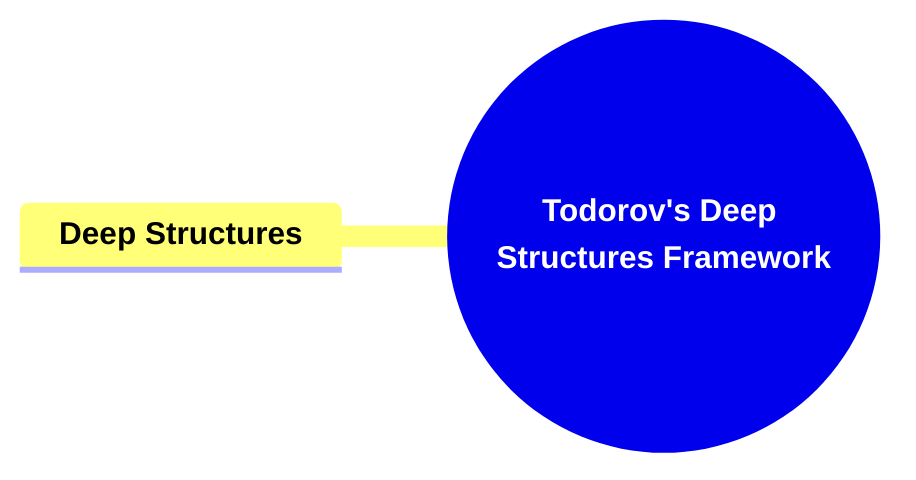

##### **Components of Deep Structures**

###### **Underlying Patterns**

- **Definition**:

  - Recurring patterns within narratives that shape the way stories are told, such as the progression from equilibrium to disequilibrium and back to equilibrium.

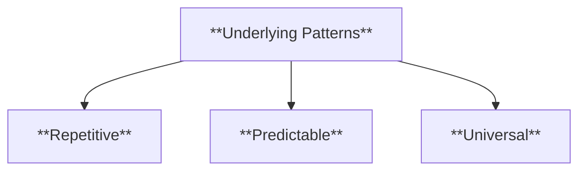

- **Characteristics**:

  - **Repetitive**: Patterns often recur throughout a narrative.
  - **Predictable**: They follow a consistent structure.
  - **Universal**: Can be found across different genres and cultures.

###### **Element Relationships**

- **Definition**:

  - The relationships between different narrative elements, such as characters, settings, and events, that work together to create a coherent and meaningful story.o

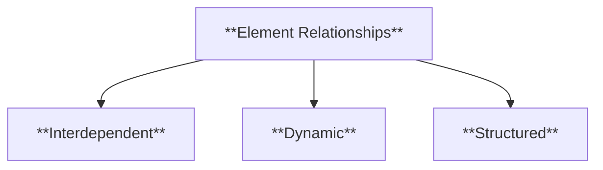

- **Characteristics**:

  - **Interdependent**: Elements rely on each other to move the plot forward.
  - **Dynamic**: Relationships between elements evolve over the course of the narrative.
  - **Structured**: They follow a consistent pattern or logic.

###### **Narrative Rules**

- **Definition**:

  - The implicit rules that govern how narratives are structured, including the sequencing of events, character development, and thematic progression.

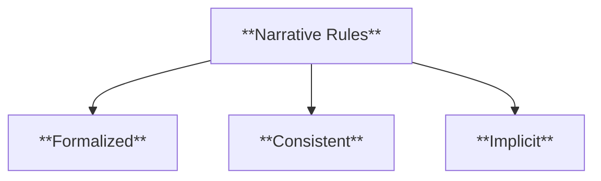

- **Characteristics**:

  - **Formalized**: Specific rules shape the organization of narrative elements.
  - **Consistent**: Rules are generally followed within a genre.
  - **Implicit**: Often understood rather than explicitly stated.

---

#### **Narrative Categorization**

- **Definition**:
  - Todorov categorizes narratives based on their structural elements, such as plot dynamics, character functions, and thematic oppositions. This categorization enables a more precise analysis of different narrative types and their distinctive characteristics.

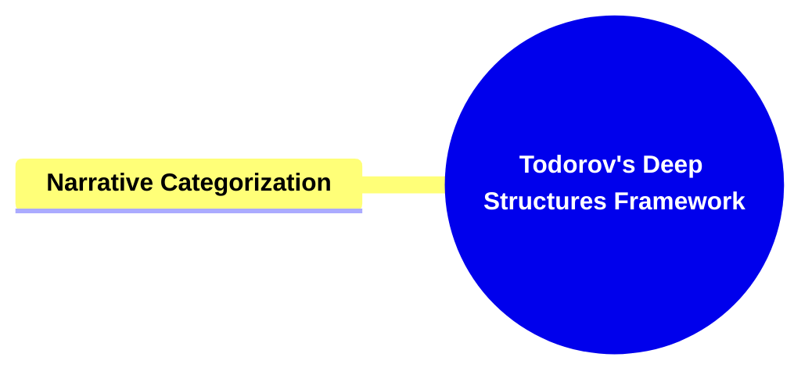

---

##### **Components of Narrative Categorization**

###### **Plot Dynamics**

- **Definition**:

  - The specific ways in which the plot unfolds, including the sequence of events, the introduction of conflict, and the resolution of the story.

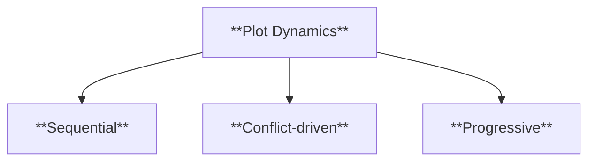

- **Characteristics**:

  - **Sequential**: Plot events follow a defined order.
  - **Conflict-driven**: The narrative revolves around conflicts.
  - **Progressive**: The plot moves toward a resolution.

###### **Character Functions**

- **Definition**:

  - The roles that characters play within the narrative, such as the hero, villain, or mentor, and how these roles contribute to the overall structure of the story.

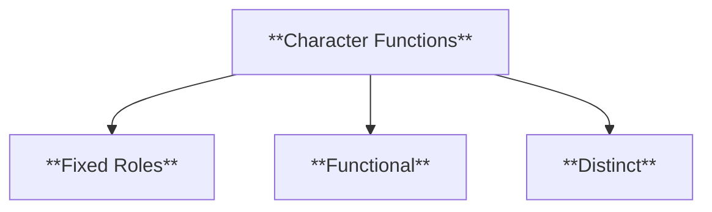

- **Characteristics**:

  - **Fixed Roles**: Characters fulfill specific narrative roles.
  - **Functional**: Each character drives a specific part of the plot.
  - **Distinct**: Characters are identifiable by their unique functions.

###### **Thematic Oppositions**

- **Definition**:

  - The fundamental oppositions, such as good vs. evil or freedom vs. oppression, that structure the narrative’s central conflict and contribute to its thematic depth.

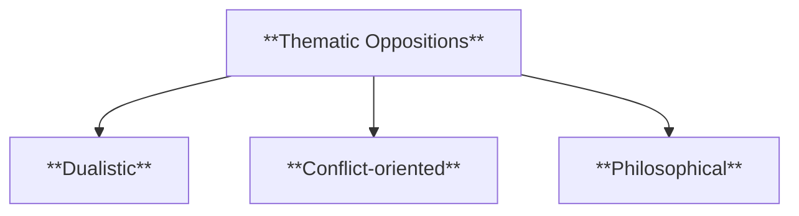

- **Characteristics**:

  - **Dualistic**: Themes are often presented in binary oppositions.
  - **Conflict-oriented**: Thematic oppositions are central to the story's tension.
  - **Philosophical**: They often reflect deeper moral or ideological questions.

---

#### **Plot Functions**

- **Definition**:
  - Plot functions refer to the specific roles that events and actions within a narrative serve in advancing the story. In Todorov’s framework, these functions are essential for maintaining the coherence and progression of the narrative, ensuring that each plot point contributes to the overall structure of the story.

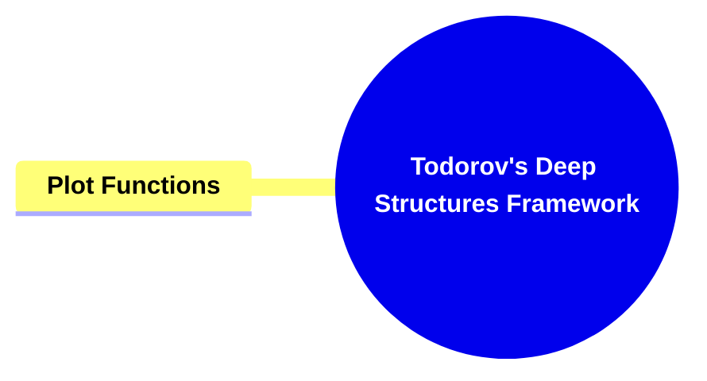

---

##### **Components of Plot Functions**

###### **Causality**

- **Definition**:

  - The cause-and-effect relationships between events that drive the narrative forward. Each action or event within the plot is connected to subsequent actions, creating a logical progression of the story.

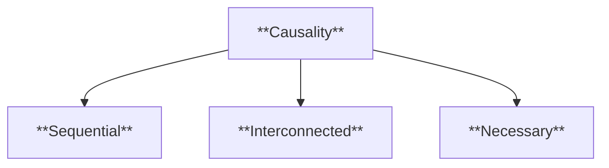

- **Characteristics**:

  - **Sequential**: Events occur in a logical sequence.
  - **Interconnected**: One event leads to another.
  - **Necessary**: Causality is essential for narrative coherence.

###### **Conflict**

- **Definition**:

  - The struggle between opposing forces, typically between the protagonist and antagonist, that drives the plot forward.

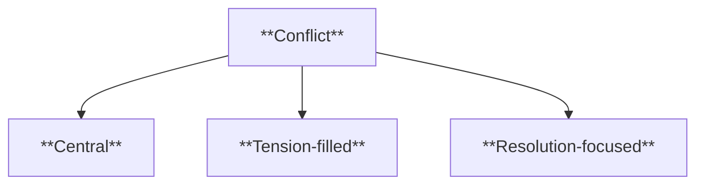

- **Characteristics**:

  - **Central**: Conflict is key to plot progression.
  - **Tension-filled**: It creates emotional stakes.
  - **Resolution-focused**: Conflict leads to the climax and resolution.

###### **Resolution**

- **Definition**:

  - The point in the narrative where the central conflict is resolved, and the story reaches its conclusion.

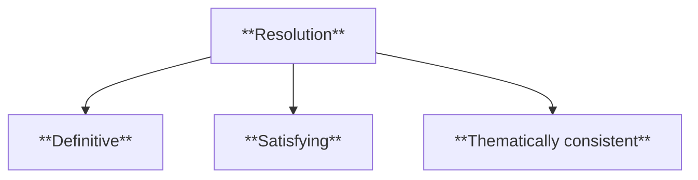

- **Characteristics**:

  - **Definitive**: Brings the story to a clear conclusion.
  - **Satisfying**: Provides closure to narrative conflicts.
  - **Thematically consistent**: Reinforces the story’s themes.

---

#### **Character Functions**

- **Definition**:
  - Character functions refer to the roles that characters play within the narrative, particularly how they contribute to the development and resolution of the plot. In Todorov’s framework, characters are not just individuals but serve specific functions that advance the story.

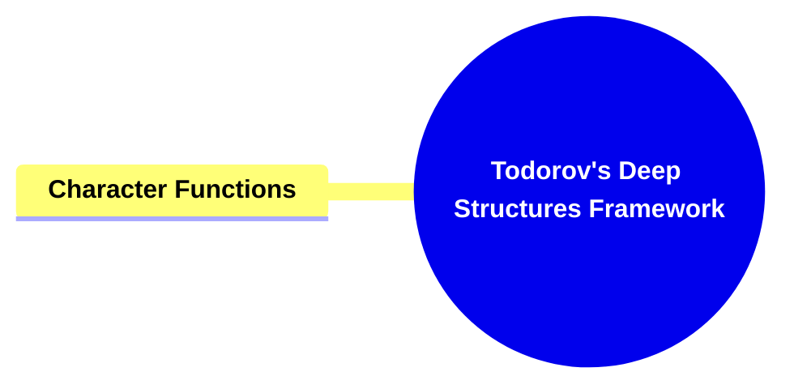

---

##### **Components of Character Functions**

###### **Protagonist**

- **Definition**:

  - The main character who drives the action of the narrative, often facing challenges and conflicts that need to be resolved.

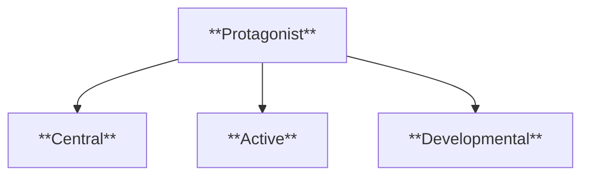

- **Characteristics**:

  - **Central**: The protagonist is the focus of the narrative.
  - **Active**: Drives the plot through decisions and actions.
  - **Developmental**: Often undergoes personal growth or change.

###### **Antagonist**

- **Definition**:

  - The character or force that opposes the protagonist, creating the central conflict in the narrative.

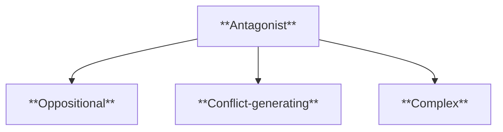

- **Characteristics**:

  - **Oppositional**: The antagonist stands in the way of the protagonist’s goals.
  - **Conflict-generating**: Their actions create the central tension.
  - **Complex**: Often has motivations that challenge the protagonist’s worldview.

###### **Supporting Characters**

- **Definition**:

  - Characters who assist the protagonist or antagonist, contributing to the development of the plot and the thematic depth of the narrative.

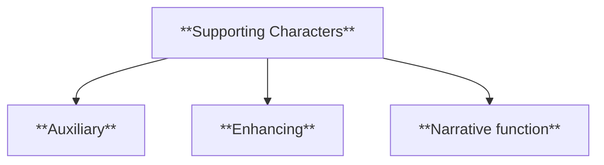

- **Characteristics**:

  - **Auxiliary**: Support the primary characters’ actions.
  - **Enhancing**: Add depth to the narrative through interactions.
  - **Narrative function**: Help advance subplots and themes.

---

### **Theoretical Significance**

- **Todorov's Contribution to Structural Analysis**:
  - Todorov's structural analysis of narrative provides a comprehensive framework for understanding the essential components of storytelling. By breaking down narratives into their fundamental elements and exploring their deep structures, Todorov offers a method for systematically analyzing how stories are built and how they function to produce meaning.
  - **Application in Literary Studies**: This framework is particularly valuable in literary studies for dissecting the architecture of narratives and for exploring how different structural elements contribute to the overall impact of a story. It allows scholars to approach narratives with a focus on the underlying rules and patterns that govern their construction.
  - **Continued Relevance**: Todorov’s deep structures framework remains influential in contemporary narrative analysis, offering tools to explore not just the content of stories but the formal structures that give them shape. His work continues to inform critical approaches to literature, enabling a deeper understanding of the universal principles underlying narrative forms.

---

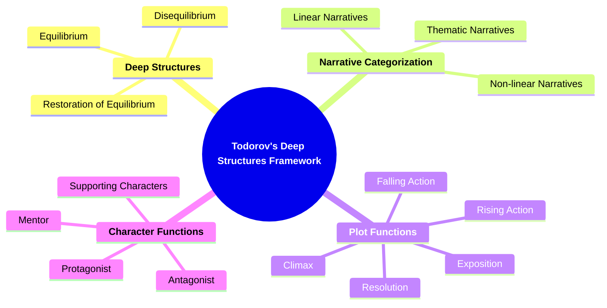

---

```markdown
apply core-1
limit references to the field of narratology

Characterization
Definition: Analyzing how characters are developed, including their traits, motivations, and relationships.
Methods:
Direct Characterization
Indirect Characterization
Importance: Characters drive the narrative; understanding them is crucial for analysis.
```
