- [1. Title: **Genette's Five Key Narrative Categories Framework**](#1-title-genettes-five-key-narrative-categories-framework)
- [2. Key Concepts](#2-key-concepts)
  - [2.1. **Order**](#21-order)
    - [2.1.1. **Components of Order**](#211-components-of-order)
      - [2.1.1.1. **Disruption of Chronology**](#2111-disruption-of-chronology)
      - [2.1.1.2. **Narrative Manipulation**](#2112-narrative-manipulation)
      - [2.1.1.3. **Complexity**](#2113-complexity)
  - [2.2. **Duration**](#22-duration)
    - [2.2.1. **Components of Duration**](#221-components-of-duration)
      - [2.2.1.1. **Narrative Pacing**](#2211-narrative-pacing)
      - [2.2.1.2. **Focus on Key Moments**](#2212-focus-on-key-moments)
      - [2.2.1.3. **Compression**](#2213-compression)
      - [2.2.1.4. **Expansion**](#2214-expansion)
  - [2.3. **Frequency**](#23-frequency)
    - [2.3.1. **Components of Frequency**](#231-components-of-frequency)
      - [2.3.1.1. **Repetition**](#2311-repetition)
      - [2.3.1.2. **Emphasis**](#2312-emphasis)
      - [2.3.1.3. **Rhythm**](#2313-rhythm)
      - [2.3.1.4. **Recurrence**](#2314-recurrence)
      - [2.3.1.5. **Perspective Variation**](#2315-perspective-variation)
  - [2.4. **Mood**](#24-mood)
    - [2.4.1. **Components of Mood**](#241-components-of-mood)
      - [2.4.1.1. **Emotional Distance**](#2411-emotional-distance)
      - [2.4.1.2. **Perspective Control**](#2412-perspective-control)
      - [2.4.1.3. **Subjectivity vs. Objectivity**](#2413-subjectivity-vs-objectivity)
  - [2.5. **Voice**](#25-voice)
    - [2.5.1. **Components of Voice**](#251-components-of-voice)
      - [2.5.1.1. **Narrative Authority**](#2511-narrative-authority)
      - [2.5.1.2. **Trustworthiness**](#2512-trustworthiness)
- [3. Implications of Narrative Categories](#3-implications-of-narrative-categories)

---

---
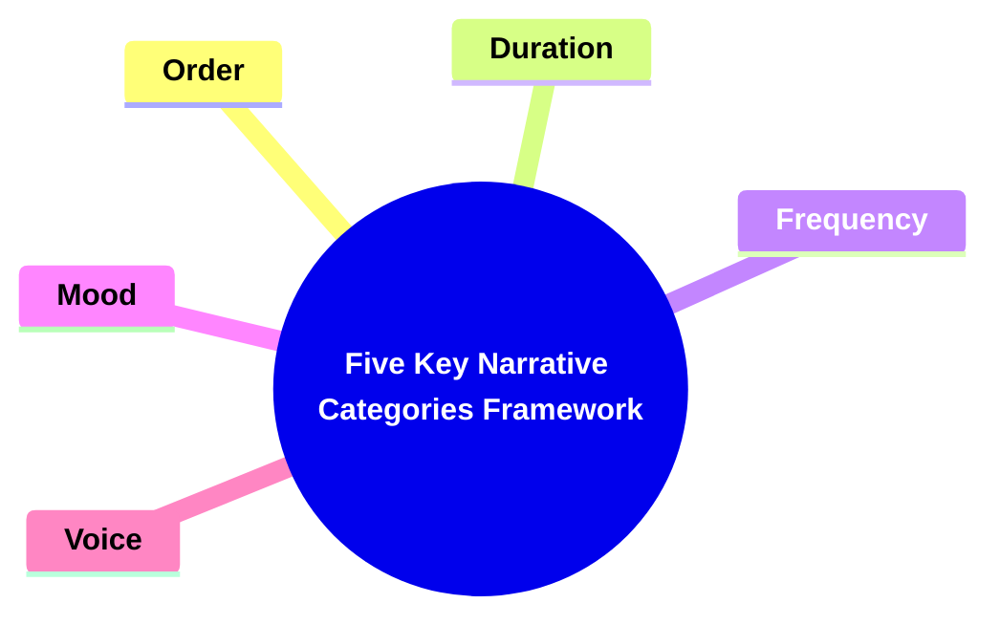
---

### 1. Title: **Genette's Five Key Narrative Categories Framework**

**Narrative Categories**:  
   **Definition**: Gérard Genette's *Five Key Narrative Categories*—Order, Duration, Frequency, Mood, and Voice—are essential concepts that provide a structured approach to analyzing how narratives are organized and how they function. These categories offer a detailed method for dissecting the way stories unfold, how events are presented, and how readers interact with the narrative.

---

### 2. Key Concepts

#### 2.1. **Order**

**Definition**:  
   Refers to the sequence in which events are presented in a narrative, which may differ from the chronological order in which events occur within the story's timeline.

##### 2.1.1. **Components of Order**

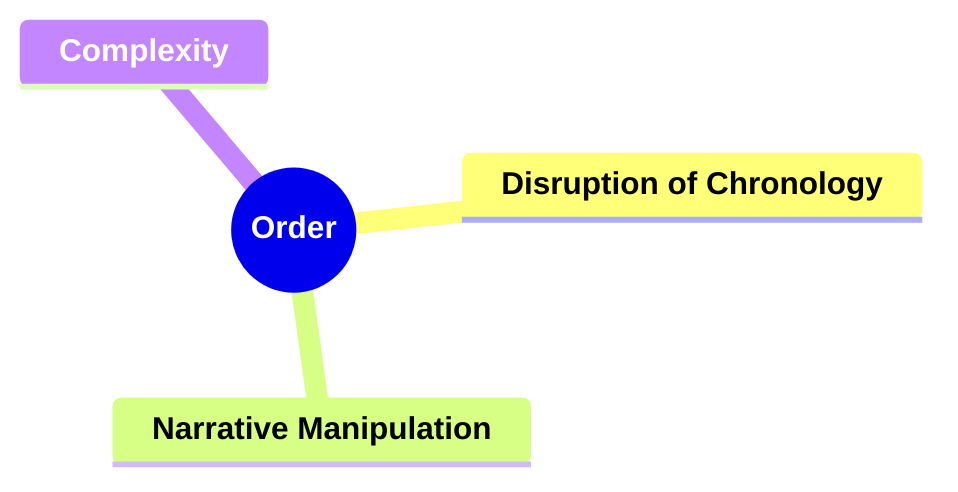

###### 2.1.1.1. **Disruption of Chronology**
  - **Definition**: Order defines how the natural flow of time can be disrupted in storytelling, influencing reader perceptions.

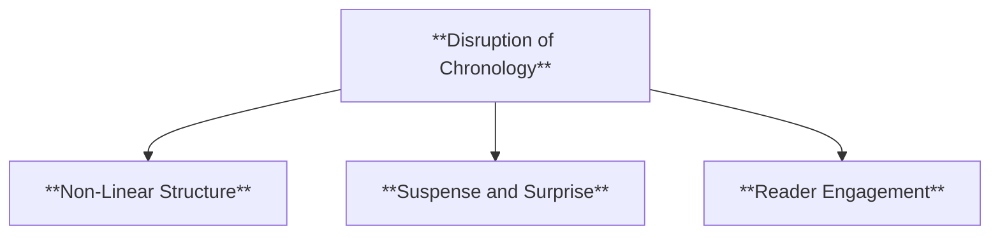

  - **Characteristics**
    - **Non-Linear Structure**: Rearranges events to create flashbacks, flash-forwards, or parallel timelines, adding depth to the narrative.
    - **Suspense and Surprise**: Uses shifts in chronology to withhold or reveal information strategically, enhancing tension.
    - **Reader Engagement**: Challenges readers to piece together the timeline, fostering active participation in understanding the plot.

###### 2.1.1.2. **Narrative Manipulation**
  - **Definition**: Affects how suspense, surprise, or thematic emphasis are created.

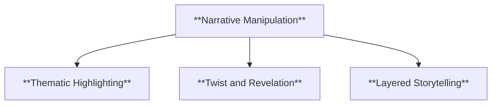

  - **Characteristics**
    - **Thematic Highlighting**: Manipulates order to emphasize key themes by contrasting different times or events.
    - **Twist and Revelation**: Alters the flow to delay or rearrange revelations, enhancing suspense and surprise.
    - **Layered Storytelling**: Creates a multi-dimensional narrative that reflects characters' perspectives or thematic complexity.

###### 2.1.1.3. **Complexity**
  - **Definition**: Complex narrative structures rely on deviations from chronological order to create non-linear storytelling.

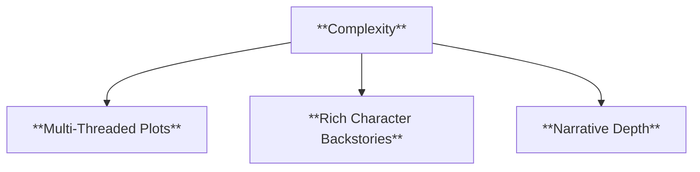

  - **Characteristics**
    - **Multi-Threaded Plots**: Integrates various timelines or narratives that converge to reveal a complete picture.
    - **Rich Character Backstories**: Uses shifts in order to explore past events that shape characters' motivations.
    - **Narrative Depth**: Creates a textured story that reflects real-life memory and experience, adding layers to reader interpretation.

---

#### 2.2. **Duration**

**Definition**:  
   The relationship between the time span covered by the story and the time devoted to narrating it, which affects pacing and narrative focus.

##### 2.2.1. **Components of Duration**

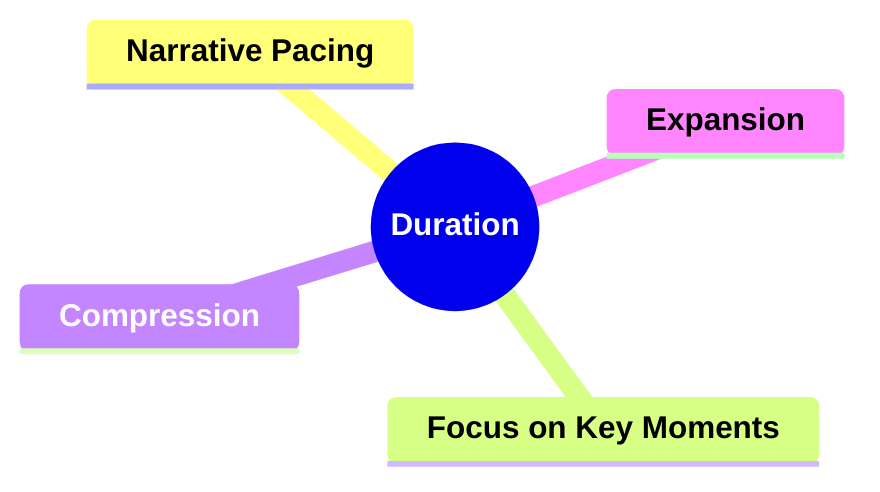


###### 2.2.1.1. **Narrative Pacing**
  - **Definition**: Controls the speed at which the story unfolds, affecting tension and reader engagement.

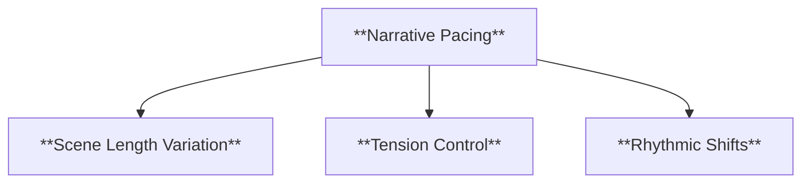

  - **Characteristics**
    - **Scene Length Variation**: Adjusts the speed by expanding or contracting scenes to slow down or accelerate the story.
    - **Tension Control**: Uses pacing to build suspense in crucial moments or relax the reader during calmer sections.
    - **Rhythmic Shifts**: Balances fast-paced action with reflective or descriptive passages to keep readers interested.

###### 2.2.1.2. **Focus on Key Moments**
  - **Definition**: Duration highlights specific events over others, emphasizing their importance to the narrative.

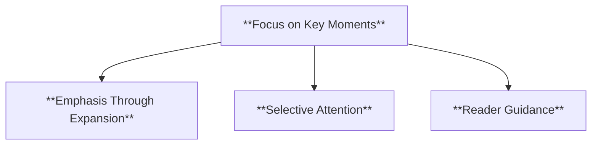

  - **Characteristics**
    - **Emphasis Through Expansion**: Spends more time detailing pivotal moments to stress their significance.
    - **Selective Attention**: Compresses less important scenes to ensure that critical events are given proper focus.
    - **Reader Guidance**: Directs attention to essential plot points by allocating more narrative space to them.

###### 2.2.1.3. **Compression**
  - **Definition**: The condensing of time or events in a narrative to accelerate pacing and focus on key moments.

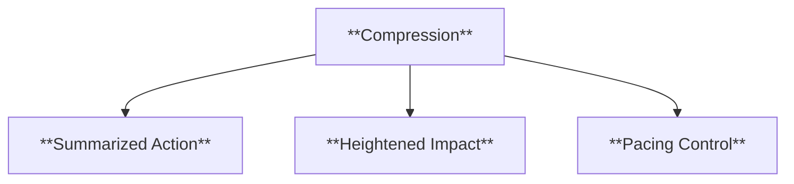

  - **Characteristics**
    - **Summarized Action**: Reduces lengthy events into brief descriptions, allowing the story to progress swiftly.
    - **Heightened Impact**: Highlights pivotal moments by quickly moving through less significant details.
    - **Pacing Control**: Maintains reader engagement by preventing the narrative from becoming bogged down in extensive details.


###### 2.2.1.4. **Expansion**
  - **Definition**: The elongation of time or detailed description to slow down the pacing and emphasize specific moments or themes.

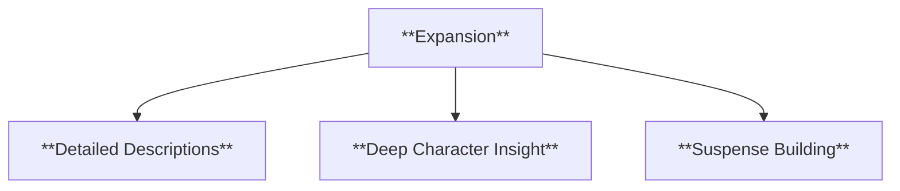

  - **Characteristics**
    - **Detailed Descriptions**: Provides rich imagery and extensive detail to immerse readers in significant scenes.
    - **Deep Character Insight**: Allows exploration of characters’ thoughts and emotions during crucial moments.
    - **Suspense Building**: Prolongs time to create tension, drawing readers into the narrative and increasing anticipation.


---

#### 2.3. **Frequency**

**Definition**:  
   Frequency refers to how often events are narrated within a story, affecting the reader’s perception of their importance and recurrence.


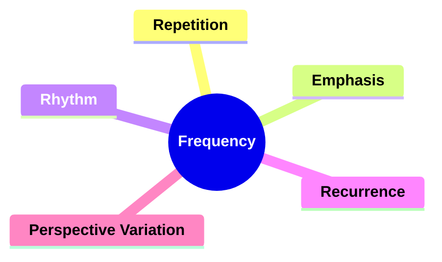

##### 2.3.1. **Components of Frequency**

###### 2.3.1.1. **Repetition**
  - **Definition**: The recurrence of specific words, phrases, themes, or motifs throughout the narrative, linking different parts of the story.

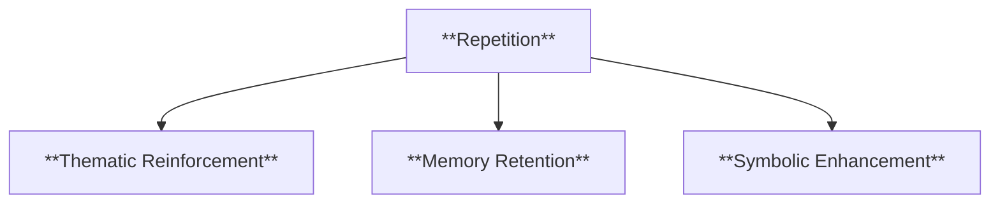


  - **Characteristics**
    - **Thematic Reinforcement**: Strengthens the importance of key ideas by revisiting them, ensuring their presence is felt throughout the narrative.
    - **Memory Retention**: Helps readers recall crucial moments or concepts, enhancing comprehension and engagement.
    - **Symbolic Enhancement**: Adds layers of interpretation as repeated elements gain greater significance with each mention.

###### 2.3.1.2. **Emphasis**
  - **Definition**: The narrative technique of drawing attention to important themes, ideas, or events to highlight their significance.

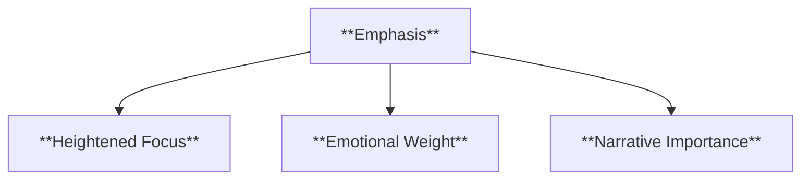

  - **Characteristics**
    - **Heightened Focus**: Uses repetition, italics, or varied narrative techniques to underscore pivotal points in the story.
    - **Emotional Weight**: Enhances the impact of specific scenes or themes by emphasizing them, deepening the reader’s emotional connection.
    - **Narrative Importance**: Signals to readers which elements are crucial for understanding the story’s core messages or outcomes.

###### 2.3.1.3. **Rhythm**
  - **Definition**: The flow and pacing of the narrative, influenced by the arrangement of sentences, scenes, and transitions.

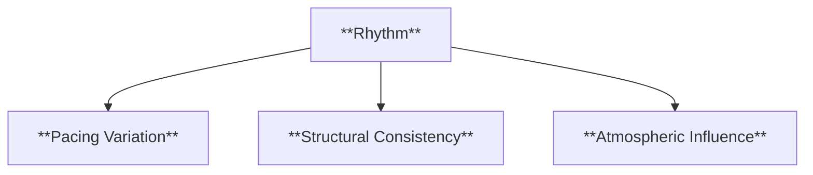

  - **Characteristics**
    - **Pacing Variation**: Balances fast-paced action with slower moments, shaping how the story unfolds and keeping readers engaged.
    - **Structural Consistency**: Uses repeated patterns, such as similar chapter lengths or alternating viewpoints, to establish a cohesive narrative beat.
    - **Atmospheric Influence**: Adjusts the tone and mood by changing the rhythm, creating suspense, excitement, or calm.

###### 2.3.1.4. **Recurrence**
  - **Definition**: The repetition of certain elements, themes, or events throughout the narrative to reinforce their importance.

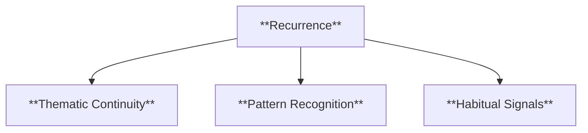

  - **Characteristics**
    - **Thematic Continuity**: Ensures that key themes remain present, linking different parts of the story and adding depth.
    - **Pattern Recognition**: Helps readers identify significant motifs or recurring actions that signal character behavior or narrative focus.
    - **Habitual Signals**: Indicates routine actions or ongoing issues within the story, highlighting the impact of recurring events.

###### 2.3.1.5. **Perspective Variation**
  - **Definition**: The use of different narrations of the same event to showcase varying viewpoints, adding depth and complexity to the narrative.

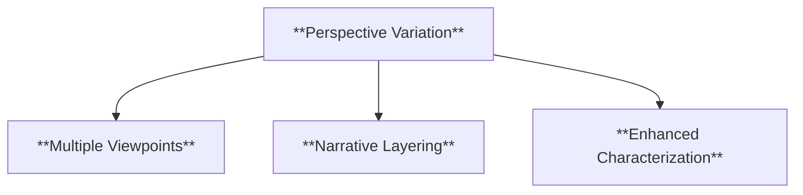

  - **Characteristics**
    - **Multiple Viewpoints**: Provides diverse interpretations of events, allowing readers to see characters' biases and motivations.
    - **Narrative Layering**: Adds complexity by overlapping perspectives, challenging readers to piece together an objective understanding.
    - **Enhanced Characterization**: Reveals deeper insights into characters through their unique perspectives and reactions to the same event.


---

#### 2.4. **Mood**

**Definition**:  
   Mood concerns the narrative perspective and the emotional distance between the narrator and the story, shaping how readers perceive and interpret the narrative.


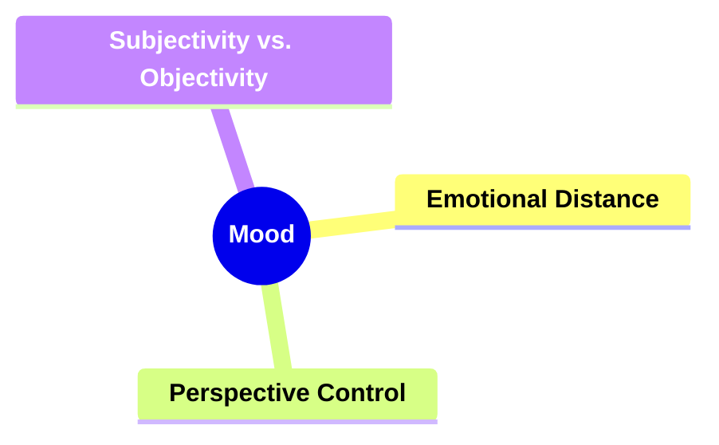

##### 2.4.1. **Components of Mood**

###### 2.4.1.1. **Emotional Distance**
  - **Definition**: The narrative’s mood can vary depending on the level of emotional distance between the narrator and the events.

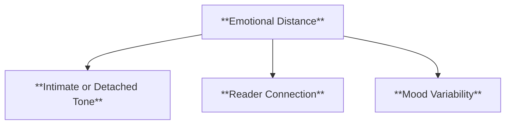

  - **Characteristics**
    - **Intimate or Detached Tone**: Adjusts how close or distant the reader feels to the characters and events.
    - **Reader Connection**: A closer emotional tone fosters empathy, while a detached mood offers analytical observation.
    - **Mood Variability**: Shifts in emotional distance create contrasting feelings, enhancing the overall impact of the story.

###### 2.4.1.2. **Perspective Control**
  - **Definition**: Mood shapes how much the reader knows and influences their emotional involvement in the narrative.

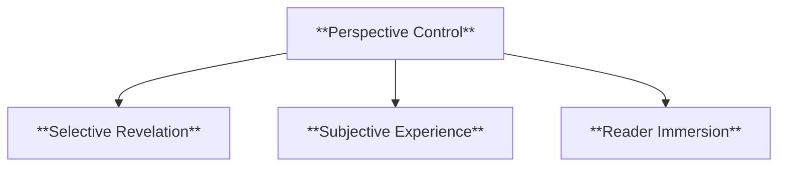

  - **Characteristics**
    - **Selective Revelation**: Controls what information is revealed to align with the desired emotional tone.
    - **Subjective Experience**: Deepens mood by filtering events through a specific character’s feelings.
    - **Reader Immersion**: Enhances engagement by creating moods that draw readers into the story’s atmosphere.

###### 2.4.1.3. **Subjectivity vs. Objectivity**
  - **Definition**: Depending on focalization, mood can create a subjective experience closely tied to a character's emotions or an objective, detached viewpoint.

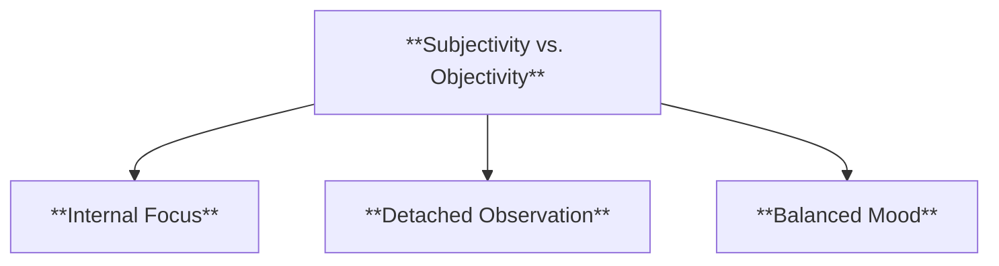

  - **Characteristics**
    - **Internal Focus**: Conveys emotions directly tied to a character’s viewpoint for a subjective narrative experience.
    - **Detached Observation**: Presents events without personal bias, promoting an objective, factual tone.
    - **Balanced Mood**: Alternates between subjective and objective scenes to vary the narrative and enhance complexity.


---

#### 2.5. **Voice**

**Definition**:  
   Voice refers to the narrative level and the relationship between the narrator and the story, addressing who speaks in the narrative.

```mermaid
mindmap
  root((**Voice**))
    **Narrative Authority**
    **Trustworthiness**
```

##### 2.5.1. **Components of Voice**

###### 2.5.1.1. **Narrative Authority**
  - **Definition**: Voice establishes how much control and insight the narrator has over the story.

```mermaid
flowchart TD
    A[**Narrative Authority**] --> B[**Omniscient Voice**]
    A --> C[**Limited Insight**]
    A --> D[**Directive Tone**]
```

  - **Characteristics**
    - **Omniscient Voice**: Offers a comprehensive view of the story, knowing all characters’ thoughts and motivations.
    - **Limited Insight**: Restricts the narrative to what a specific character knows, creating suspense or surprise.
    - **Directive Tone**: Guides the reader’s understanding and interpretation through the voice’s level of control and certainty.

###### 2.5.1.2. **Trustworthiness**
  - **Definition**: The reliability of the narrator can vary, influencing the reader’s trust in their account.

```mermaid
flowchart TD
    E[**Trustworthiness**] --> F[**Reliable Narration**]
    E --> G[**Unreliable Narration**]
    E --> H[**Reader Skepticism**]
```


  - **Characteristics**
    - **Reliable Narration**: Provides an accurate, dependable depiction of events, fostering reader confidence.
    - **Unreliable Narration**: Challenges the reader to discern the truth, adding mystery and complexity.
    - **Reader Skepticism**: Encourages readers to question and analyze the narrator’s account, deepening engagement.


---

```mermaid
mindmap
  root((**Five Key Narrative Categories Framework**))
    **Order**
      Disruption of Chronology
      Narrative Manipulation
      Complexity
    **Duration**
      Narrative Pacing
      Focus on Key Moments
      Compression
      Expansion
    **Frequency**
      Repetition
      Emphasis
      Rhythm
      Recurrence
      Perspective Variation
    **Mood**
      Emotional Distance
      Perspective Control
      Subjectivity vs. Objectivity
    **Voice**
      Narrative Authority
      Trustworthiness
```


---

---

### 3. Implications of Narrative Categories

**Structural Insights**:  
   Genette’s five key narrative categories—Order, Duration, Frequency, Mood, and Voice—are crucial for understanding the structural mechanisms of narrative. They provide the tools necessary for analyzing the layers of storytelling and how these elements affect the reader's engagement and interpretation.

**Impact on Literary Theory**:  
   These narrative categories have become foundational in narratology, shaping critical approaches to narrative analysis. By breaking down the components of storytelling, Genette’s framework continues to inform how scholars examine narratives across different genres and media.

---
