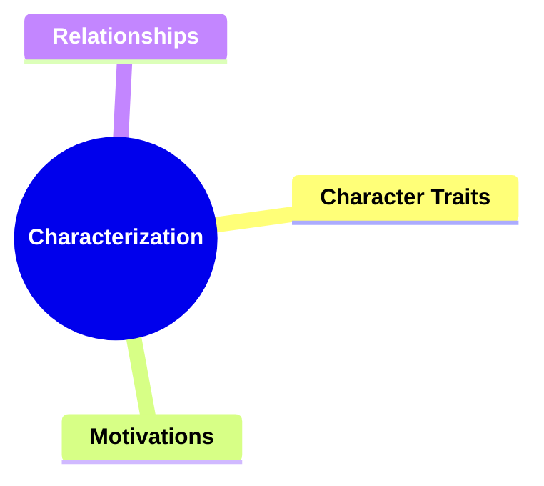
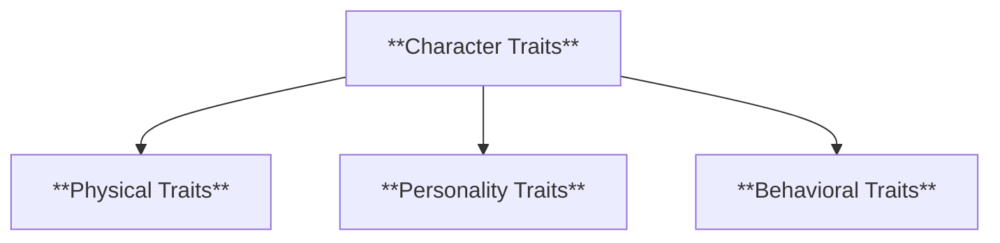
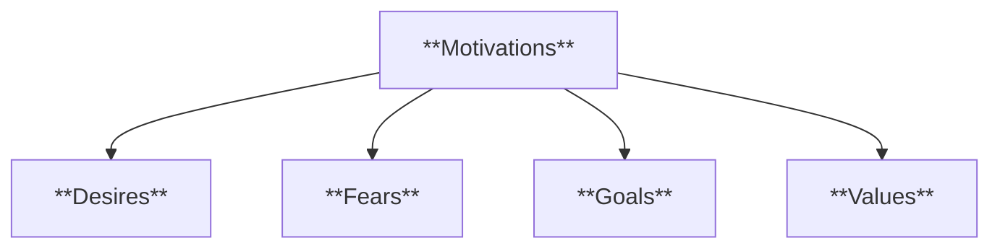
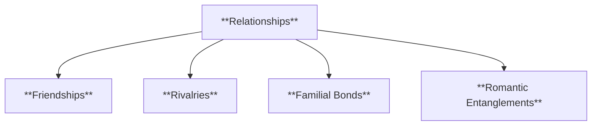
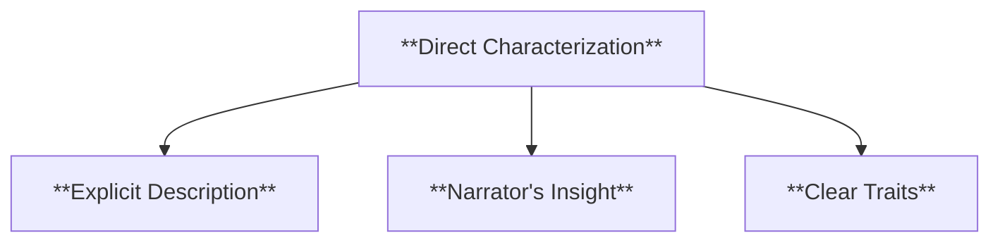
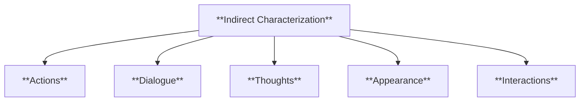
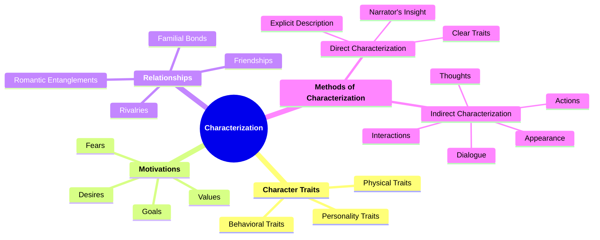

# 02 CH-3302 CHARACTERIZATION

### **Characterization**

- **Analyzing how characters are developed, including their traits, motivations, and relationships.**
  - **Methods**:
    - **Direct Characterization**
    - **Indirect Characterization**
  - **Importance**: Characters drive the narrative; understanding them is crucial for analysis.

---

### **Key Concepts**

---

#### **Characterization**

- **Definition**:
  - In narratology, characterization refers to the techniques used by authors to create and develop characters within a narrative. This includes the depiction of characters' traits, motivations, behaviors, and relationships, which collectively contribute to their depth and believability.

##### **Components of Characterization**

###### **Character Traits**

- **Definition**:
  - The distinguishing qualities, attributes, and features that define a character's personality and behavior within the narrative.

- **Characteristics**:
  - **Physical Traits**: Descriptions of a character's appearance, such as height, build, and distinctive features.
  - **Personality Traits**: Internal attributes like kindness, ambition, or stubbornness that influence a character's actions and decisions.
  - **Behavioral Traits**: Observable actions and habits that reveal a character's nature and tendencies.

###### **Motivations**

- **Definition**:
  - The driving forces behind a character's actions and decisions, often rooted in their desires, fears, goals, and values.

- **Characteristics**:
  - **Desires**: What the character wants to achieve or obtain.
  - **Fears**: What the character is afraid of, which may influence their behavior.
  - **Goals**: The objectives the character strives to accomplish throughout the narrative.
  - **Values**: The principles and beliefs that guide the character's decisions and actions.

###### **Relationships**

- **Definition**:
  - The connections and interactions between characters, including friendships, rivalries, familial bonds, and romantic entanglements, which shape the narrative dynamics.

- **Characteristics**:
  - **Friendships**: Supportive and collaborative interactions between characters.
  - **Rivalries**: Competitive or antagonistic relationships that create conflict.
  - **Familial Bonds**: Relationships based on family ties, influencing character motivations and actions.
  - **Romantic Entanglements**: Love interests and romantic connections that add emotional depth to the narrative.

---

#### **Methods of Characterization**

---

##### **Direct Characterization**

- **Definition**:
  - A technique where the narrator explicitly describes a character's traits, providing clear and straightforward information about their personality, appearance, and motivations.

- **Characteristics**:
  - **Explicit Description**: The narrator directly states the character's qualities without ambiguity.
  - **Narrator's Insight**: Provides the reader with the narrator's perspective on the character.
  - **Clear Traits**: Leaves little room for interpretation, ensuring the reader understands the character's attributes.

###### **Examples of Direct Characterization**

- "John was a brave and honorable knight."
- "Sarah is known for her kindness and generosity."

---

##### **Indirect Characterization**

- **Definition**:
  - A technique where the character's traits are revealed through their actions, dialogue, thoughts, appearance, and interactions with other characters, allowing readers to infer their personality and motivations.

- **Characteristics**:
  - **Actions**: What the character does, which reflects their personality and motivations.
  - **Dialogue**: The way a character speaks can reveal their thoughts, feelings, and traits.
  - **Thoughts**: Inner monologue provides insight into the character's mind.
  - **Appearance**: Physical look and mannerisms that suggest certain traits.
  - **Interactions**: How a character behaves with others, indicating their relationships and social skills.

###### **Examples of Indirect Characterization**

- A character helps an injured stranger without expecting anything in return, showing their kindness.
- A protagonist remains silent during a confrontation, indicating their conflict-avoidant nature.

---

### **Theoretical Significance**

- **Importance of Characterization**:

  - In narratology, characterization is fundamental for creating believable and relatable characters that engage the audience. Well-developed characters drive the narrative forward, influence plot development, and embody the themes and messages of the story.

- **Application in Narratological Analysis**:

  - Scholars analyze characterization to understand how characters contribute to the narrative structure, how their development affects the story's progression, and how their interactions reveal deeper meanings and thematic elements.

- **Enhancing Narrative Engagement**:
  - Effective characterization enhances the reader's emotional investment in the story, making the narrative more compelling and memorable. It allows for a deeper connection between the audience and the characters, fostering empathy and interest.

---

