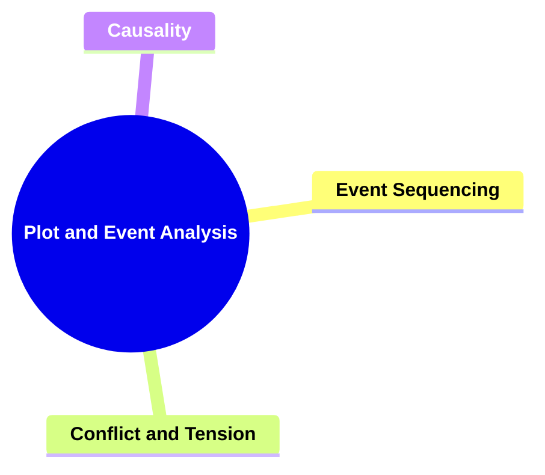
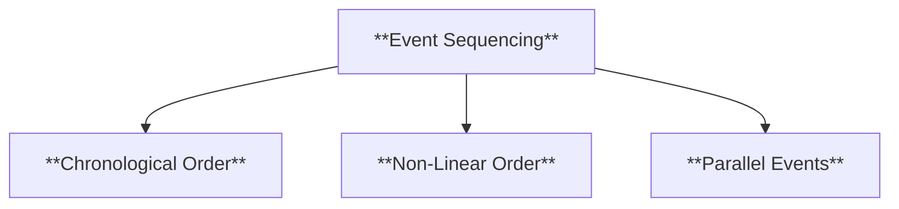
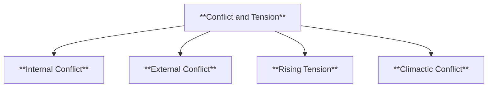
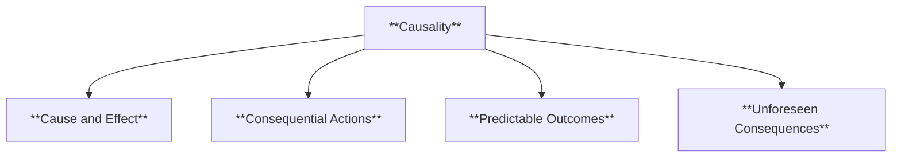
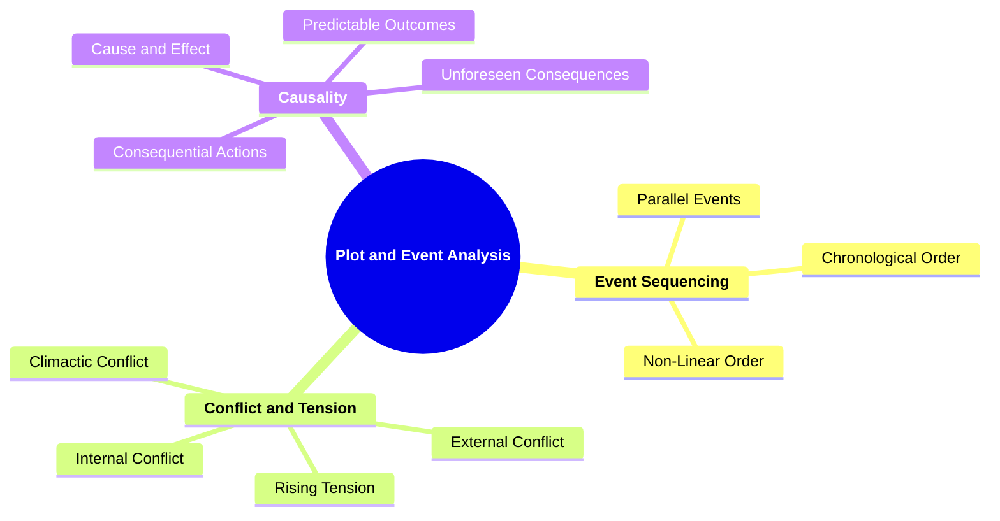

# 03 PA-3303 PLOT AND EVENT ANALYSIS

### **Plot and Event Analysis**

- **Examining the sequence of events and their causal relationships within the narrative.**
  - **Focus**:
    - **Event Sequencing**
    - **Conflict and Tension**
    - **Causality**
  - **Importance**: The plot is the backbone of the story, essential for understanding narrative progression.

---

### **Key Concepts**

---

#### **Plot and Event Analysis**

- **Definition**:
  - In narratology, plot and event analysis involves dissecting the arrangement and interrelation of events within a narrative. It focuses on how events are organized, the conflicts they generate, and the causal links that drive the story forward. This analysis helps in understanding the structure and dynamics that make a narrative coherent and compelling.

##### **Components of Plot and Event Analysis**

###### **Event Sequencing**

- **Definition**:
  - The order in which events occur in a narrative, determining the flow and pace of the story. Effective event sequencing ensures that the narrative progresses logically and maintains the audience's interest.

- **Characteristics**:
  - **Chronological Order**: Events are presented in the order they occur in time, providing a clear and straightforward narrative flow.
  - **Non-Linear Order**: Events are arranged out of chronological sequence, often using flashbacks or flash-forwards to enhance the storytelling.
  - **Parallel Events**: Multiple storylines run concurrently, intersecting at key points to enrich the narrative complexity.

###### **Conflict and Tension**

- **Definition**:
  - The presence of opposing forces or challenges that create suspense and drive the narrative forward. Conflict and tension are essential for maintaining audience engagement and facilitating character development.

- **Characteristics**:
  - **Internal Conflict**: Struggles within a character, such as moral dilemmas or emotional battles, contributing to character depth.
  - **External Conflict**: Opposition between characters or between a character and external forces, driving plot advancement.
  - **Rising Tension**: Gradual increase in suspense and stakes, leading up to the narrative's climax.
  - **Climactic Conflict**: The peak of tension where the main conflict reaches its most intense point, determining the story's outcome.

###### **Causality**

- **Definition**:
  - The relationship between cause and effect within the narrative, where events are interconnected through their influence on one another. Causality ensures that the plot unfolds logically and that actions have meaningful consequences.

- **Characteristics**:
  - **Cause and Effect**: Each event is a result of preceding actions, creating a logical progression in the story.
  - **Consequential Actions**: Characters' decisions lead to subsequent events, shaping the narrative trajectory.
  - **Predictable Outcomes**: Events follow expected patterns based on established causality, providing narrative coherence.
  - **Unforeseen Consequences**: Unexpected results of actions add complexity and surprise to the narrative.

---

### **Theoretical Significance**

- **Importance of Plot and Event Analysis**:

  - In narratology, analyzing plot and events is fundamental for understanding how stories are constructed and how they function to convey meaning. It allows scholars to dissect the narrative's structure, uncover the underlying mechanisms that drive the story, and appreciate the intricacies of storytelling.

- **Application in Narratological Analysis**:

  - Scholars utilize plot and event analysis to examine the effectiveness of narrative structures, the role of conflict in character development, and the impact of causal relationships on story progression. This analysis aids in identifying patterns, themes, and techniques that contribute to a narrative's success.

- **Enhancing Narrative Comprehension**:
  - A thorough understanding of plot and event sequencing, conflict, and causality enhances the ability to interpret and appreciate complex narratives. It facilitates a deeper engagement with the story, allowing for a more nuanced analysis of its components and their interplay.

---

