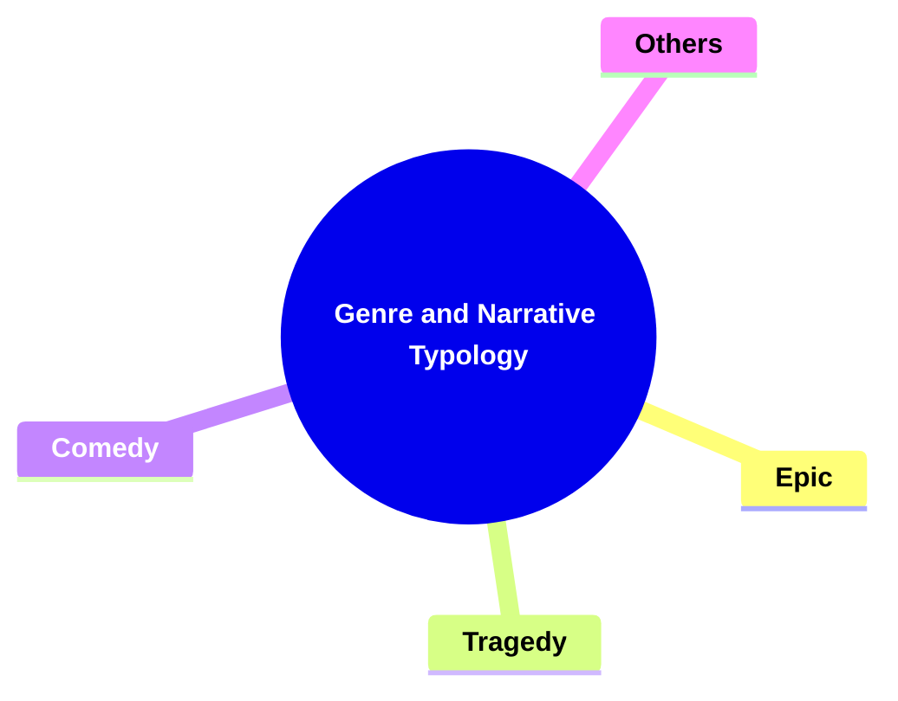
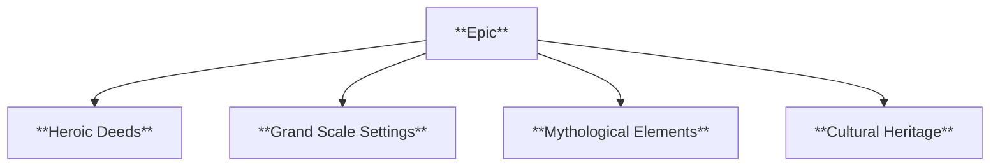
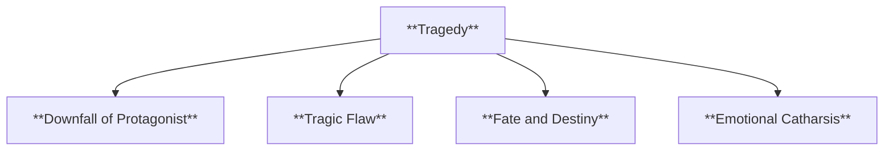
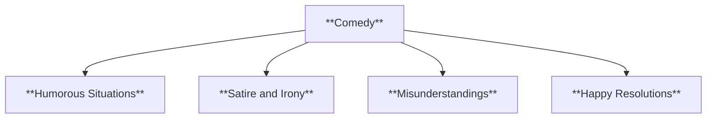
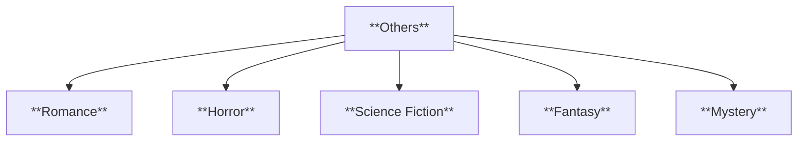
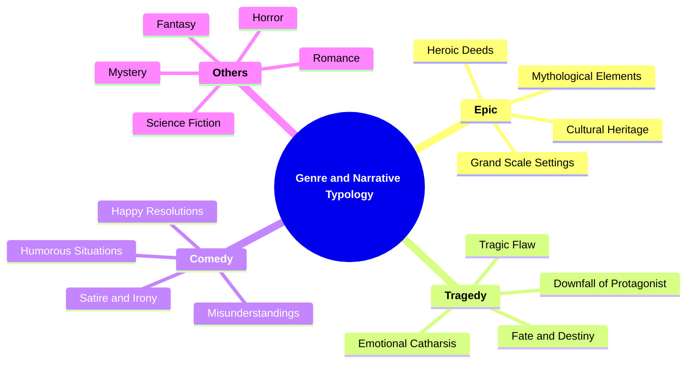

# 16 GT-3505 GENRE AND NARRATIVE TYPOLOGY

### **Genre and Narrative Typology**

- **Understanding genre conventions and their influence on narratives.**
  - **Genres**:
    - **Epic**
    - **Tragedy**
    - **Comedy**
    - **Others**
  - **Importance**: Requires knowledge of various genres and their characteristics.

---

### **Key Concepts**

---

#### **Genre and Narrative Typology**

- **Definition**:
  - In narratology, **genre and narrative typology** refer to the classification of narratives based on shared conventions, themes, structures, and stylistic elements. Understanding genre conventions helps in analyzing how specific narrative forms influence storytelling techniques and audience expectations.

##### **Components of Genre and Narrative Typology**

###### **Epic**

- **Definition**:
  - **Epic** narratives are grand-scale stories that often involve heroic deeds, significant events, and vast settings. They typically focus on the journey or quest of a central hero, incorporating elements of adventure, mythology, and cultural heritage.

- **Characteristics**:
  - **Heroic Deeds**: Central characters perform extraordinary actions that have significant impact.
  - **Grand Scale Settings**: The story unfolds in expansive environments, often spanning multiple locations or realms.
  - **Mythological Elements**: Incorporates elements from mythology, such as gods, supernatural beings, and legendary artifacts.
  - **Cultural Heritage**: Reflects and preserves the cultural values, traditions, and history of a society.

###### **Tragedy**

- **Definition**:
  - **Tragedy** focuses on serious and somber themes, often depicting the downfall of a protagonist due to a flaw, fate, or external forces. They aim to evoke emotions like pity, fear, and catharsis in the audience.

- **Characteristics**:
  - **Downfall of Protagonist**: The main character experiences a decline from a high position to a low state.
  - **Tragic Flaw**: The protagonist possesses a flaw or makes a critical mistake that leads to their downfall.
  - **Fate and Destiny**: Themes of inevitability and predestined outcomes influence the narrative.
  - **Emotional Catharsis**: The story aims to release emotional tension, leading to a purging of emotions in the audience.

###### **Comedy**

- **Definition**:
  - **Comedy** narratives are designed to amuse and entertain, often using humor, satire, and irony. They typically involve light-hearted themes, misunderstandings, and happy resolutions.

- **Characteristics**:
  - **Humorous Situations**: The narrative includes funny scenarios and dialogue intended to provoke laughter.
  - **Satire and Irony**: Uses satire to critique societal norms and irony to highlight discrepancies between expectations and reality.
  - **Misunderstandings**: Plotlines often involve characters misunderstanding each other, leading to humorous complications.
  - **Happy Resolutions**: The story typically concludes with positive outcomes, restoring order and harmony.

###### **Others**

- **Definition**:
  - This category encompasses genres that do not fit into the traditional classifications of epic, tragedy, or comedy. It includes genres like romance, horror, science fiction, fantasy, and more, each with its own unique conventions and narrative techniques.

- **Characteristics**:
  - **Romance**: Focuses on love relationships and emotional connections between characters.
  - **Horror**: Aims to evoke fear, suspense, and dread through supernatural elements, monsters, or psychological terror.
  - **Science Fiction**: Explores futuristic concepts, advanced technology, and speculative scenarios based on scientific principles.
  - **Fantasy**: Features magical elements, mythical creatures, and imaginary worlds, often involving epic quests and battles.
  - **Mystery**: Centers around solving a crime or uncovering secrets, involving detectives or protagonists who investigate and resolve enigmas.

---

### **Theoretical Significance**

- **Understanding Genre Conventions**:

  - In narratology, recognizing genre conventions is essential for analyzing how different narrative forms shape storytelling techniques and influence audience expectations. Each genre has its own set of rules and conventions that guide the narrative structure, character development, and thematic focus.

- **Influence on Narrative Techniques**:

  - Genre dictates specific narrative strategies and stylistic choices. For example, epics utilize grand settings and heroic characters, while comedies rely on humor and light-hearted plotlines. Understanding these influences helps in dissecting the effectiveness and purpose of narrative elements within a story.

- **Enhancing Critical Analysis**:

  - By categorizing narratives into genres, scholars can compare and contrast how different genres approach similar themes or plot structures. This comparative analysis highlights the unique strengths and limitations of each genre, fostering a deeper understanding of narrative diversity.

- **Guiding Authorial Intent**:

  - Authors often adhere to or subvert genre conventions to achieve specific effects or to comment on the genre itself. Analyzing these choices provides insights into the author's intentions and the broader cultural or societal contexts in which the narrative is situated.

- **Facilitating Audience Engagement**:
  - Knowledge of genre conventions allows audiences to set expectations and engage with narratives more effectively. It also enables creators to play with these expectations, creating innovative and surprising storytelling experiences.

---

