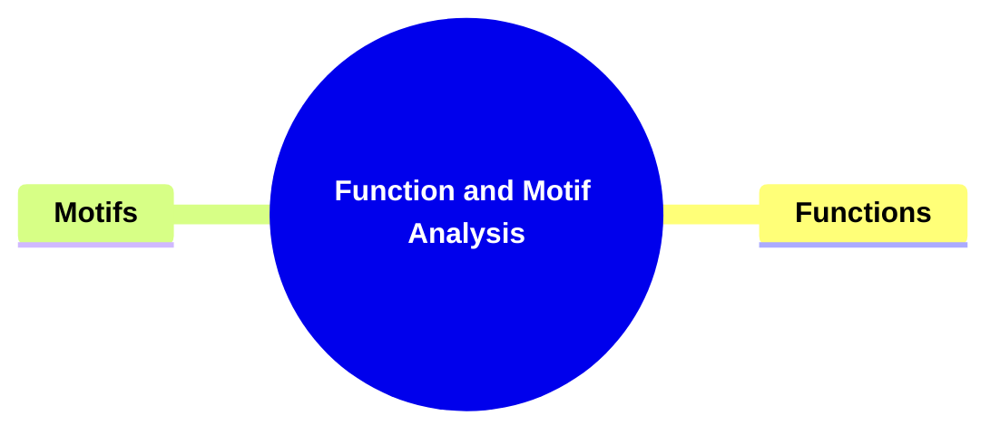
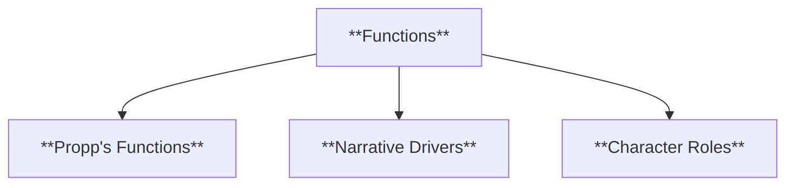
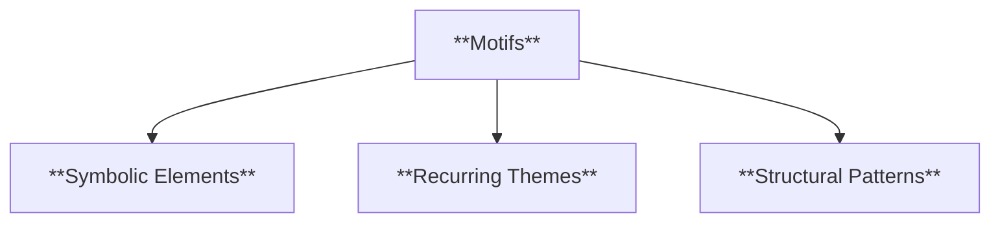
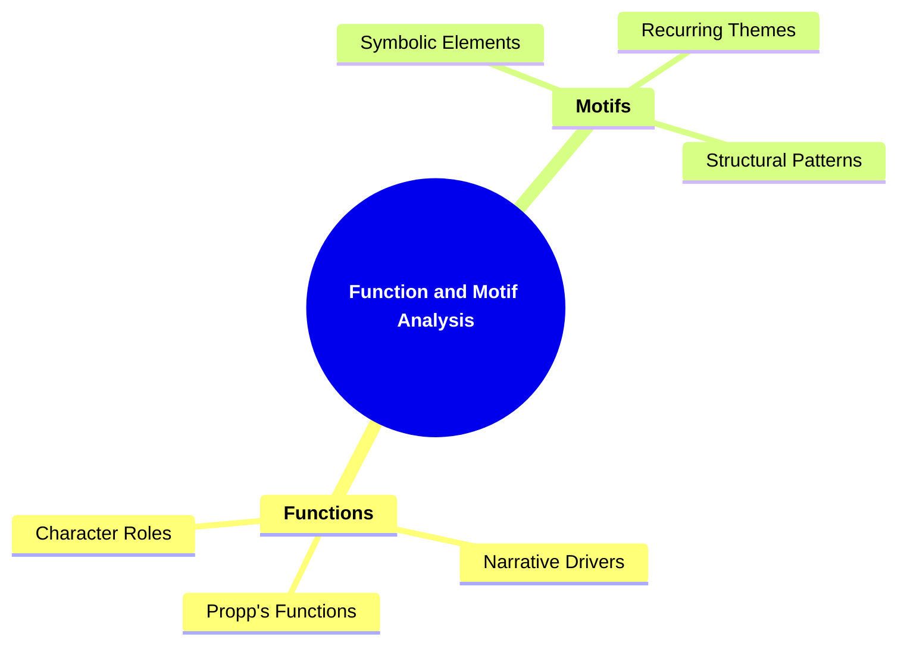

# 17 FM_3506 FUNCTION AND MOTIF ANALYSIS

### **Function and Motif Analysis**

- **Identifying recurring elements and their functions within the narrative.**
  - **Theories**:
    - **Structuralist Approaches (e.g., Vladimir Propp's Functions)**
  - **Importance**: Builds on plot and thematic analysis.

---

### **Key Concepts**

---

#### **Function and Motif Analysis**

- **Definition**:
  - In narratology, **function and motif analysis** involves identifying and examining the recurring elements within a narrative and understanding their roles in advancing the plot, developing characters, and reinforcing themes. Functions refer to the specific actions or events that drive the narrative forward, while motifs are recurring symbols, themes, or elements that add depth and coherence to the story.

##### **Components of Function and Motif Analysis**

###### **Functions**

- **Definition**:
  - Functions are the building blocks of narrative structure, representing specific actions or events that contribute to the progression of the plot. Vladimir Propp's structuralist approach identifies a series of functions that are common across various fairy tales and narratives, illustrating how these functions shape the story's architecture.

- **Characteristics**:
  - **Propp's Functions**: A sequence of narrative actions identified by Vladimir Propp that are essential for the structure of folk tales.
  - **Narrative Drivers**: Functions act as catalysts that move the story forward by introducing conflicts, challenges, and resolutions.
  - **Character Roles**: Each function is often associated with specific character archetypes, such as the hero, villain, or donor, who perform these actions.

###### **Motifs**

- **Definition**:
  - Motifs are recurring elements, symbols, or themes within a narrative that hold significant meaning and contribute to the story's overall message. They help in reinforcing themes, developing characters, and creating a cohesive narrative.

- **Characteristics**:
  - **Symbolic Elements**: Objects, colors, or symbols that represent larger ideas or themes within the narrative.
  - **Recurring Themes**: Ideas or messages that appear multiple times throughout the story, emphasizing their importance.
  - **Structural Patterns**: Repeated narrative structures or sequences that provide rhythm and predictability to the story.

---

### **Theoretical Significance**

- **Building on Plot and Thematic Analysis**:

  - Function and motif analysis enhances the understanding of a narrative's structure by breaking down the story into its fundamental components. This detailed examination allows for a deeper appreciation of how plots are constructed and how themes are interwoven throughout the narrative.

- **Structuralist Foundations**:

  - Rooted in structuralist theory, particularly Vladimir Propp's work, function analysis provides a systematic approach to identifying the essential actions that constitute a narrative. This framework facilitates the comparison of different narratives based on their structural similarities and differences.

- **Enhancing Narrative Coherence**:

  - By recognizing recurring motifs, scholars can trace the development of themes and symbols, contributing to the narrative's overall coherence and unity. Motifs serve as threads that connect various parts of the story, making the narrative more cohesive and meaningful.

- **Facilitating Comparative Analysis**:

  - Function and motif analysis allows for the comparison of diverse narratives by highlighting common functions and motifs across different cultures and genres. This comparative approach uncovers universal storytelling elements and unique cultural expressions within narratives.

- **Supporting Character and Theme Development**:

  - Understanding the functions associated with different character roles aids in analyzing how characters influence the plot and interact with each other. Similarly, identifying motifs helps in exploring how recurring symbols and themes contribute to the story's depth and resonance.

- **Influence on Reader Interpretation**:
  - Recognizing functions and motifs enables readers and scholars to interpret the underlying meanings and messages of a narrative more effectively. It deepens the engagement with the text by uncovering the layers of significance embedded within the story.

---

