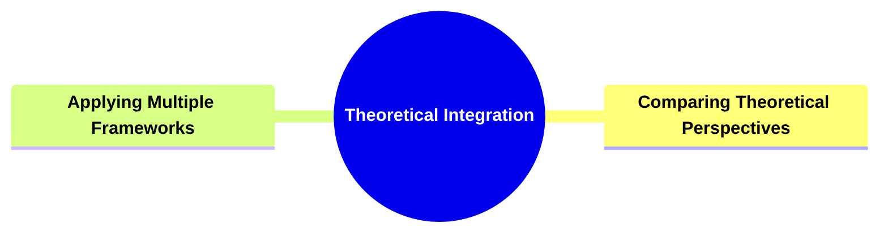
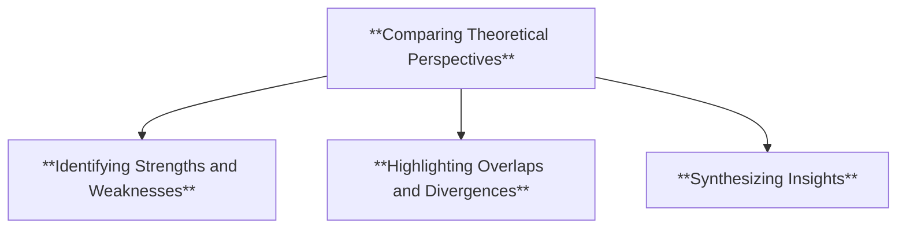
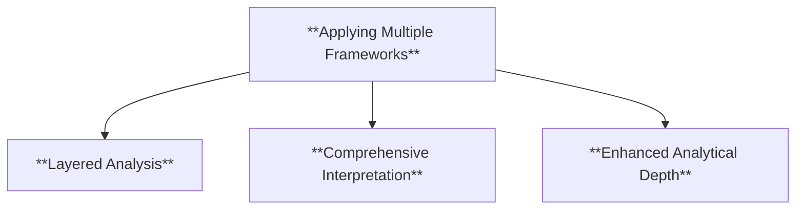
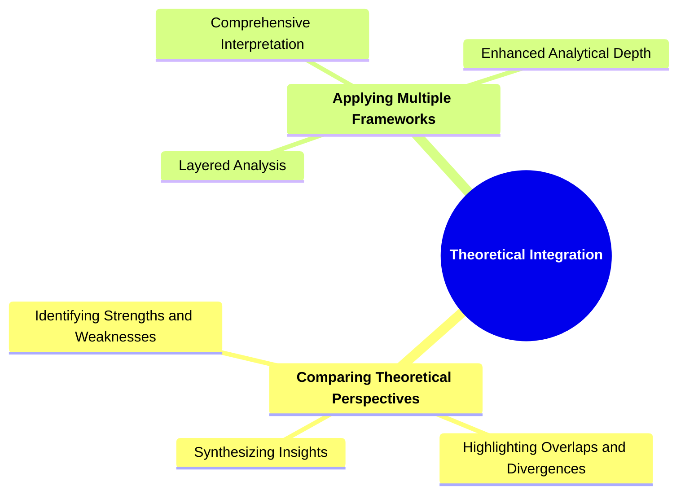

# 24 TI-3702 THEORETICAL INTEGRATION

### **Theoretical Integration**

- **Integrating different narratological theories and frameworks.**
  - **Approach**:
    - **Comparing Theoretical Perspectives**
    - **Applying Multiple Frameworks**
  - **Outcome**: Develops critical thinking and adaptability.

---

### **Key Concepts**

---

#### **Theoretical Integration**

- **Definition**:
  - In narratology, **theoretical integration** involves the synthesis of various narratological theories and frameworks to provide a more comprehensive understanding of narratives. This approach allows scholars to compare and contrast different theoretical perspectives, apply multiple frameworks simultaneously, and develop nuanced analyses that account for the complexity of storytelling.

##### **Components of Theoretical Integration**

###### **Comparing Theoretical Perspectives**

- **Definition**:
  - **Comparing theoretical perspectives** entails analyzing and contrasting different narratological theories to identify their strengths, weaknesses, and areas of overlap. This comparative analysis fosters a deeper understanding of each theory's unique contributions to the study of narratives.

- **Characteristics**:
  - **Identifying Strengths and Weaknesses**: Evaluating the effectiveness and limitations of each theoretical perspective.
  - **Highlighting Overlaps and Divergences**: Recognizing commonalities and differences between theories.
  - **Synthesizing Insights**: Combining valuable elements from multiple theories to enhance analytical depth.

###### **Applying Multiple Frameworks**

- **Definition**:
  - **Applying multiple frameworks** involves utilizing more than one narratological framework concurrently to analyze a narrative. This multifaceted approach allows for a richer and more layered interpretation of the text, accommodating various aspects of narrative structure, character development, and thematic exploration.

- **Characteristics**:
  - **Layered Analysis**: Examining different narrative elements through distinct theoretical lenses.
  - **Comprehensive Interpretation**: Achieving a well-rounded understanding by integrating diverse analytical approaches.
  - **Enhanced Analytical Depth**: Delving deeper into the narrative's complexities by leveraging multiple perspectives.

---

### **Theoretical Significance**

- **Developing Critical Thinking**:

  - Theoretical integration encourages scholars to critically evaluate and question existing narratological theories. By comparing and contrasting different perspectives, analysts develop the ability to discern the most effective tools for narrative analysis.

- **Fostering Adaptability**:

  - Applying multiple frameworks enhances a scholar's adaptability, enabling them to approach narratives from various angles. This flexibility is essential for analyzing diverse and complex storytelling methods.

- **Creating Comprehensive Analyses**:

  - Integrating different theories results in more thorough and nuanced analyses. It allows for the exploration of narratives' multifaceted nature, accounting for structural, thematic, and stylistic dimensions simultaneously.

- **Enhancing Scholarly Discourse**:

  - Theoretical integration contributes to the evolution of narratological studies by fostering dialogue between different theoretical traditions. It promotes the development of hybrid theories that can address the limitations of individual frameworks.

- **Supporting Innovative Research**:
  - By combining multiple narratological theories, researchers can pioneer new analytical methods and uncover previously overlooked aspects of narratives. This innovation drives the field forward, expanding the horizons of narrative analysis.

---

