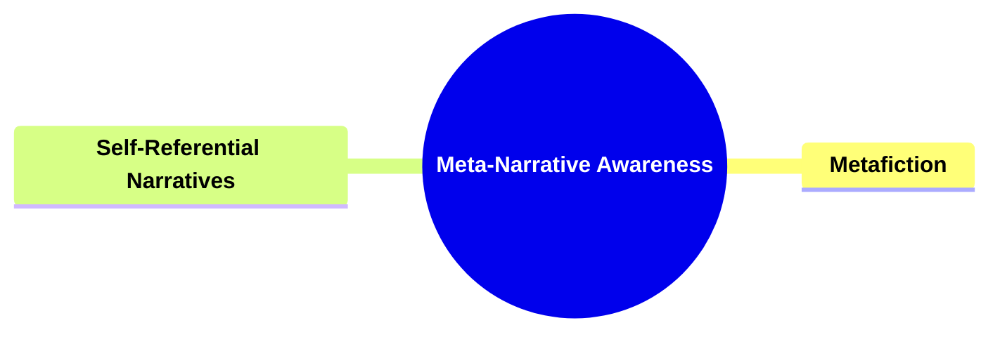
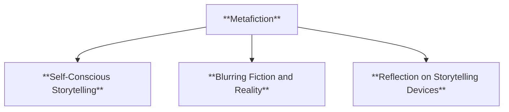
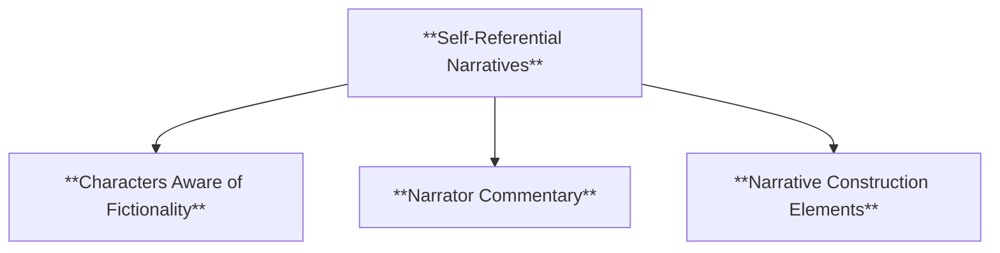
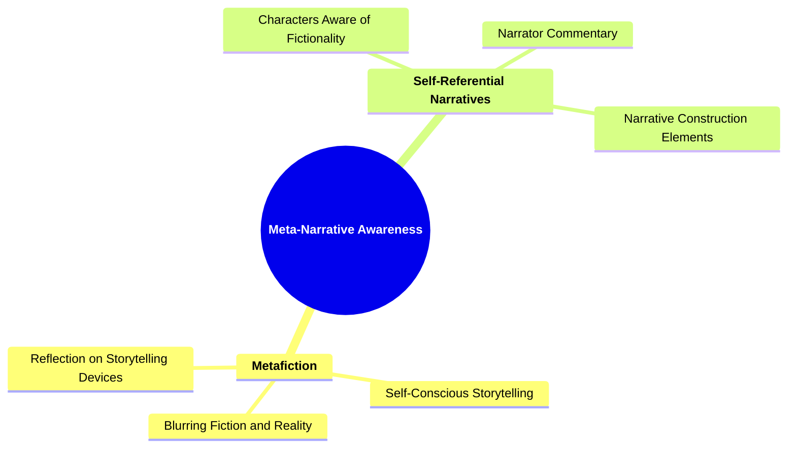

# 28 MN-3706 META-NARRATIVE AWARENESS

### **Meta-Narrative Awareness**

- **Reflecting on the nature of narratives and storytelling.**
  - **Examples**:
    - **Metafiction**
    - **Self-Referential Narratives**
  - **Outcome**: Encourages philosophical engagement with storytelling.

---

### **Key Concepts**

---

#### **Meta-Narrative Awareness**

- **Definition**:
  - In narratology, **meta-narrative awareness** involves a conscious reflection on the construction, conventions, and functions of narratives and storytelling itself. It examines how narratives acknowledge their own artifice, question their own processes, and engage with the nature of storytelling, fostering a deeper philosophical understanding of narrative mechanisms and their implications.

##### **Components of Meta-Narrative Awareness**

###### **Metafiction**

- **Definition**:
  - **Metafiction** is a narrative technique that self-consciously addresses the devices of fiction, often blurring the boundaries between fiction and reality. It draws attention to its own status as a constructed narrative, thereby prompting readers to reflect on the nature and conventions of storytelling.

- **Characteristics**:
  - **Self-Conscious Storytelling**: The narrative explicitly comments on its own creation or structure.
  - **Blurring Fiction and Reality**: Merges elements of the real world with the fictional narrative, making it difficult to distinguish between them.
  - **Reflection on Storytelling Devices**: Highlights the techniques and conventions used in storytelling, encouraging readers to think about how stories are told.

###### **Self-Referential Narratives**

- **Definition**:
  - **Self-referential narratives** are stories that refer back to themselves or their own narrative process. They may involve characters who are aware of their fictional nature, narrators who comment on the storytelling process, or plots that incorporate elements of narrative construction.

- **Characteristics**:
  - **Characters Aware of Fictionality**: Characters recognize that they are part of a story or fiction.
  - **Narrator Commentary**: The narrator provides insights or comments about the narrative process or their role in the story.
  - **Narrative Construction Elements**: Elements that showcase how the story is built, such as plot devices that reveal the author's hand in crafting the story.

---

### **Theoretical Significance**

- **Encouraging Philosophical Engagement**:

  - Meta-narrative awareness invites both creators and audiences to engage in philosophical contemplation about the nature of storytelling. It challenges traditional notions of narrative boundaries and prompts critical thinking about how stories influence and reflect human understanding and culture.

- **Breaking Conventional Narrative Boundaries**:

  - By highlighting the constructed nature of narratives, meta-narrative techniques disrupt conventional storytelling norms. This can lead to innovative narrative forms and encourage experimentation within narrative structures.

- **Enhancing Reader's Critical Thinking**:

  - Meta-narrative elements encourage readers to become active participants in the narrative process, analyzing and questioning the storytelling methods and the underlying messages conveyed through the narrative's self-awareness.

- **Facilitating Deeper Understanding of Narrative Mechanics**:

  - Reflecting on how narratives are constructed provides insights into the mechanics of storytelling, such as plot development, character creation, and thematic exploration. This understanding enriches both the creation and analysis of narratives.

- **Influencing Narrative Theory Development**:
  - Meta-narrative awareness contributes to the evolution of narratological theories by introducing new perspectives on how narratives function and interact with their audiences. It broadens the scope of narrative studies to include self-referential and reflective storytelling practices.

---

