- [1. **Title: Chatman's Character and Event Framework**](#1-title-chatmans-character-and-event-framework)
- [2. **Key Concepts**](#2-key-concepts)
  - [2.1. **Kernel Characters**](#21-kernel-characters)
    - [2.1.1. **Components of Kernel Characters**](#211-components-of-kernel-characters)
      - [2.1.1.1. **Protagonists**](#2111-protagonists)
      - [2.1.1.2. **Antagonists**](#2112-antagonists)
      - [2.1.1.3. **Key Decision Makers**](#2113-key-decision-makers)
  - [2.2. **Satellite Characters**](#22-satellite-characters)
    - [2.2.1. **Components of Satellite Characters**](#221-components-of-satellite-characters)
      - [2.2.1.1. **Supporting Figures**](#2211-supporting-figures)
      - [2.2.1.2. **Secondary Characters**](#2212-secondary-characters)
  - [2.3. **Kernel Events**](#23-kernel-events)
    - [2.3.1. **Components of Kernel Events**](#231-components-of-kernel-events)
      - [2.3.1.1. **Decisive Actions**](#2311-decisive-actions)
      - [2.3.1.2. **Conflicts**](#2312-conflicts)
      - [2.3.1.3. **Resolutions**](#2313-resolutions)
      - [2.3.1.4. **Turning Points**](#2314-turning-points)
  - [2.4. **Satellite Events**](#24-satellite-events)
    - [2.4.1. **Components of Satellite Events**](#241-components-of-satellite-events)
      - [2.4.1.1. **Character Backstory**](#2411-character-backstory)
      - [2.4.1.2. **Thematic Exploration**](#2412-thematic-exploration)
      - [2.4.1.3. **Subplots**](#2413-subplots)
- [3. Implications of Chatman's Character and Event Framework](#3-implications-of-chatmans-character-and-event-framework)

---

### 1. **Title: Chatman's Character and Event Framework**

**Character and Event**:
**Definition**: In _"Story and Discourse"_ (1978), Seymour Chatman presents a framework for analyzing narratives by categorizing characters and events. He introduces the concepts of _kernel_ and _satellite_ characters, as well as _kernel_ and _satellite_ events, to differentiate between those that are central to the plot and those that provide additional context. This framework helps to understand how different components of a narrative contribute to the overall development and progression of the story.

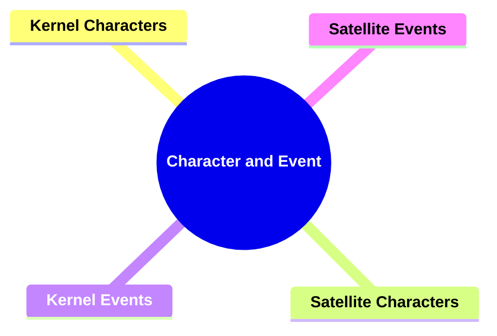

---

### 2. **Key Concepts**

#### 2.1. **Kernel Characters**

**Definition**:
Kernel characters are essential to the plot’s progression. They are central figures involved in major events that shape the narrative’s direction and drive the story forward.

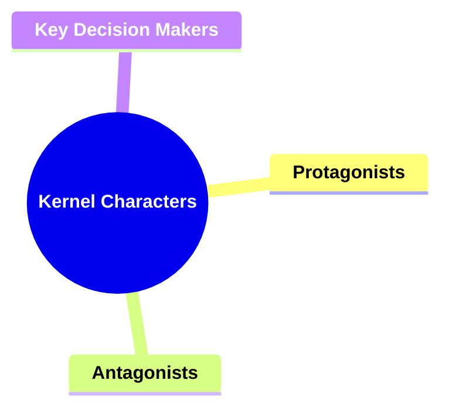

##### 2.1.1. **Components of Kernel Characters**

###### 2.1.1.1. **Protagonists**

- **Definition**: Characters who lead the narrative, making pivotal decisions.

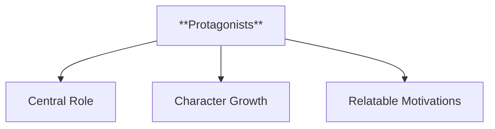

- **Characteristics**
  - **Central Role**: Drive the main storyline and are the primary focus of the narrative, guiding the plot with their actions and choices.
  - **Character Growth**: Typically undergo development, facing internal and external challenges that contribute to their evolution throughout the story.
  - **Relatable Motivations**: Possess goals and values that resonate with readers, fostering connection and emotional investment in their journey.

---

###### 2.1.1.2. **Antagonists**

- **Definition**: Characters who oppose the protagonist and create conflict.

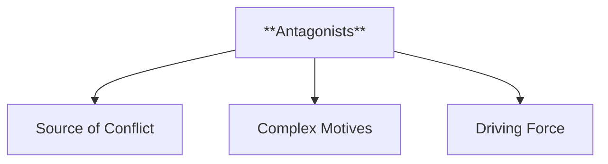

- **Characteristics**
  - **Source of Conflict**: Challenge the protagonist by introducing obstacles and opposition, fueling the central tension in the narrative.
  - **Complex Motives**: Can have motivations and backstories that add depth, making them more than one-dimensional villains.
  - **Driving Force**: Propel the story forward by pushing the protagonist to grow, adapt, or confront their own flaws.

---

###### 2.1.1.3. **Key Decision Makers**

- **Definition**: Those whose actions result in significant turning points in the story.

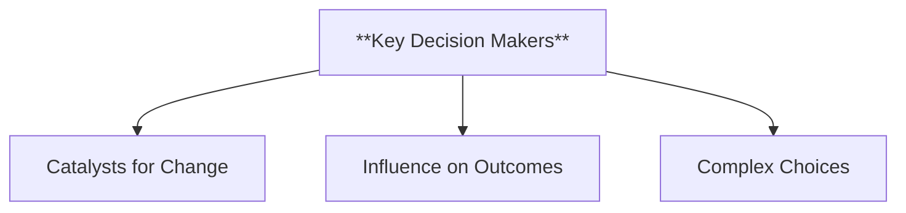

- **Characteristics**
  - **Catalysts for Change**: Make choices that dramatically alter the course of the plot, creating pivotal moments in the story.
  - **Influence on Outcomes**: Their decisions often have far-reaching consequences, impacting not just the protagonist but the entire narrative landscape.
  - **Complex Choices**: Face dilemmas that highlight themes or moral questions, adding depth and intrigue to the narrative as they navigate tough decisions.

---

#### 2.2. **Satellite Characters**

**Definition**:
Satellite characters serve supplementary roles. While they add depth and complexity to the story, their actions are not critical to the plot’s main progression.

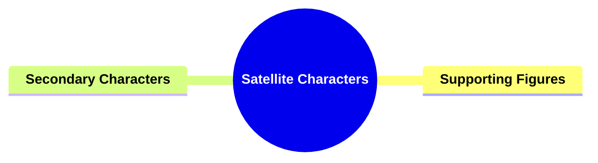

##### 2.2.1. **Components of Satellite Characters**

###### 2.2.1.1. **Supporting Figures**

- **Definition**: Characters who provide context or enhance the main characters’ journeys.

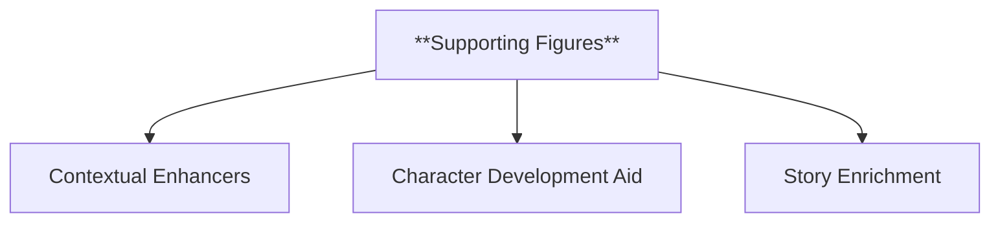

- **Characteristics**
  - **Contextual Enhancers**: Offer background information or additional perspectives that help develop the protagonist and the story world.
  - **Character Development Aid**: Support the main characters’ growth by being confidants, helpers, or contrasting figures that highlight key traits.
  - **Story Enrichment**: Add layers to the narrative through their interactions and subplots, making the world more immersive and realistic.

---

###### 2.2.1.2. **Secondary Characters**

- **Definition**: Those who add depth to the narrative but are not directly involved in the core conflicts or resolutions.

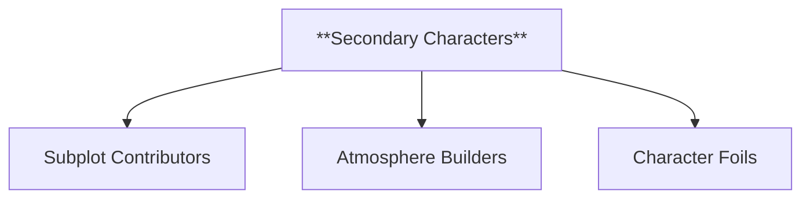

- **Characteristics**
  - **Subplot Contributors**: Participate in side stories that enhance the main plot and add complexity without taking center stage.
  - **Atmosphere Builders**: Help create a rich setting and contribute to the story’s tone by representing various aspects of the world or community.
  - **Character Foils**: Serve to contrast or complement the main characters, providing insights into their behavior or beliefs through indirect comparison.

---

#### 2.3. **Kernel Events**

**Definition**:
Kernel events are major plot points that drive the narrative forward. These events represent turning points or essential actions that define the structure of the story.

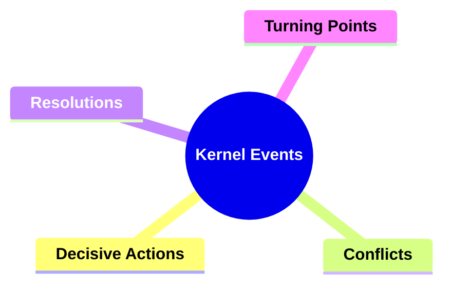

##### 2.3.1. **Components of Kernel Events**

###### 2.3.1.1. **Decisive Actions**

- **Definition**: Events where characters make key decisions that impact the direction of the narrative.

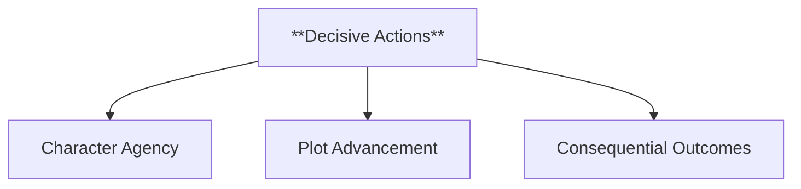

- **Characteristics**
  - **Character Agency**: Highlight the ability of characters to make choices that drive the story, showcasing their motivations and values.
  - **Plot Advancement**: Propel the narrative forward by setting new paths or initiating major events that alter the status quo.
  - **Consequential Outcomes**: Lead to significant changes in the story, impacting characters’ fates and the overall plot trajectory.

---

###### 2.3.1.2. **Conflicts**

- **Definition**: Moments where central conflicts are introduced or escalated.

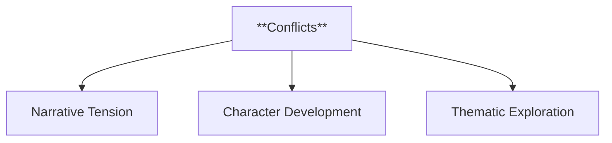

- **Characteristics**
  - **Narrative Tension**: Create suspense and engage the reader by presenting obstacles that challenge characters and test their resolve.
  - **Character Development**: Push characters to adapt and grow as they face and confront challenges.
  - **Thematic Exploration**: Emphasize key themes by illustrating how characters react to and manage conflict.

---

###### 2.3.1.3. **Resolutions**

- **Definition**: Moments where central conflicts are resolved.

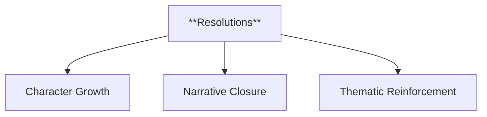

- **Characteristics**
  - **Character Growth**: Showcase the development and transformation of characters as they reach a resolution.
  - **Narrative Closure**: Provide a sense of completion or satisfaction by tying up plotlines and answering major questions.
  - **Thematic Reinforcement**: Reinforce the core messages of the story through the outcomes of the conflicts and how they are resolved.

---

###### 2.3.1.4. **Turning Points**

- **Definition**: Pivotal moments that significantly change the course of the story.

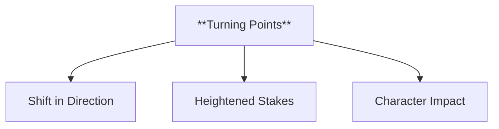

- **Characteristics**
  - **Shift in Direction**: Mark a departure from the existing trajectory of the narrative, leading to new developments or revelations.
  - **Heightened Stakes**: Often raise the tension and importance of the plot, ensuring that the outcome becomes more uncertain or significant.
  - **Character Impact**: Influence characters’ decisions, beliefs, or relationships, making these moments transformative within the story.

---

#### 2.4. **Satellite Events**

**Definition**:
Satellite events are minor occurrences that provide additional context or background but do not significantly alter the story’s main plotline.

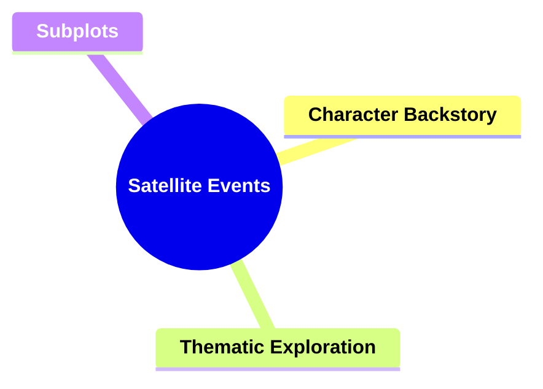

##### 2.4.1. **Components of Satellite Events**

###### 2.4.1.1. **Character Backstory**

- **Definition**: Events that delve into a character’s past, providing depth but not driving the main narrative.

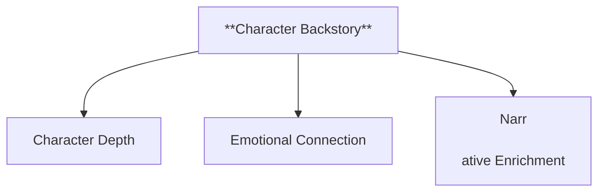

- **Characteristics**
  - **Character Depth**: Adds layers to the character by revealing their past experiences, motivations, and formative moments.
  - **Emotional Connection**: Helps readers empathize with or understand the character’s current behavior and decisions.
  - **Narrative Enrichment**: Provides context that enhances the main story, offering explanations for character dynamics and relationships.

---

###### 2.4.1.2. **Thematic Exploration**

- **Definition**: Events that explore the narrative’s themes without impacting the core plot.

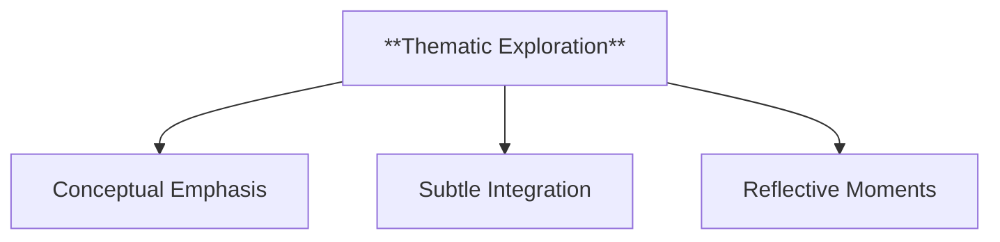

- **Characteristics**
  - **Conceptual Emphasis**: Focuses on illustrating and expanding the story’s central themes, deepening the narrative’s message.
  - **Subtle Integration**: Weaves thematic ideas through scenes and dialogue without altering the primary storyline.
  - **Reflective Moments**: Encourages readers to think about broader concepts and questions posed by the story, adding intellectual depth.

---

###### 2.4.1.3. **Subplots**

- **Definition**: Minor storylines that run parallel to the main plot, enriching the overall narrative.

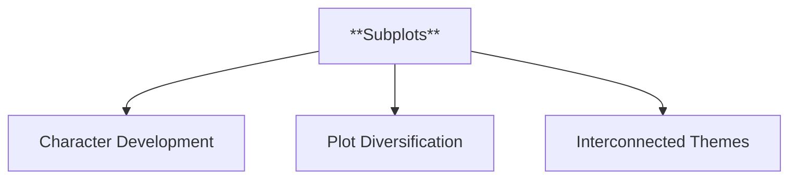

- **Characteristics**
  - **Character Development**: Allows secondary characters to grow and evolve, adding complexity to the story world.
  - **Plot Diversification**: Provides additional layers of interest and variety, preventing the main plot from becoming monotonous.
  - **Interconnected Themes**: Often tie back to the main narrative, reinforcing its themes and contributing to the story’s resolution.

---

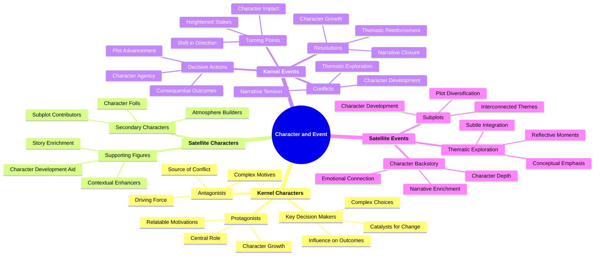

---

### 3. Implications of Chatman's Character and Event Framework

**Impact on Narrative Theory**:
Chatman’s framework has been influential in narrative theory, particularly in distinguishing between major and minor elements of a story. By categorizing characters and events as kernels or satellites, Chatman provides a clear structure for analyzing how different components of a narrative contribute to its overall progression and thematic depth.

**Collaborative or Future-Oriented Insight**:
Chatman’s ideas are applicable across various narrative forms, including literature, film, theater, and interactive media. His framework helps to analyze how both core and supplementary elements of a story work together to create a cohesive narr

- **Theoretical Significance**:
  - **Impact on Narrative Theory**: Chatman’s Character and Event Framework has had a significant impact on narrative theory, particularly in the analysis of plot structure and character development. By distinguishing between kernel and satellite elements, Chatman’s framework provides a systematic way to analyze the complexity and hierarchy within narratives. This approach has been influential in both literary studies and media analysis, offering tools to dissect how stories are constructed and how different components interact to create meaning.
  - **Application Across Media**: While originally developed for literary analysis, Chatman’s framework is also applicable to other narrative forms, including film, television, and video games. In these mediums, the distinction between kernel and satellite elements can help to analyze the pacing, narrative focus, and character dynamics, offering insights into how different storytelling techniques are employed across various formats.
  - **Supporting Information**:
    - **Interdisciplinary Influence**: Chatman’s framework has influenced disciplines beyond literary studies, including film studies, where it is used to analyze screenplays and cinematic storytelling. In game studies, the distinction between kernel and satellite elements is useful for understanding branching narratives and player agency.
    - **Criticism and Adaptation**: Some critics have argued that the binary distinction between kernels and satellites may oversimplify the complexity of certain narratives, especially those that intentionally blur the lines between major and minor elements. However, subsequent scholars have expanded on Chatman’s ideas, adapting them to accommodate more fluid and complex narrative structures, particularly in postmodern and experimental works.
